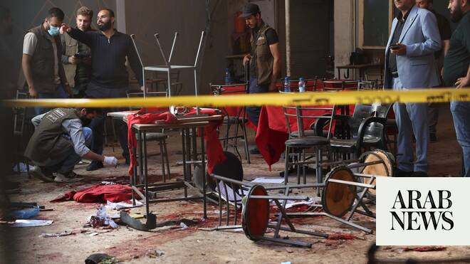

# Explosive device goes off in cafe in Syria’s capital, killing at least 9 people

Source: https://www.arabnews.com/node/2649412/middle-east
Captured source: https://www.arabnews.com/node/2649412/middle-east
Published: 2026-07-02T15:41:55+03:00
Modified: 2026-07-02T22:25:39+03:00
Author: AP

## Summary

DAMASCUS: An explosive device was detonated Thursday in a cafe in the Syrian capital of Damascus, killing at least nine people, Syria’s Health Ministry said. The explosion near the main courthouse complex left 20 others wounded, the ministry said as reported by Syria’s state-run Al-Ikhbariya network. No group immediately claimed responsibility. Security forces rushed to the

## Image

## Video Or Embed URLs

- https://7accd4d14d15d899763038e665408d0d.safeframe.googlesyndication.com/safeframe/1-0-45/html/container.html
- blob:https://www.arabnews.com/8f761c16-3b43-4cd6-b35d-ac4f54610ef2
- https://imasdk.googleapis.com/js/core/bridge3.774.0_en.html
- https://static.addtoany.com/menu/sm.25.html
- about:blank
- https://sync.teads.tv/wigo-no-slot
- https://ep2.adtrafficquality.google/sodar/sodar2/255/runner.html
- https://www.google.com/recaptcha/api2/aframe
- https://cm.g.doubleclick.net/partnerpixels?gdpr=0&us_privacy=1---&gpp_sid=-1&url=https%3A%2F%2Fwww.arabnews.com%2Fnode%2F2649412%2Fmiddle-east

## Text

https://arab.news/jkm3s

The explosion near the main courthouse complex left 20 others wounded, the ministry said

The Interior Ministry is set to announce its initial findings soon, said Damascus Gov. Maher Idlibi

DAMASCUS: An explosive device was detonated Thursday in a cafe in the Syrian capital of Damascus, killing at least nine people, Syria’s Health Ministry said. The explosion near the main courthouse complex left 20 others wounded, the ministry said as reported by Syria’s state-run Al-Ikhbariya network. No group immediately claimed responsibility. Security forces rushed to the cafe and cordoned off the area as they investigate the attack. The Interior Ministry is set to announce its initial findings soon, said Damascus Gov. Maher Idlibi. Idlibi said the device appeared “primitive” and vowed that the perpetrators will be held to account.

A video circulating on social media showed several wounded people lying on the ground, with police officers nearby. Ambulances later rushed to the scene treating people on site and taking the more severely wounded to hospitals in the Syrian capital. The cafe was frequented by lawyers who worked in the neighborhood. Jalal Aljanani, who owns a restaurant next door, ran toward the cafe when he heard the explosion and was horrified by the sight of the bodies on the floor. “We carried the victims to the cars until the traffic police arrived,” he told The Associated Press, his shirt covered in blood. “Many of them had suffered severe impact injuries, and almost all of them were bleeding.” Since overthrowing the Assad dynasty and taking power in a lightning insurgency in December 2024, Syria’s new rulers have cracked down on militants from the extremist Daesh group in an attempt to thwart attacks in and around the capital. During the uprising-turned war in Syria that began in 2011, Syrian President Ahmad Al-Sharaa led the Hayat Tahrir al Sham group, formerly affiliated with Al-Qaeda, but since coming to power has vowed to protect Syrians of all backgrounds, especially religious and ethnic minorities. Al-Sharaa has reasserted the government’s full authority across the vast majority of the country, wresting control back from extremist groups or Kurdish-led forces. However, he still contends with security concerns as he tries to stabilize the country. Security agencies frequently announce that they have raided IS cells and thwarted attacks reportedly targeting minorities and busy commercial areas. However, several incidents such as a suicide bombing in a church in July 2025 have raised concerns among many Syrians.
