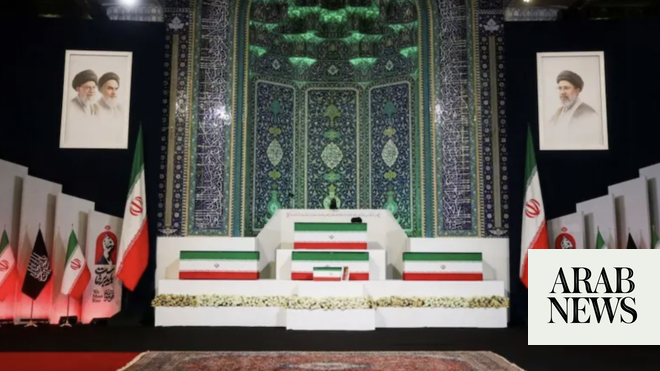

# Iran’s slain leader Khamenei laid in state in Tehran for week of mass funeral events

Source: https://www.arabnews.com/node/2649502/middle-east
Captured source: https://www.arabnews.com/node/2649502/middle-east
Published: 2026-07-03T07:14:27+03:00
Modified: 2026-07-03T21:35:32+03:00
Author: Reuters

## Summary

DUBAI: The body of Ayatollah Ali Khamenei lay in state in a vast hall in Tehran on Friday as clerics, officials, foreign dignitaries and other ​mourners paid their respects to Iran’s late Supreme Leader, slain by US and Israeli bombs. Iran is staging a week of mass funeral processions for Khamenei, whose 37-year reign was brought to an end in February by the first airstrike of

## Image

## Video Or Embed URLs

- blob:https://www.arabnews.com/813d9f3b-4a74-42b4-b990-9460fd2dea08
- https://imasdk.googleapis.com/js/core/bridge3.774.0_en.html
- https://0f991dfc33935cc3b60c386de98f82ab.safeframe.googlesyndication.com/safeframe/1-0-45/html/container.html
- about:blank
- https://static.addtoany.com/menu/sm.25.html
- https://ep2.adtrafficquality.google/sodar/sodar2/255/runner.html
- https://www.google.com/recaptcha/api2/aframe
- https://cm.g.doubleclick.net/partnerpixels?gdpr=0&us_privacy=1---&gpp_sid=-1&url=https%3A%2F%2Fwww.arabnews.com%2Fnode%2F2649502%2Fmiddle-east

## Text

https://arab.news/9hsbu

Millions of people and a coterie of foreign dignitaries will attend Saturday’s official ceremony for Ali Khamenei

DUBAI: The body of Ayatollah Ali Khamenei lay in state in a vast hall in Tehran on Friday as clerics, officials, foreign dignitaries and other ​mourners paid their respects to Iran’s late Supreme Leader, slain by US and Israeli bombs.

Iran is staging a week of mass funeral processions for Khamenei, whose 37-year reign was brought to an end in February by the first airstrike of the war, in a show of public devotion to the Islamic Republic’s theocratic state and revolutionary zeal.

Khamenei’s body was expected to be taken to Qom, Najaf and Kerbala, the great Shiite centers of Iran and Iraq, before being laid to rest on Thursday in Mashhad, home to the country’s holiest pilgrim shrine.

CRITICAL MOMENT FOR ISLAMIC REPUBLIC

His coffin was unveiled late on Thursday to a throng of sobbing supporters, swaying and beating their heads in time to a sung lament as flowers were thrown from the bier into the crowd. On Friday the coffin — and those of family members killed with him — was laid in state in the great prayer hall built to honor his predecessor, Ayatollah Ruhollah Khomeini.

The funeral is taking place at a critical moment for Iran, where the clerical rulers backed ‌by the Islamic Revolutionary Guard ‌Corps are riding high from surviving what they saw as an existential war against their greatest and ​most ‌powerful foes.

Authorities ⁠aim to ​mobilize ⁠millions of people for the big processions over the coming days, offering transport, food and lodging to buoy the numbers.

But nearly five decades after the 1979 revolution, and for all the official proclamations of national unity in the run-up to Khamenei’s funeral, the Islamic Republic has rarely been so internally fractured.

Support for the clerical leadership is paper thin, analysts say, and the new Supreme Leader, Khamenei’s son Mojtaba Khamenei, has not been seen in any new image since being wounded in the strike that killed his father.

Years of crippling sanctions have paralyzed the economy as accelerating bouts of mass nationwide protests have been put down by security forces with increasing force — culminating in the killing of thousands of demonstrators in January.

Those deep problems have been brushed aside this week, with the authorities mounting a display of state power and mass support.

Tehran streets were tightly controlled, with military and police vehicles lining the major ⁠roads and police and members of the black-shirted volunteer Basij paramilitary force patrolling on motorbikes. Iran warned the United States and ‌Israel against any attacks during the funeral.

After the coffins arrived on Friday, borne high across the upraised hands ‌of a waiting crowd, they were laid in the prayer hall on a white, stepped dais before ​a high, intricately tiled, arched recess, flanked by national and black mourning flags.

A black ‌turban, worn by clerics claiming descent from Islam’s Prophet Muhammad, lay on the coffin on a folded chequered scarf, a symbol in Iran of militant revolutionary ideals ‌and solidarity with Palestinians.

Former Russian President Dmitry Medvedev, Chinese National People’s Congress deputy head He Wei, Pakistani Prime Minister Shehbaz Sharif and Iraqi President Nizar Amedi were among the foreign leaders and officials attending.

Families of Hezbollah leader Hassan Nasrallah and senior commander Imad Mughniyeh, close Lebanese allies of Iran killed in Israeli strikes, attended the ceremony.

Iran’s own political leaders — the president, parliament speaker, foreign minister and others — filed in to weep and pray on Friday morning.

A group of generals stood saluting in front of the coffin. Among them was the new Revolutionary Guards head Ahmad Vahidi, ‌having not appeared in public since his appointment for fear of assassination.

SOBBING CROWDS, FUNERAL TOUR OF IRAN AND IRAQ

In Iran’s theocratic system, Khamenei was not only head of state and leader of a revolutionary movement, but the representative ⁠on earth for Shiite Islam’s 12th imam, ⁠who disappeared in the ninth century.

His death in an enemy attack plays into a powerful Shiite tradition of martyrdom and mourning, in which processions of flagellants beat their chests or backs.

That potent symbolism has been evident in the black funeral flags hanging over city streets since his death referencing the seventh-century martyrdom of Shi’ism’s third imam, Hossein.

In central Tehran overnight, a crowd stood sobbing and chanting, led by a Basij member, as others handed out posters of the late Khamenei.

“God willing, only by avenging his blood, demanding justice for it, and ensuring that our leader’s blood is not left unavenged, can this sorrow of the people be somewhat alleviated,” said Mobina Razaaghi, an 18-year-old student from Isfahan, attending the funeral events with classmates.

Killed alongside Khamenei, and displayed in coffins next to his, were his daughter, son-in-law and baby granddaughter, as well as the wife of his son Mojtaba.

BURIAL POSTPONED DUE TO WAR

Burials are meant to be conducted within a day of death in Islam, but because of the risks of holding a big funeral during the war it was postponed until after last month’s interim truce deal was agreed.

Hotels are offering 50 percent discounts, schools, mosques and sports halls have been prepared to house mourners, and bus and rail networks are being diverted to serve the main events.

After what authorities are billing as a massive procession in central Tehran on ​Monday, the remains will be taken to the seminary city of Qom, the ​center of Iran’s Shiite hierarchy, for ceremonies on Tuesday.

Ceremonies will then be held in Iraq’s shrine cities of Najaf and Kerbala on Wednesday, with prominent attendees from Iran’s regional network of Shiite proxies.

He will be buried on Thursday, after another procession, in Mashhad near the tomb of the Imam Reza, a figure of great devotion in Iran.
