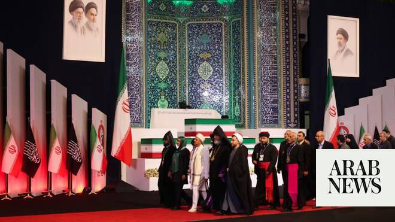

# Powerful general in Iran emerges from hiding as Tehran prepares for Khamenei’s dayslong funeral

Source: https://www.arabnews.com/node/2649510/middle-east
Captured source: https://www.arabnews.com/node/2649510/middle-east
Published: 2026-07-03T08:56:24+03:00
Modified: 2026-07-03T10:23:54+03:00
Author: AP

## Summary

DUBAI: A powerful general who leads Iran’s paramilitary Revolutionary Guard emerged from hiding as Tehran prepared Friday for the dayslong funeral for the late Supreme Leader Ayatollah Ali Khamenei. Photos published online by Iranian state media showed Gen. Ahmad Vahidi attending a meeting about the funeral of Khamenei, 86, then sitting alongside his casket as Iran’s theocracy

## Image

## Video Or Embed URLs

- blob:https://www.arabnews.com/7e7506e9-26ba-457a-b8a9-eed52fd0100f
- https://imasdk.googleapis.com/js/core/bridge3.774.0_en.html
- https://e792cf4e706c054b89642851c1ca6c6f.safeframe.googlesyndication.com/safeframe/1-0-45/html/container.html
- https://static.addtoany.com/menu/sm.25.html
- about:blank
- https://sync.teads.tv/wigo-no-slot
- https://www.google.com/recaptcha/api2/aframe
- https://cm.g.doubleclick.net/partnerpixels?gdpr=0&us_privacy=1---&gpp_sid=-1&url=https%3A%2F%2Fwww.arabnews.com%2Fnode%2F2649510%2Fmiddle-east

## Text

https://arab.news/y6szh

Vahidi has become a major player in formulating Iran’s tough stance in negotiating a possible permanent end to the war with the US

DUBAI: A powerful general who leads Iran’s paramilitary Revolutionary Guard emerged from hiding as Tehran prepared Friday for the dayslong funeral for the late Supreme Leader Ayatollah Ali Khamenei. Photos published online by Iranian state media showed Gen. Ahmad Vahidi attending a meeting about the funeral of Khamenei, 86, then sitting alongside his casket as Iran’s theocracy held a smaller service for him Thursday night near the supreme leader’s former home in downtown Tehran. Vahidi has become a major player in formulating Iran’s tough stance in negotiating a possible permanent end to the war with the United States, experts say. He is believed to be part of a small clique in direct contact with Iran’s new Supreme Leader Ayatollah Mojtaba Khamenei, who remains in hiding after being reportedly wounded in the Feb. 28 Israeli strikes that killed his father, the elder Khamenei. Vahidi himself hasn’t been seen publicly since Feb. 8, weeks before the Iran war began. Video published by Iranian state media showed the mourning ceremony for Khamenei near the husseiniyah at his compound in Tehran. An Israeli airstrike in the war’s first moments killed Khamenei and some of his family members. State media said Khamenei’s body sat within a coffin on a stage, with red tulips lined up in front of it. What appeared to be paper butterflies hung from the ceiling in front of it. The black-clad mourners, whom state media identified as coming from families of those who lost loved ones in the 12-day war in 2025 and the recent Iran war, threw scarves and other items for attendants to brush against the coffin, a common practice in Iran. Later, state media showed images of Khamenei’s casket draped by a red flag with white calligraphy reading “Ya Hussein,” a Shiite expression in remembrance of the 7th-century martyrdom of the Prophet Muhammad’s grandson. It had been flying over the Imam Hussein golden-domed shrine in Karbala, Iraq. The flag also traditionally symbolizes both the spilled blood of someone unjustly killed and a call for vengeance. On Friday morning, security forces carried Khamenei’s coffin overhead by hand as it arrived at the Grand Mosalla in Tehran. Religious leaders walked past Khamenei’s coffin, as well as others of his slain family, including his 14-month-old granddaughter, Zahra Mohammadi Golpayegani. Beginning Saturday, Iran will hold a dayslong funeral for Khamenei, and his body will be transported to cities in both Iran and neighboring Iraq. Authorities plan to shut down streets, airspace and daily life in Tehran as mourners commemorate the life of Khamenei, who led Iran for decades with an iron fist while confronting the West.
