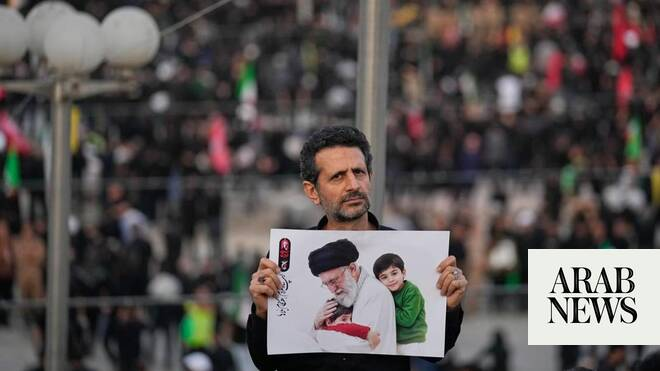

# Iran begins dayslong funeral for the late Supreme Leader Ayatollah Ali Khamenei, killed in war

Source: https://www.arabnews.com/node/2649615/middle-east
Captured source: https://www.arabnews.com/node/2649615/middle-east
Published: 2026-07-04T07:04:01+03:00
Modified: 2026-07-04T07:06:38+03:00
Author: AP

## Summary

TEHRAN, Iran: Iran began a dayslong funeral Saturday for the late Supreme Leader Ayatollah Ali Khamenei, months after an airstrike killed him at the start of the war. He was 86. Khamenei’s body was to be on display at the Grand Mosalla in Tehran, Iran’s capital. Early Saturday, mourners wearing black walked through the streets of Tehran, emptied of vehicle traffic, trying to

## Image

## Video Or Embed URLs

- https://83205415e2358b4473ea2a91dde060d1.safeframe.googlesyndication.com/safeframe/1-0-45/html/container.html
- https://static.addtoany.com/menu/sm.25.html
- about:blank
- https://imasdk.googleapis.com/js/core/bridge3.774.0_en.html
- https://www.google.com/recaptcha/api2/aframe
- https://sync.teads.tv/wigo-no-slot
- https://cm.g.doubleclick.net/partnerpixels?gdpr=0&us_privacy=1---&gpp_sid=-1&url=https%3A%2F%2Fwww.arabnews.com%2Fnode%2F2649615%2Fmiddle-east

## Text

https://arab.news/8zzhb

Iran’s government expects to see millions flood the streets of the capital

Khamenei’s body will be transported to cities in both Iran and neighboring Iraq

TEHRAN, Iran: Iran began a dayslong funeral Saturday for the late Supreme Leader Ayatollah Ali Khamenei, months after an airstrike killed him at the start of the war. He was 86. Khamenei’s body was to be on display at the Grand Mosalla in Tehran, Iran’s capital. Early Saturday, mourners wearing black walked through the streets of Tehran, emptied of vehicle traffic, trying to reach the Grand Mosalla. Some carried banners and flags, while billboards across the city bore Khamenei’s image. A crowd of men outside rhythmically beat their chests in mourning, a common practice at Shiite funerals. “I am here to say goodbye to my beloved leader Ali Khamenei,” said a weeping Hananeh Mousavi, 27, who attended the funeral alongside her mother. “I never expected to see such a day. I wish I had died before this tragedy.” An outdoor stage set up at the Grand Mosalla resembled the stage where Khamenei once gave his speeches at a husseiniyah at his compound in downtown Tehran. That site was destroyed in the Israeli airstrike that killed Khamenei and some of his family at the start of the Iran war on Feb. 28. Iran’s government expects to see millions flood the streets of the capital in scenes reminiscent of the burial of the late Supreme Leader Ayatollah Ruhollah Khomeini in 1989. “We attended the funeral to show that we are all committed to defend our country and religion,” said Ali Kazemi, who came from the northwestern city of Tabriz, some 530 kilometers (330 miles) away from Tehran. A large turnout could provide a boost for Iran’s government, particularly as it tries to leverage its hold on the Strait of Hormuz in negotiations with the United States over a permanent end to the war, and as concern still lingers that Israel could attack yet again. Iran chose July 4, the 250th anniversary of the creation of the US, to begin the funeral. While authorities did not acknowledge the timing, crowds at the ceremony in Tehran chanted: “Death to America!” — reprising a cry that’s been common in Iran since the 1979 Islamic Revolution and US Embassy takeover and hostage crisis. “We knocked the hell out of Iran,” US President Donald Trump said in a speech at the same time in South Dakota in front of Mount Rushmore. “They want to settle so badly. We gave them a week off for a funeral.” Khamenei’s body will be transported to cities in both Iran and neighboring Iraq. Authorities have shut down streets, airspace and daily life in Tehran for the mourning. It remains unclear whether Iran’s new supreme leader, Ayatollah Mojtaba Khamenei, will appear at his father’s funeral. The late supreme leader appeared in 1989 at Khomeini’s funeral, weeping visibly, as he began his journey to lead Iran for decades with an iron fist while confronting the West. Israel’s repeated threats to kill Mojtaba Khamenei drew a warning from Iran’s joint military command Thursday, which told Israel and the US “to avoid any miscalculation” over the coming days.
