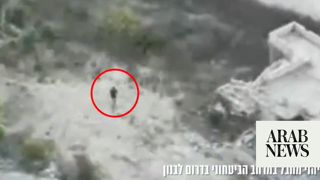

# Israeli military says killed armed militant in south Lebanon

Source: https://www.arabnews.com/node/2649689/middle-east
Captured source: https://www.arabnews.com/node/2649689/middle-east
Published: 2026-07-04T23:00:52+03:00
Modified: 2026-07-04T23:06:55+03:00
Author: AFP

## Summary

JERUSALEM: The Israeli military said on Saturday that it killed an armed militant in the “security zone” under its control in south Lebanon. “Earlier today (Saturday), IDF soldiers identified an armed terrorist operating inside the Security Zone, in the Majdal Zoun area in southern Lebanon,” the military said in a statement, adding that troops “opened fire at the terrorist”

## Image

## Video Or Embed URLs

- https://19e6d2f650392526ae3960676e52e5a0.safeframe.googlesyndication.com/safeframe/1-0-45/html/container.html
- https://static.addtoany.com/menu/sm.25.html
- about:blank
- https://www.google.com/recaptcha/api2/aframe
- https://imasdk.googleapis.com/js/core/bridge3.774.0_en.html
- https://sync.teads.tv/wigo-no-slot
- https://cm.g.doubleclick.net/partnerpixels?gdpr=0&us_privacy=1---&gpp_sid=-1&url=https%3A%2F%2Fwww.arabnews.com%2Fnode%2F2649689%2Fmiddle-east

## Text

https://arab.news/9ntv6

Israeli military said troops “opened fire at the terrorist” and, after conducting “extensive searches,” then “eliminated” him

NNA said an Israeli helicopter carried out “a broad sweep operation on the outskirts” of Majdal Zoun

JERUSALEM: The Israeli military said on Saturday that it killed an armed militant in the “security zone” under its control in south Lebanon. “Earlier today (Saturday), IDF soldiers identified an armed terrorist operating inside the Security Zone, in the Majdal Zoun area in southern Lebanon,” the military said in a statement, adding that troops “opened fire at the terrorist” and, after conducting “extensive searches,” then “eliminated” him. Lebanon’s state-run National News Agency (NNA) said an Israeli helicopter carried out “a broad sweep operation on the outskirts” of Majdal Zoun and launched five missiles toward the village, without specifying a target or immediately reporting casualties. The NNA also reported on Saturday that an Israeli strike on the village of Mansouri wounded one person, and reported Israeli artillery shelling elsewhere. Hezbollah drew Lebanon into the Middle East war on March 2 with rocket fire at Israel to avenge the killing of Iran’s supreme leader in US-Israeli strikes days earlier. Israel responded with heavy airstrikes and a ground invasion of southern Lebanon, where its troops still occupy swathes of territory near the border. At the end of June, Lebanon and Israel agreed to a US-backed framework aiming to pave the way for a permanent end to hostilities.
