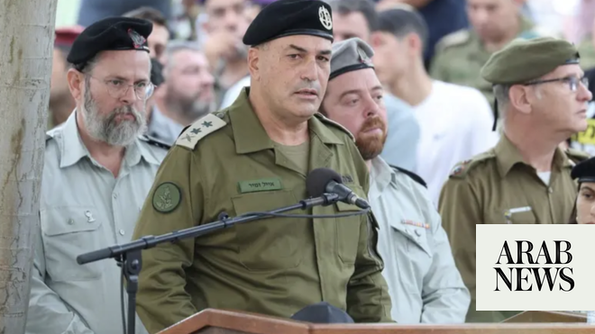

# In south Lebanon, Israel army chief vows to act ‘decisively’ against Hezbollah

Source: https://www.arabnews.com/node/2649756/middle-east
Captured source: https://www.arabnews.com/node/2649756/middle-east
Published: 2026-07-05T18:41:36+03:00
Modified: 2026-07-05T19:07:33+03:00
Author: AFP

## Summary

JERUSALEM: Israel’s military chief visited forces deployed around Beaufort castle in southern Lebanon on Sunday, vowing to push ahead with the campaign against Hezbollah. “The IDF will continue to operate decisively to remove threats from Lebanese territory and is prepared to transition rapidly to offensive operations should the ceasefire be violated,” Lt. Gen. Eyal Zamir told

## Image

## Video Or Embed URLs

- https://853d7b90ebe853b83684527ea3c70de8.safeframe.googlesyndication.com/safeframe/1-0-45/html/container.html
- https://static.addtoany.com/menu/sm.25.html
- about:blank
- https://imasdk.googleapis.com/js/core/bridge3.774.0_en.html
- https://www.google.com/recaptcha/api2/aframe
- https://cm.g.doubleclick.net/partnerpixels?gdpr=0&us_privacy=1---&gpp_sid=-1&url=https%3A%2F%2Fwww.arabnews.com%2Fnode%2F2649756%2Fmiddle-east

## Text

https://arab.news/29mjw

“The IDF will continue to operate decisively to remove threats from Lebanese territory”: Lt. Gen. Eyal Zamir

JERUSALEM: Israel’s military chief visited forces deployed around Beaufort castle in southern Lebanon on Sunday, vowing to push ahead with the campaign against Hezbollah.

“The IDF will continue to operate decisively to remove threats from Lebanese territory and is prepared to transition rapidly to offensive operations should the ceasefire be violated,” Lt. Gen. Eyal Zamir told soldiers during the visit, according to a statement issued by the military.

Israeli forces seized the crusader-era castle and the area around it recently, giving the military a strategic toehold it previously occupied for nearly two decades.

Israel says it uncovered a tunnel network beneath the castle, saying it was built to give fighters of Lebanese militant group Hezbollah a fortified strike hub just kilometers from Israeli territory.

Israel previously overran the fortress during its 1982 invasion of Lebanon, after a prolonged battle with the Palestinian fighters hidden in the castle’s maze of historic underground tunnels.

The castle was damaged by violent bombardment in the process.

Israel then used it as one of its main observation posts until its troops withdrew from the country in 2000.

“Our troops’ activities at the Beaufort Ridge and throughout southern Lebanon are being carried out in accordance with the framework of the agreement and the mechanisms established under it,” Zamir said on Sunday, referring to the recent US-brokered agreement between Israel and Lebanon intended to permanently halt hostilities.

But Zamir said that “any threat directed at our troops or the Israeli civilians will be struck immediately and eliminated.”

“The Lebanese Armed Forces are required to fulfil their commitments under the historic agreement that was signed and act to clear the area of Hezbollah terrorists and terrorist infrastructure,” he added.

Hezbollah drew Lebanon into the Middle East war on March 2 with rocket fire at Israel to avenge the killing of Iran’s supreme leader in US-Israeli strikes days earlier.

Israel responded with massive airstrikes and a ground invasion of southern Lebanon, where its troops now occupy swathes of territory near the border.
