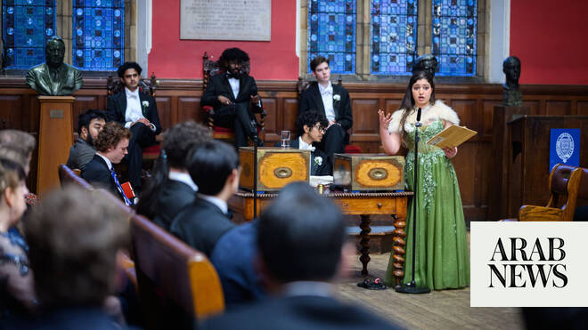

# How Oxford Union’s first Palestinian president became Britain’s most scrutinized student leader

Source: https://www.arabnews.com/node/2649784/world
Captured source: https://www.arabnews.com/node/2649784/world
Published: 2026-07-05T23:21:28+03:00
Modified: 2026-07-06T01:22:12+03:00
Author: Robert Edwards

## Summary

OXFORD: By the time Arwa Elrayess’s presidency of the Oxford Union drew to a close, she had become one of the most divisive student figures in Britain. Her name had ricocheted through newspapers and political debate, far beyond Oxford’s dreaming spires. Critics accused the 20-year-old of legitimizing extremism after leaked WhatsApp messages about Hamas and the Oct. 7, 2023,

## Image

## Video Or Embed URLs

- https://c401019d1c0b6e2214dd018ae531b663.safeframe.googlesyndication.com/safeframe/1-0-45/html/container.html
- https://static.addtoany.com/menu/sm.25.html
- about:blank
- https://www.google.com/recaptcha/api2/aframe
- https://imasdk.googleapis.com/js/core/bridge3.774.0_en.html
- https://cm.g.doubleclick.net/partnerpixels?gdpr=0&us_privacy=1---&gpp_sid=-1&url=https%3A%2F%2Fwww.arabnews.com%2Fnode%2F2649784%2Fworld

## Text

https://arab.news/bydgu

Arwa Elrayess reflects on how a childhood spent in Gaza shaped her politics and prepared her for Oxford Union’s fiercest battles

Union’s first Palestinian president discusses media scrutiny, Tommy Robinson and why controversy only strengthened her resolve

OXFORD: By the time Arwa Elrayess’s presidency of the Oxford Union drew to a close, she had become one of the most divisive student figures in Britain. Her name had ricocheted through newspapers and political debate, far beyond Oxford’s dreaming spires.

Critics accused the 20-year-old of legitimizing extremism after leaked WhatsApp messages about Hamas and the Oct. 7, 2023, attacks surfaced in the national press.

Others condemned her decision to invite far-right activist Tommy Robinson to debate Islam at the Union, arguing that Britain’s oldest debating society had crossed a line by giving him a platform.

Supporters saw something entirely different: a politically outspoken Palestinian student subjected to an extraordinary campaign of scrutiny because of who she was and what she represented.

For Elrayess, the controversies are inseparable from a much longer story — one that begins not in Oxford, but in Gaza.

“I was born in London to a Palestinian father and an Algerian mother,” she told Arab News, just days after concluding her term as president. “Our family is very political. We always used to have political discussions over the dinner table.”

But at the age of five, her family made what she jokingly describes as “quite the reverse migration,” leaving central London for Gaza: “The joke is that after the 2008 financial crash, it was better to live in Gaza, a war zone, than it was to live in central London.”

What followed, she said, fundamentally shaped both her politics and her ambitions. Meeting her Palestinian relatives, she became acutely aware that the only meaningful difference between her life and theirs was nationality.

“These people are no different to me,” she said. “They’re exceptionally intelligent ... but will never really reach the opportunities that I was afforded purely because of the fact that I have a piece of paper that says I’m British and they don’t.”

Her grandfather, a former Palestinian justice minister, maintained an extensive political library filled with correspondence, historical documents and notes to Arab leaders.

“I used to go to my grandfather’s library and essentially just read,” she said. “He would explain the Palestinian conflict. He would explain Middle Eastern politics.”

Those conversations continued until her own experience of confinement made politics intensely personal.

Elrayess recalls repeatedly travelling to the Rafah border crossing with Egypt, waiting in the heat every few weeks to learn whether her family would be permitted to leave.

“When I finally was able to leave ... it really hit me that ... I’m going to have a substantially different life to those of my cousins ... purely because I was born in Harrow (northwest London),” she said.

The experience left her with “a bit of guilt” over the opportunities she believed had been unfairly distributed. “I had to do something with them,” she said.

That conviction eventually carried her to Oxford to study philosophy, politics and economics, the course traditionally favored by Britain’s own political elite and by many of its former prime ministers.

But it was the Oxford Union — an institution founded in 1823, independent of the world-famous university but no less influential — that quickly became more than just an extracurricular activity.

Elrayess remembered watching clips of journalist and left-wing commentator Mehdi Hasan debating there years earlier and imagined herself speaking in the Union’s historic chamber.

That opportunity arrived sooner than expected.

During her first term at Oxford, she was selected to speak in a Palestine-Israel debate opposite an Israel Defense Forces soldier and a representative from UK Lawyers for Israel.

“For those 10 minutes I was able to say everything that had been bubbling inside me for the last 18 years,” she said. What happened afterwards proved just as significant.

People approached to thank her. Some said she had voiced thoughts they had felt unable to express. Others admitted they had never spoken to a Palestinian before. “They had only ever interacted with these things either through headlines or statistics,” she said.

She left convinced that the Union offered something unique — a place where deeply contested issues could be argued face-to-face rather than through caricature. “I decided I was going to continue in the Union because that was an incredible opportunity,” she said.

When Elrayess chose to run for the presidency herself, the moment carried symbolism far beyond student politics. “There had never been a Palestinian president before,” she said.

To her, the election represented proof that voices she believed had long been marginalized could find a place within one of Britain’s most prestigious institutions: “I thought to myself ... if not now, then when?”

Winning, she said, demonstrated that “people like me have a space in these institutions.”

Representation mattered for another reason.

“I probably wouldn’t have been as inclined to join the Union if it wasn’t for the fact that ... we had our first ever Arab president,” she said, referring to Ebrahim Osman-Mowafy, an Egyptian law student who was elected for the autumn term in 2024.

With an eye to her successors, she hopes others will now reach the same conclusion. “Every step forward I take is one less step someone else needs to take,” she said.

However, the backlash against her candidacy arrived almost immediately. Rumors circulated among students alleging false family links to Hamas.

Opponents attempted to portray her as antisemitic, filed electoral complaints after her victory and sought disciplinary proceedings that temporarily suspended her presidency before concluding that she had “no case to answer.”

“It started off with smaller rumors among students,” she said. “They tried to accuse me of all sorts of antisemitism.”

She described months consumed by complaints, legal correspondence and media enquiries, which cost her months of preparation time ahead of her term.

The most damaging controversy emerged later, however, when newspapers reported on leaked WhatsApp messages in which she discussed Hamas, resistance movements and the Oct. 7, 2023, attacks.

Among the most widely quoted remarks was her observation that: “Any resistance group will inevitably be deemed a terrorist organization by the West until they earn their liberation, by which time they will be lauded as heroes as history has repeatedly proven.”

Critics said Elrayess’s comments crossed a line from political explanation into moral excuse-making.

Oxford Students Against Discrimination said it was “appalled” by her messages, calling them “a failure of basic humanity” and “a betrayal of every Jewish student who has had to navigate this university under her leadership.”

A former Oxford Union committee member told the Daily Mail: “This isn’t student radicalism; it is the explicit normalization of terror.”

The Campaign Against Antisemitism, meanwhile, called the remarks “absolutely sickening,” arguing that any effort to excuse the Oct. 7 attacks should have disqualified her from holding the Union presidency.

Elrayess insisted these interpretations fundamentally distorted what she said in what was an academic discussion among politics students.

“We were having an academic discussion about how labels of terrorism are often used for political purposes,” she said, citing the example of Nelson Mandela.

However, that did not stop major news outlets picking up the story.

Elrayess has been portrayed by much of the British and international press as a highly controversial figure. The Telegraph said she suggested Hamas would be “lauded as heroes,” while the BBC highlighted her description of the Oct. 7 attacks as “proportional.”

Conservative and Jewish publications such as JNS and The Algemeiner, meanwhile, were more severe, casting her remarks as the normalization of terrorism and a cause for resignation.

Elrayess stressed that understanding violence should not be confused with endorsing it: “You can understand why people behave the way that they do without justifying or giving any moral legitimacy to it.”

Without analyzing causes, she argued, “we are bound to have these events repeat themselves.”

The experience has left her deeply skeptical of how Palestinian voices are represented in British media. “Everything that a Palestinian wants to say ... will come preemptively interpreted,” she said.

She believes context is routinely discarded in favor of headlines: “It did not matter that I provided paragraphs upon paragraphs of context ... What did matter was that they were able to find a quote that they could selectively manipulate.”

If the WhatsApp controversy dominated national newspapers, the invitation extended to Tommy Robinson reignited debate over the Oxford Union’s interpretation of free speech.

Robinson, whose real name is Stephen Yaxley-Lennon, is a British far-right anti-Islam activist and former leader of the English Defence League.

More recently he has become the figurehead of the “Unite the Kingdom” movement, which has brought tens of thousands of people onto the streets of London to oppose mass immigration and voice concerns about national identity — with the open support of X-owner Elon Musk.

The invitation to debate the motion, “This House believes the West is right to be suspicious of Islam,” provoked resignations, protests and criticism that the Union was legitimizing far-right, anti-Muslim extremism. Elrayess rejected that premise entirely.

“The Union is not there to grant moral legitimacy,” she said, pointing instead to the institution’s long history of hosting controversial figures. “We’ve invited extremists and radicals and criminals and prisoners.”

The purpose, she argued, is not endorsement. “We invite them because their views are influential and consequential enough that they deserve to be challenged.”

Her defense rests on a distinction between platforming and scrutinizing. “What is inherently dangerous is giving someone a platform and then not giving them adequate scrutiny,” she said, arguing that Robinson already possesses an enormous audience online: “What he doesn’t have is people who come up and confront him.”

Events on the night reinforced her conviction.

Protests outside the Union on June 17 escalated into disorder, with around 200 activists blocking the surrounding streets. Elrayess said demonstrators prevented many Muslim attendees from entering the chamber to question Robinson.

“They ultimately ended up creating what they were fearful of from the start,” she said, saying her own parents were among those caught outside. “My mother, who’s a hijabi, had cans thrown at her and people spat in her face,” she claimed.

Despite everything, Elrayess insists she never felt isolated within Oxford itself. Committee members, including Jewish colleagues with whom she disagreed politically, defended her publicly.

“Everyone who’s read any of the articles ... came up in my defense,” she said. Many viewed the reporting as “a character assassination.”

She also rejected suggestions that the pressure made her reconsider speaking openly: “If their intention was to intimidate me into silence ... they’ve done the very opposite.”

Instead, she argued, the experience strengthened her commitment to free speech as a principle that must apply even to those whose views she opposes. One day, she said, similar arguments could be used against Palestinians themselves.

“I never want there to be a day where Palestinians like myself feel like they need to be shunned and intimidated into silence,” she said.

Asked how she hoped history would remember her presidency, she returned to the themes that have run through her life — from Gaza to Oxford, from her grandfather’s library to the Union chamber: representation, free speech and resilience.

She hopes that being the first Palestinian president will encourage others from underrepresented communities to believe they belong. “I hope I leave some form of inspiration,” she said.

She also hopes her presidency demonstrated that freedom of expression means defending speech consistently, not selectively. “Free speech is a two-way street,” she said.

And whatever her critics intended, she added, they failed in one objective above all: “They only really win when such attempts are successful in silencing and intimidating us.”
