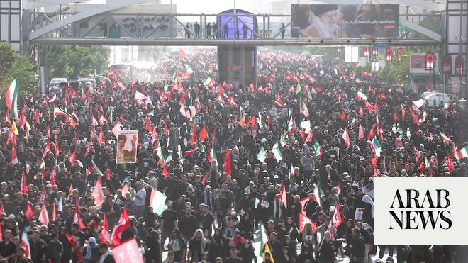

# Iranian mourners call for vengeance on Trump during Khamenei funeral procession

Source: https://www.arabnews.com/node/2649806/middle-east
Captured source: https://www.arabnews.com/node/2649806/middle-east
Published: 2026-07-06T12:29:13+03:00
Modified: 2026-07-06T14:52:58+03:00
Author: Agencies

## Summary

TEHRAN: Crowds of Iranians marched through the streets of Tehran on Monday in a funeral procession for slain leader ​Ayatollah Ali Khamenei, the biggest day yet in a week of massive memorial ceremonies demonstrating the grip of surviving clerical leaders. Drone footage on state television showed many tens of thousands of people crammed into a boulevard in central Tehran. The

## Image

## Video Or Embed URLs

- blob:https://www.arabnews.com/4eaa1855-58a6-420c-b7ef-4580a67b7ae5
- https://imasdk.googleapis.com/js/core/bridge3.774.0_en.html
- https://119c5cb5f549cb3b0fe619e234ca7b1d.safeframe.googlesyndication.com/safeframe/1-0-45/html/container.html
- about:blank
- https://static.addtoany.com/menu/sm.25.html
- https://ep2.adtrafficquality.google/sodar/sodar2/255/runner.html
- https://www.google.com/recaptcha/api2/aframe
- https://cm.g.doubleclick.net/partnerpixels?gdpr=0&us_privacy=1---&gpp_sid=-1&url=https%3A%2F%2Fwww.arabnews.com%2Fnode%2F2649806%2Fmiddle-east

## Text

https://arab.news/pv6th

Mourners hurl rocks at billboard of US President Donald Trump

Sons of slain leader pray at coffins but no appearance by successor Mojtaba

TEHRAN: Crowds of Iranians marched through the streets of Tehran on Monday in a funeral procession for slain leader ​Ayatollah Ali Khamenei, the biggest day yet in a week of massive memorial ceremonies demonstrating the grip of surviving clerical leaders.

Drone footage on state television showed many tens of thousands of people crammed into a boulevard in central Tehran.

The coffins of the slain leader and four of his family members were driven in a large truck through the streets, while fire hoses sprayed water from above to keep the marchers cool.

As they passed under a bridge mourners hurled stones at a billboard hung from above showing ‌US President ‌Donald Trump with a bullet aimed at his head.

“The US ​killed ‌our ⁠father,” ​it read. “We ⁠won’t let you go!”

The crowds waved Iranian flags and red banners with a slogan calling out to the “avengers of Khamenei,” adapting a phrase at the heart of Shiite Islam since the grandson of the Prophet Muhammad was killed in battle in the seventh century.

Iran’s theocracy planned to see large crowds attend the ceremony across the city to show popular support for the government.

The 1989 funeral of his predecessor, Ayatollah Ruhollah Khomeini, drew some 10 million people, according to state news agency IRNA, and crowd surges killed more than 10 people and injured over 10,000.

Thousands had filled the Grand Mosalla on Sunday, where they paid their respects to Khamenei and four family members, all killed on February 28 in Israeli airstrikes based on US intelligence.

Massive concrete walls separated the public from the coffin to prevent stampedes.

It is unclear what level of access and proximity the public will have during the procession, but authorities are mindful that in 1989 they were forced to use a helicopter to transport Khomeini for burial after mourners stormed his vehicle, causing his burial shroud to tear and his body to fall to the ground.

As well as laying to rest the man who ruled the Islamic republic for more than three-and-a-half decades, the funerals are a chance for Iran’s authorities to burnish their resilience after five weeks at war with Israel and the United States.

Iran’s speaker of parliament and chief negotiator with the US, Mohammad Bagher Ghalibaf — one of the most prominent faces of the post-Ali Khamenei era — hailed on X how the “proud and invincible nation of Islamic Iran unanimously” paid tribute to its “martyr.”

Monday’s procession will be followed by similar events in the clerical hub of Qom on Tuesday and in Iraq’s holy cities of Najaf and Karbala on Wednesday, culminating in Khamenei’s burial in his hometown of Mashhad in northeastern Iran on Thursday.

Three of Ali Khamenei’s sons made a rare public appearance at the funeral on Sunday, further highlighting the absence of Mojtaba Khamenei, who was named supreme leader shortly after his father’s killing but has yet to appear in public.

Officials have said he was wounded in the airstrikes but the severity of his injuries remains unclear.

The new commander of the powerful Revolutionary Guards, Ahmad Vahidi, whose predecessor was killed on February 28, appeared at the funerals for a second time on Sunday, this time in the open air, after he went unseen throughout the war.

Esmail Qaani, the shadowy head of the Guards’ Quds Force — responsible for its foreign operations — also made a rare appearance.

While Iranian authorities have been keen to present a united front, none of President Masoud Pezeshkian’s surviving predecessors, who had tensions in their relationship with Khamenei, have so far been seen at the ceremonies.

The government is also eager to tout the mass mobilization in support of the authorities after mass protests in January that rights groups say were quelled by a crackdown that killed thousands of people.

The Middle East war is on hold following a ceasefire and an initial accord struck with the US. Both Washington and Tehran have warned they are ready to resume military action, and vengeance has been a major theme at the funerals.

“The killers (of Khamenei) must face punishment,” a 38-year-old man who gave his surname as Miremadi told AFP at the prayers on Sunday.

“We back our revolution and our leader, and we demand revenge for the blood of our loved ones,” said a woman, 39, with the surname Bakand.

Khamenei long pursued a course of confrontation with the West, and Tehran for years has provided support to anti-US and anti-Israel armed groups around the Middle East, including Palestinian Hamas and Lebanon’s Hezbollah, who both sent delegations to the ceremonies.
