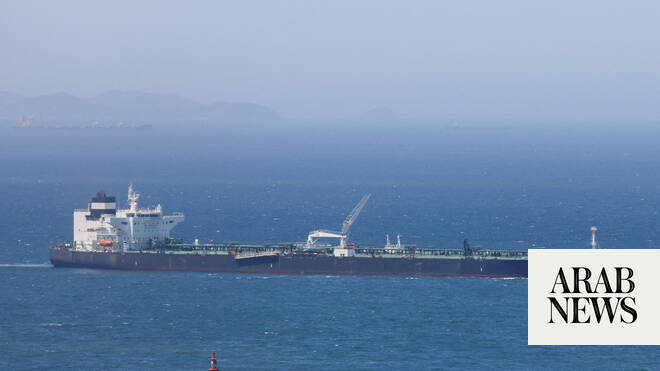

# Iran fires missiles at commercial ships in Strait of Hormuz, Axios reports

Source: https://www.arabnews.com/node/2649917/middle-east
Captured source: https://www.arabnews.com/node/2649917/middle-east
Published: 2026-07-07T06:28:50+03:00
Modified: 2026-07-07T06:56:49+03:00
Author: Reuters

## Summary

Iran’s Revolutionary Guards fired at least two missiles at commercial ships transiting through the Strait of Hormuz on Monday night, Axios reported, citing two US officials. Two commercial ships suffered significant damage but had no casualties, the report said, citing a US official. Separately, Britain’s maritime security agency said a tanker caught fire after being hit by an

## Image

## Video Or Embed URLs

- https://184382ba46610faf1ccf690d84b4a24c.safeframe.googlesyndication.com/safeframe/1-0-45/html/container.html
- https://static.addtoany.com/menu/sm.25.html
- about:blank
- https://www.google.com/recaptcha/api2/aframe
- https://imasdk.googleapis.com/js/core/bridge3.774.0_en.html
- https://cm.g.doubleclick.net/partnerpixels?gdpr=0&us_privacy=1---&gpp_sid=-1&url=https%3A%2F%2Fwww.arabnews.com%2Fnode%2F2649917%2Fmiddle-east

## Text

https://arab.news/mrzgj

Two commercial ships suffered significant damage but no casualties, Axios reports

UKMTO says tanker hit by unidentified projectile east of Oman’s Limah, fire reported

Iran’s Revolutionary Guards fired at least two missiles at commercial ships transiting through the Strait of Hormuz on Monday night, Axios reported, citing two US officials.

Two commercial ships suffered significant damage but had no casualties, the report said, citing a US official.

Separately, Britain’s maritime security agency said a tanker caught fire after being hit by an unknown projectile east of Oman’s Limah early on Tuesday.

The United Kingdom Maritime Trade Operations agency (UKMTO) said early ‌on Tuesday ‌that the tanker was struck on its port side while traveling ​southbound ‌about ⁠8 ​nautical miles (15 ⁠km) east of Limah, causing a fire.

No casualties or environmental impact had been reported.

Reuters could not immediately verify the Axios report or determine whether the ships described in that report included the tanker cited in the UKMTO advisory.

Iranian state television said a liquified natural gas tanker was attacked in Strait of Hormuz off Oman after ignoring warnings, AP reported.

US Central Command did not immediately respond to a request for comment.

The reports underscored the risks to shipping around the Strait of Hormuz, the narrow waterway between Iran and Oman through which about a fifth of global oil consumption passes. Commercial vessels have come under ⁠attack during the war that began with US-Israeli strikes on Iran, despite ‌an interim agreement that included safe-passage provisions.

Indirect US-Iran talks ‌ended last week without any public sign of headway toward a ​lasting peace, despite a 60-day ceasefire intended ‌to create space for diplomacy following the US and Israeli strikes that triggered the conflict.

President ‌Donald Trump said on Monday the US would either reach a deal with Iran or “finish the job,” renewing his threat of military action as Tehran projects defiance following the funeral of former Supreme Leader Ayatollah Ali Khamenei.

‘Ready to fire at you’

Iran’s Revolutionary Guards warned ships via maritime radio over the weekend that “our missiles ‌and drones are ready to fire at you,” the Wall Street Journal reported on Monday, quoting from a recording it obtained.

One of the ⁠vessels under attack ⁠appeared to be Al Rekayyat, a liquefied natural gas tanker owned and managed by Nakilat, also known as Qatar Gas Transport Company Ltd, which operates one of the world’s largest LNG shipping fleets, the WSJ said, adding that the ship had been hit on the port side, at the top of the engine room.

“Engine room fire and full of smoke. Unable to assess further damage. All crew are safe and mustered on the starboard side,” the WSJ quoted from a recording.

The vessel was at the mouth of the strait, in the Gulf of Oman, when it was attacked, the WSJ reported.

Nakilat, QatarEnergy and Qatar’s International Media Office did not immediately respond to requests for comment sent outside normal business hours.

Investors have been keeping a ​close eye on talks between the US and ​Iran over the fate of shipping through the Strait of Hormuz while tracking the recovery in Gulf oil exports.
