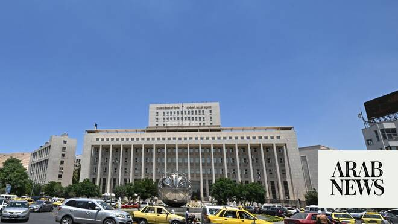

# Bomb attacks wound 18 in Damascus as Macron visits

Source: https://www.arabnews.com/node/2649942/middle-east
Captured source: https://www.arabnews.com/node/2649942/middle-east
Published: 2026-07-07T10:28:59+03:00
Modified: 2026-07-07T14:25:24+03:00
Author: ReutersArab News

## Summary

DAMASCUS: Bombs exploded near the hotel where Emmanuel Macron was staying in Syria on Tuesday, a security source said, but the French president did not hear the explosions, the Elysee said, and he met Syrian President Ahmed al-Sharaa soon afterwards. Macron is said to be safe and unharmed and is continuing with his visit. Eighteen people were injured including four police,

## Image

## Video Or Embed URLs

- blob:https://www.arabnews.com/8d00fe2e-88f8-477f-8998-65477c60b789
- https://imasdk.googleapis.com/js/core/bridge3.774.0_en.html
- https://945c570112d5b8226efa0483716872d7.safeframe.googlesyndication.com/safeframe/1-0-45/html/container.html
- about:blank
- https://static.addtoany.com/menu/sm.25.html
- https://www.google.com/recaptcha/api2/aframe
- https://cm.g.doubleclick.net/partnerpixels?gdpr=0&us_privacy=1---&gpp_sid=-1&url=https%3A%2F%2Fwww.arabnews.com%2Fnode%2F2649942%2Fmiddle-east

## Text

https://arab.news/mhs9w

DAMASCUS: Bombs exploded near the hotel where Emmanuel Macron was staying in Syria on Tuesday, a security source said, but the French president did not hear the explosions, the Elysee said, and he met Syrian President Ahmed al-Sharaa soon afterwards.

Macron is said to be safe and unharmed and is continuing with his visit.

Eighteen people were injured including four police, according to the Syrian state news agency.

Security Forces detected two explosive devices during field operations and specialized units initiated the necessary measures to dismantle them. The devices blew up while preparations to dismantle them were underway.

Preliminary inspection revealed that the first device was placed inside a vehicle parked by the roadside, while the second was inside a trash bin.

Investigations are ongoing to uncover the circumstances of the attack and identify those involved.

The blasts underscore the major security challenges in Syria, where Macron is the first head of state of a European Union country to visit since rebels led by Sharaa toppled Bashar Assad in 2024.

A witness heard explosions in the vicinity and saw smoke rising. Roads were sealed off and security measures were implemented, the security source said.

The Elysee said the blasts were not audible from the presidential motorcade and a Reuters journalist with the press group accompanying Macron did not hear the blast or see any commotion during the French president's morning events.

State television later reported that Macron and Sharaa were meeting at the Syrian Presidential Palace.

Macron’s visit has highlighted Syria’s geopolitical transformation under Sharaa, a former al Qaeda commander who has established close ties with Western and Middle Eastern powers that shunned Assad, as he seeks to rebuild a country shattered by 13 years of war.

During the Syrian conflict, a range of militant groups including Islamic State gained a foothold in the country.

Sharaa, a member of Syria’s Sunni Muslim majority, has pledged to build an inclusive new order in Syria since ending more than five decades of iron-fisted rule by the Assad family. But his promise has been tested by bouts of violence pitting pro-government forces against members of religious and ethnic minority groups, with many hundreds killed last year.
