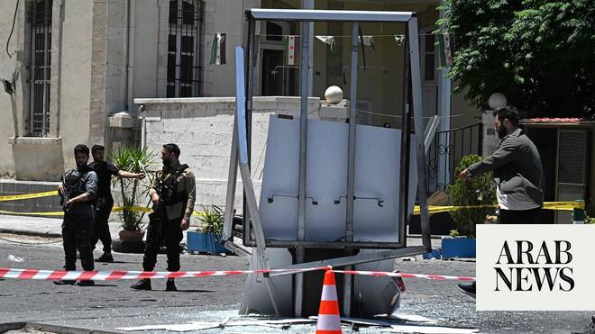

# Bomb attack rocks Damascus during Macron visit

Source: https://www.arabnews.com/node/2649942/middle-east
Captured source: https://www.arabnews.com/node/2649942/middle-east
Published: 2026-07-07T10:28:59+03:00
Modified: 2026-07-07T18:40:20+03:00
Author: AFP

## Summary

DAMASCUS: Two bombs exploded on Tuesday near ​a hotel in Damascus where French President Emmanuel Macron spent the night, wounding 18 people and overshadowing the first visit to Syria by a European Union head of state since Bashar Assad was toppled. Macron, whose motorcade left the hotel shortly before the blasts, pressed ahead with his visit, meeting President Ahmed Al-Sharaa

## Image

## Video Or Embed URLs

- blob:https://www.arabnews.com/bb32b8f6-fb95-4254-89cd-4416bff5936d
- https://imasdk.googleapis.com/js/core/bridge3.774.0_en.html
- https://c6c18490d88361213343a4a2badca9d9.safeframe.googlesyndication.com/safeframe/1-0-45/html/container.html
- about:blank
- https://static.addtoany.com/menu/sm.25.html
- https://ep2.adtrafficquality.google/sodar/sodar2/255/runner.html
- https://www.google.com/recaptcha/api2/aframe
- https://cm.g.doubleclick.net/partnerpixels?gdpr=0&us_privacy=1---&gpp_sid=-1&url=https%3A%2F%2Fwww.arabnews.com%2Fnode%2F2649942%2Fmiddle-east

## Text

https://arab.news/mhs9w

Explosions struck a busy area of Damascus between the Tourism Ministry and the national museum across the street from the Four Seasons hotel

DAMASCUS: Two bombs exploded on Tuesday near ​a hotel in Damascus where French President Emmanuel Macron spent the night, wounding 18 people and overshadowing the first visit to Syria by a European Union head of state since Bashar Assad was toppled. Macron, whose motorcade left the hotel shortly before the blasts, pressed ahead with his visit, meeting President Ahmed Al-Sharaa at the presidential palace. His office said he had not heard the blasts. The attack underlined lingering security challenges facing Sharaa who has built close ties with Western states as he has sought to rebuild a country shattered by 13 years of civil war.

The explosions struck a busy area of Damascus between the Tourism Ministry and the national museum across the street from the Four Seasons hotel, where a source in Macron’s delegation and Syrian security sources said he had spent the night and had met civil ‌society groups on ‌Tuesday morning. Posting on X just after the blasts, Macron said his visit continued and praised the “dignity, ​courage ‌and ⁠determination” of Syrians ​he ⁠had met. “We are not naive about the risks, but they are being managed,” Macron said later in a news conference with Sharaa. “Certain groups” sought to prevent “Syria’s full and complete reintegration into the international community,” he added.

Macron also said France was working to redefine its security and military cooperation with Syria, including the potential support of French special forces to fight Daesh, which has claimed several attacks on Syrian forces this year. There was no immediate claim of responsibility for Tuesday’s attack. Sharaa said investigations were ongoing. Macron, who led calls for the lifting of Western sanctions on Syria last year, was accompanied by business leaders, including the CEOs of TotalEnergies and shipping group CMA CGM. He said France was ready to help rebuild Syria’s economy and banking sector.

The Elysee said CMA ⁠CGM signed a partnership deal with Syria, including air cargo freight handling at Damascus airport, and that France ‌and Syria would start a process to restore to Syria €51 million ($58.3 million) of assets confiscated ‌from the late Rifaat Assad, Bashar’s uncle. TotalEnergies’ CEO said his company would discuss signing ​an offshore exploration contract with Syrian officials, but that lingering insecurity meant a ‌return to onshore oil activities was still not a viable option.

The first blast hit soon after Macron’s motorcade left ‌for the presidential palace. Reuters footage showed flames and smoke billowing from the site, when a second explosion was caught on camera a few meters (yards) away. The second blast went off next to an ambulance parked at the scene, where some two dozen people had gathered. Reuters video showed Macron’s motorcade heading along a highway toward the presidential palace before the blasts. Daesh, an adversary of Sharaa during the civil war, declared a new phase of operations against his government in February. Aron Lund of the ‌Century International think-tank said such attacks could dent confidence in Syria’s recovery, but they posed no threat to government control over the country. “It’s a worrying phenomenon, but I don’t think we should overstate it. ⁠It’s been 1-1/2 years and Islamic ⁠State hasn’t re-emerged in the way many feared,” he said.
