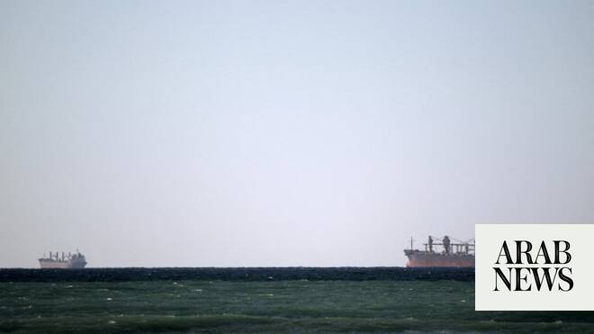

# US revokes temporary sanctions waiver on Iranian oil

Source: https://www.arabnews.com/node/2650024/middle-east
Captured source: https://www.arabnews.com/node/2650024/middle-east
Published: 2026-07-07T22:38:07+03:00
Modified: 2026-07-07T22:39:42+03:00
Author: AFP

## Summary

WASHINGTON: The US Treasury Department on Tuesday revoked a license that temporarily lifted oil sanctions on Iran, calling Tehran’s actions in the Strait of Hormuz “wholly unacceptable.” “Iran’s actions in the Strait were wholly unacceptable to the United States and will be met with consequences,” a US official told AFP, after attacks on tankers in the key waterway. The waiver

## Image

## Video Or Embed URLs

- https://f078de68427456e2ee734abf87029a4c.safeframe.googlesyndication.com/safeframe/1-0-45/html/container.html
- https://static.addtoany.com/menu/sm.25.html
- about:blank
- https://www.google.com/recaptcha/api2/aframe
- https://imasdk.googleapis.com/js/core/bridge3.774.0_en.html
- https://sync.teads.tv/wigo-no-slot
- https://cm.g.doubleclick.net/partnerpixels?gdpr=0&us_privacy=1---&gpp_sid=-1&url=https%3A%2F%2Fwww.arabnews.com%2Fnode%2F2650024%2Fmiddle-east

## Text

https://arab.news/9khzb

Washington’s move comes after three tankers including a Qatari LNG vessel were struck

The official maintained: “Our negotiators continue to work in good faith toward a final deal“

WASHINGTON: The US Treasury Department on Tuesday revoked a license that temporarily lifted oil sanctions on Iran, calling Tehran’s actions in the Strait of Hormuz “wholly unacceptable.” “Iran’s actions in the Strait were wholly unacceptable to the United States and will be met with consequences,” a US official told AFP, after attacks on tankers in the key waterway. The waiver announced in June had originally allowed the Islamic republic to produce, sell and deliver crude oil and related products through August 21. Washington’s move comes after three tankers including a Qatari LNG vessel were struck within hours in the Strait of Hormuz, according to maritime monitors and Qatar. Peace mediator Doha denounced an “unacceptable” Iranian attack. The developments have revived concerns about freedom of navigation after Iran lifted its blockade of the waterway following a fragile ceasefire with the United States. The US official, speaking on condition of anonymity, said Tuesday that its memorandum of understanding with Iran “is entirely performance-based,” warning that Tehran will only see benefits if it shows “good behavior.” But the official maintained: “Our negotiators continue to work in good faith toward a final deal.” The future of Hormuz, the main route for Gulf energy exports, has been a sticking point during negotiations between Tehran and Washington to permanently end the conflict that began in late February.
