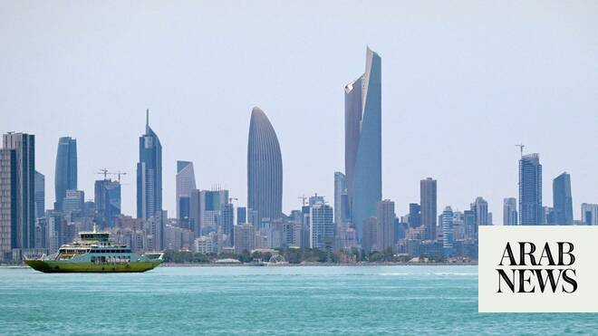

# Iran targets sites in Bahrain, Kuwait after wave of US strikes

Source: https://www.arabnews.com/node/2650053/middle-east
Captured source: https://www.arabnews.com/node/2650053/middle-east
Published: 2026-07-08T08:19:45+03:00
Modified: 2026-07-08T10:30:28+03:00
Author: Reuters

## Summary

Iran’s Revolutionary Guards said they targeted US military sites in Bahrain and Kuwait on Wednesday after the US launched a wave of military strikes on Iran in response to attacks on tankers in the Strait of Hormuz. In the latest blow to the fragile ceasefire agreement, the Islamic Revolutionary Guard ​Corps said it carried out a joint missile and drone operation against key

## Image

## Video Or Embed URLs

- blob:https://www.arabnews.com/c0943863-d4b6-4916-b13e-a1a19f739dc7
- https://imasdk.googleapis.com/js/core/bridge3.776.0_en.html
- https://01f9f3ba5ad7c914c8b5a4afaa2273ab.safeframe.googlesyndication.com/safeframe/1-0-45/html/container.html
- https://static.addtoany.com/menu/sm.25.html
- about:blank
- https://ep2.adtrafficquality.google/sodar/sodar2/255/runner.html
- https://www.google.com/recaptcha/api2/aframe
- https://cm.g.doubleclick.net/partnerpixels?gdpr=0&us_privacy=1---&gpp_sid=-1&url=https%3A%2F%2Fwww.arabnews.com%2Fnode%2F2650053%2Fmiddle-east

## Text

https://arab.news/9hncv

US earlier launched a wave of military strikes on Iran in response to attacks on tankers in the Strait of Hormuz

US sites in Bandar Salman, Bahrain’s Fifth Naval District and Ali Al Salem Air Base in Kuwait, targeted by Iran

At least four oil and gas tankers turn back from Hormuz strait after vessel attacks

Iran’s Revolutionary Guards said they targeted US military sites in Bahrain and Kuwait on Wednesday after the US launched a wave of military strikes on Iran in response to attacks on tankers in the Strait of Hormuz.

In the latest blow to the fragile ceasefire agreement, the Islamic Revolutionary Guard ​Corps said it carried out a joint missile and drone operation against key US military sites in Bandar Salman, Bahrain’s Fifth Naval District and Ali Al Salem Air Base in Kuwait, and shot down a US MQ9 drone attempting to interfere in the operation. Air raid sirens sounded in Bahrain and Kuwait, officials said.

The Kuwaiti army said air defenses were confronting “hostile” missile and drone attacks. The US earlier unleashed fresh military strikes and revoked a license allowing Iran to sell oil in response to attacks on three tankers in the strait.

The US Central Command said more than 60 small boats of the Islamic Revolutionary Guard Corps were among the targets hit, in a bid to impose a heavy cost on Iran for strikes on shipping in violation of the ceasefire.

“The unwarranted aggression by Iranian forces is a clear and dangerous violation of the ceasefire and undermines freedom of navigation,” CENTCOM said in a statement.

Two military bases in Iran’s southern province of Bushehr were targeted, a provincial official told Fars News Agency. There were no reports of casualties yet.

Iran’s top joint military command, Khatam Al-Anbiya Central Headquarters, condemned the US strikes as ‌a “blatant act of aggression,” threatened ‌a “crushing response,” and warned that Tehran would not allow US interference in the management of the strait.

A top ​Iranian ‌negotiator, ⁠parliament speaker ​Mohammad ⁠Bagher Ghalibaf, accused the US of breaching the ceasefire agreement. He cited not only the latest US military strikes, but renewed oil sanctions, violations of Iranian “adjustments” in the Strait of Hormuz, and Israeli attacks against Lebanon.

“The era of bullying and extortion is over,” Ghalibaf said in a post on X. “We don’t fold.”

Iranian media earlier reported explosions in Iran’s main oil hub of Kharg Island, on Qeshm Island and in the southern port cities of Sirik and Bandar Abbas.

Iran’s Press TV reported several blasts were heard in southern Kharg Island. CENTCOM made no mention of Kharg Island, from which Iran exports 90 percent of its crude oil.

A US official told Reuters that strikes targeted Iranian air defense systems, coastal surveillance systems, surface-to-air missiles, anti-ship cruise missiles and drone launch sites.

No civilian deaths were reported in Iran, but several people were injured by shrapnel from an “enemy projectile” that hit a commercial pier ⁠in Sirik, according to an Iranian state TV reporter. The reports said strikes also hit fishing piers in Sirik and ‌in Bandar Abbas.

The incidents were the latest threat to the fragile ceasefire agreement the US and Iran ‌struck last month, pausing the conflict that started with US and Israeli strikes across the Islamic Republic.

Four oil and gas tankers turn back from Hormuz strait after vessel attacks

At least four oil and gas tankers have turned back from attempting to transit the Strait of Hormuz, ship-tracking data showed, as renewed attacks on vessels in the ​critical waterway heightened safety and security concerns.

The diversions come after a Qatari liquefied natural gas tanker and a Saudi-flagged crude oil tanker were damaged near the strait on Tuesday following reports that Iran fired missiles at ships in the waterway, prompting maritime authorities to raise the threat risk for transiting vessels to “severe.”

LNG tankers — Al Ghariya, Duhail and Al Ruwais — have all been inching westward toward the Strait of Hormuz before changing ‌course to ‌turn away late on Tuesday, showed data ​from analytics ‌firms ⁠Kpler ​and LSEG. ⁠All three tankers controlled by QatarEnergy were empty and heading toward Qatar’s Ras Laffan export facility to load cargoes.

Meanwhile, LSEG and Kpler data also showed an Indian-flagged tanker, carrying 2 million barrels of Kuwaiti crude loaded late last week, made a U-turn off the tip of Oman at the Strait of Hormuz on Wednesday.

In a potentially major blow to that agreement, Washington moved on Tuesday to ‌withdraw a key concession that had allowed Iran to sell oil on international markets.

Oil prices rose more than 3 percent after the US announced the move.

A ‌US official said earlier that negotiators continued to work in good faith toward a final agreement with Iran. But control of the strait has given Tehran immense leverage, effectively allowing it to force a stalemate with the world’s most powerful military.

Analysts say Tehran uses attacks on ships to underscore that leverage as it negotiates a long-term peace deal with the US Under the interim US-Iran agreement, the US Treasury issued a June 22 general license to allow the sale of crude oil and petrochemical and petroleum products of Iranian origin through August 21. In ‌revoking that license on Tuesday, it gave Iran until July 17 to wind down any transactions.

Any measure necessary

Iran’s foreign ministry condemned the move as a breach of the framework agreement to end the war and said Washington ⁠would bear responsibility for the consequences.

The ministry ⁠said early on Wednesday that Iran would take any measure it deemed necessary to safeguard its interests and national security. While Tehran denied responsibility for the latest strikes on ships in the strait, Qatar blamed Iran for attacking the vessels, including the huge Qatari liquefied natural gas tanker, the Al Rekayyat, which reported being struck by a drone that caused a fire in its engine room. The crew were safe and being evacuated.

Iran’s foreign ministry said Qatar’s accusations were perplexing and that Tehran was diligently fulfilling its commitments.

Even so, it said commercial vessels faced risks for using routes not coordinated with Iran.

A second US official, speaking on condition of anonymity, said initial indications were that Iran had fired at three commercial vessels.

Iran’s rulers aim to install a permanent system to collect fees in what would amount to a huge shift of the balance of power in a region where Washington has long acted as guarantor of security.

The US strikes came after huge crowds mourned Iran’s Supreme Leader Ayatollah Ali Khamenei in the holy city of Qom.

Khamenei was killed with his daughter, granddaughter, son-in-law and daughter-in-law on the war’s first day.

The ceasefire was intended to provide a 60-day ​window for negotiations on a permanent agreement, but indirect talks in Qatar ended ​last week with no sign of headway.

US President Donald Trump has repeatedly threatened to resume bombing unless Iran agrees to “make a deal.”

Iran’s Foreign Minister Abbas Araghchi said that under the terms of the interim ceasefire memorandum, negotiations on the final deal would “not commence if threats continue.”
