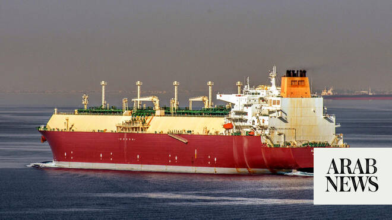

# Qatari LNG tanker awaits salvage off Oman after projectile strike

Source: https://www.arabnews.com/node/2650142/middle-east
Captured source: https://www.arabnews.com/node/2650142/middle-east
Published: 2026-07-08T18:50:41+03:00
Modified: 2026-07-08T18:59:35+03:00
Author: Reuters

## Summary

LONDON/DOHA: A Qatari LNG tanker remained stranded off Oman on Wednesday after ​a projectile strike sparked a fire in its engine room, though industry sources said the vessel’s cargo appeared secure and the risk of an explosion was low for now. The attacks on the tankers prompted Washington to revoke a license allowing Iran to sell oil and US forces to strike Iranian targets

## Image

## Video Or Embed URLs

- https://e64ceec3c5e915212d809a861921a673.safeframe.googlesyndication.com/safeframe/1-0-45/html/container.html
- https://static.addtoany.com/menu/sm.25.html
- about:blank
- https://imasdk.googleapis.com/js/core/bridge3.774.0_en.html
- https://www.google.com/recaptcha/api2/aframe
- https://cm.g.doubleclick.net/partnerpixels?gdpr=0&us_privacy=1---&gpp_sid=-1&url=https%3A%2F%2Fwww.arabnews.com%2Fnode%2F2650142%2Fmiddle-east

## Text

https://arab.news/gtfch

Al Rekayyat was among three vessels attacked in the Strait of Hormuz, prompting US airstrikes on Iran

Some tankers turning round and halting voyages through the strait

LONDON/DOHA: A Qatari LNG tanker remained stranded off Oman on Wednesday after ​a projectile strike sparked a fire in its engine room, though industry sources said the vessel’s cargo appeared secure and the risk of an explosion was low for now. The attacks on the tankers prompted Washington to revoke a license allowing Iran to sell oil and US forces to strike Iranian targets overnight.

President Donald Trump said on Wednesday an interim agreement to end the war with Iran was “over,” comments that triggered a 5 percent jump in global oil prices. The US military also said two other tankers had been targeted by Iran in recent days. The head of the UN shipping agency condemned the attacks over the past 48 hours and urged parties to allow the evacuation of stranded ships. At least four oil and gas tankers have turned back from trying to transit the strait, ship-tracking data showed ‌on Wednesday. LNG tankers ‌are among the highest-risk ships in the region due to the high value of the ​vessels ‌and ⁠their cargoes.

Qatari LNG tanker Al Rekayyat, loaded with liquefied natural gas, was hit on its port side overnight on Tuesday, one source said, while another briefed on the matter said the vessel was at risk of exploding due to a fire in its engine room. Efforts are continuing to extinguish the fire, an industry source familiar with the matter told Reuters. All the crew have been safely evacuated. The LNG stored in the tanker’s tanks remains intact and there is no breach of those tanks, the industry source said. Another industry source assessed that as long as the vessel was not subject to any further attack, it was likely to remain in its current state and not explode. “Breaching a main tank ⁠would be catastrophic,” the second industry source added. Two vessels — a tug boat and a separate service ‌ship — are currently near the tanker, which is located near the entrance of the Strait ‌of Hormuz and close to Oman’s coast, the LSEG and MarineTraffic ship tracking data ​showed. Nakilat, also known as Qatar Gas Transport Company Ltd, which owns ‌the Al Rekayyat tanker, did not respond to a request for comment, nor did QatarEnergy. Qatar’s foreign ministry said on Tuesday ‌that Iran bore full legal responsibility for the attack, and summoned the deputy Iranian ambassador to protest the targeting of the tanker. It is the first time an LNG ship from Qatar, a mediator in talks between the United States and Iran, has been struck since the start of the Iran war on February 28.

'Severe' threat level

The US Navy-led Joint Maritime Information Center on Tuesday raised the threat level to transit the strait ‌to “severe” from “substantial” following the attacks on the Al Rekayyat and the two other tankers. One of the other two ships targeted was the Saudi-flagged crude oil supertanker Wedyan.

Its Saudi-based operator Bahri said ⁠on Wednesday the vessel was “involved ⁠in an incident” while sailing through the strait on July 7, adding that the tanker was in a “seaworthy condition” with the cargo secure and there were no crew injuries. The other tanker targeted was the Liberia-flagged supertanker Cyprus Prosperity. The UN’s International Maritime Organization (IMO) said sailings through Hormuz should be avoided “as long as the safety and security of crews cannot be assured.” “No seafarer should have to risk their life simply for doing their job,” IMO Secretary-General Arsenio Dominguez said in a statement. An IMO initiative to get hundreds of stranded ships and thousands of seafarers out was paused in late June due to a previous attack on a ship by Iran. Around 14 LNG tankers were anchored on Wednesday off the coast of Qatar’s Ras Laffan terminal, with one vessel, Umm Al Amad, at the terminal loading, according to analysis from Kpler. Only four tankers sailed through the strait in the early hours of Wednesday versus an average of 34 ships last week and 22 on Tuesday, separate Kpler analysis showed. These transits are still below the average daily traffic of 125-140 ships before the Iran conflict ​began on February 28. “The attacks on three tankers unfortunately proves ​the point we’ve made numerous times — it’s not safe and free to pass the Strait of Hormuz as long as there is no permanent peace agreement,” said Peter Sand, chief analyst at freight pricing platform Xeneta.
