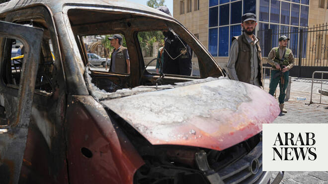

# Syria authorities say all members of Daesh-linked cell behind blasts arrested

Source: https://www.arabnews.com/node/2650309/middle-east
Captured source: https://www.arabnews.com/node/2650309/middle-east
Published: 2026-07-09T22:06:43+03:00
Modified: 2026-07-10T11:52:21+03:00
Author: AFP

## Summary

DAMASCUS: ‌Syrian officials on Thursday said the country had captured a Daesh-linked cell responsible for two bomb blasts during French President Emmanuel Macron’s visit to Damascus earlier this week. “The cell responsible for the terrorist bombings that targeted Damascus two days ago is now in our custody,” Interior Minister Anas Khattab posted on X. “Once the investigations

## Image

## Video Or Embed URLs

- https://cf0dc420dcd8cab19b1fd1333eab6fae.safeframe.googlesyndication.com/safeframe/1-0-45/html/container.html
- https://static.addtoany.com/menu/sm.25.html
- about:blank
- https://www.google.com/recaptcha/api2/aframe
- https://imasdk.googleapis.com/js/core/bridge3.774.0_en.html
- https://sync.teads.tv/wigo-no-slot
- https://cm.g.doubleclick.net/partnerpixels?gdpr=0&us_privacy=1---&gpp_sid=-1&url=https%3A%2F%2Fwww.arabnews.com%2Fnode%2F2650309%2Fmiddle-east

## Text

https://arab.news/n6hjz

Syria’s interior minister says authorities ⁠will reveal cell members’ identities after investigations

DAMASCUS: ‌Syrian officials on Thursday said the country had captured a Daesh-linked cell responsible for two bomb blasts during French President Emmanuel Macron’s visit to Damascus earlier this week. “The cell responsible for the terrorist bombings that targeted Damascus two days ago is now in our custody,” Interior Minister Anas Khattab posted on X. “Once the investigations are completed, we will reveal to the public the identities of the cell’s members, their roles, and all of their affiliations and connections,” he added. Ahmad Dalati, head of interior security for the Damascus region, said on Syrian state television that preliminary investigations indicated “the cell was affiliated with Daesh.” The interior ministry said in a statement that the cell had been captured following a series of raids “carried out at the same time against the suspects’ different locations across Damascus and its countryside.” The statement said the raids occurred in four neighborhoods, two of which have populations from toppled ruler Bashar Assad’s Alawite minority. Two blasts hit central Damascus on Tuesday, killing one person and wounding dozens during the French president’s first visit to Syria. The blasts near the hotel where Macron had spent the night came after his departure from the building, and moments before Syrian state media announced his arrival at the presidential palace to meet his Syrian counterpart Ahmed Al-Sharaa. In a joint news conference after the blast, Macron said we must “not let ourselves be destabilized” by such attacks, and reiterated Paris’s support for the country. Macron became the first head of state from the European Union to visit Syria since the fall of Assad in 2024. Syria last year joined the US-led coalition against Daesh, a jihadist group that was largely wiped out in Iraq and Syria by 2019.
