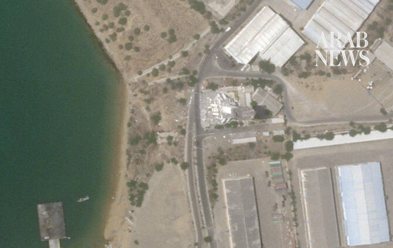

# Security official: Iran will respond against Israel if infrastructure attacked

Source: https://www.arabnews.com/node/2650400/middle-east
Captured source: https://www.arabnews.com/node/2650400/middle-east
Published: 2026-07-10T16:20:42+03:00
Modified: 2026-07-10T17:59:24+03:00
Author: AFP

## Summary

TEHRAN: Iran will respond to any attack against its infrastructure, including by striking Israel, the head of the country’s top security body said on Friday, after Tehran and Washington resumed fighting this week. “Any attack on infrastructure will be retaliated against, and the criminal Zionist regime responsible for these atrocities will not be safe from the response of our

## Image

## Video Or Embed URLs

- https://truthsocial.com/@realDonaldTrump/116896167446779964/embed
- https://43a5da1b7576c2c659c8b65b24e3e55b.safeframe.googlesyndication.com/safeframe/1-0-45/html/container.html
- https://static.addtoany.com/menu/sm.25.html
- about:blank
- https://www.google.com/recaptcha/api2/aframe
- https://imasdk.googleapis.com/js/core/bridge3.774.0_en.html
- https://cm.g.doubleclick.net/partnerpixels?gdpr=0&us_privacy=1---&gpp_sid=-1&url=https%3A%2F%2Fwww.arabnews.com%2Fnode%2F2650400%2Fmiddle-east

## Text

https://arab.news/979je

US military carried out heavy strikes overnight between Wednesday and Thursday, saying it targeted 90 military sites

Israeli defense minister warns Israel prepared to resume military campaign against Iran if needed

Trump says Washington agrees to talks with Iran, but ceasefire “over”

TEHRAN: Iran will respond to any attack against its infrastructure, including by striking Israel, the head of the country’s top security body said on Friday, after Tehran and Washington resumed fighting this week.

“Any attack on infrastructure will be retaliated against, and the criminal Zionist regime responsible for these atrocities will not be safe from the response of our fighters,” Mohammad Bagher Zolghadr said in a statement carried by state TV.

US President Donald Trump said Friday the US had agreed to continue negotiations with Iran but reiterated that the ceasefire between the two countries was finished.

“Iran has asked us to continue ‘talks.’ We have agreed to do so, but the United States has stated to them, in no uncertain terms, that the Cease Fire is OVER!” Trump posted on his Truth Social platform.

Fighting picked up again this week between the US and Iran in the most significant exchange of fire since the two sides signed a memorandum of understanding on June 17, seeking to formalize an April ceasefire and guide talks to conclusively end the war.

The US military carried out heavy strikes overnight between Wednesday and Thursday, saying it targeted 90 military sites.

But the Islamic republic accused Washington of also targeting civilian infrastructure in order to detract from the funeral of late supreme leader Ali Khamenei.

Bridges and railway links between the capital Tehran and Khamenei’s hometown of Mashhad, where he was buried on Thursday, were hit, according to Iran.

Iranian authorities say 17 people have been killed in US strikes.

Benjamin Netanyahu’s office announced that the Israeli prime minister spoke on Thursday with the US president, who informed him of the latest American moves in the Gulf.

Later on Thursday evening, Iranian state media reported what it said was a US-Israeli attack on a military headquarters near Bushehr, where Iran’s only civilian nuclear plant is located.

Israeli Defense Minister Israel Katz said Israel was prepared to resume its military campaign against Iran if needed, vowing to do so “with even greater force.”

Meanwhile, Qatari negotiators are in Iran to ​meet Iranian officials in an effort to de-escalate tensions and create conditions for broader ‌negotiations to ‌continue, ​a ‌source with ⁠knowledge ​of the ⁠situation told Reuters on Friday.

The source added that the talks were being ⁠conducted in coordination ‌with ‌the United ​States.

The ‌talks aim to ‌address the implementation of the US-Iran memorandum of understanding ‌and the issues that triggered the recent ⁠escalation ⁠between Washington and Tehran, including disputes over navigation in the Strait of Hormuz, the source said
