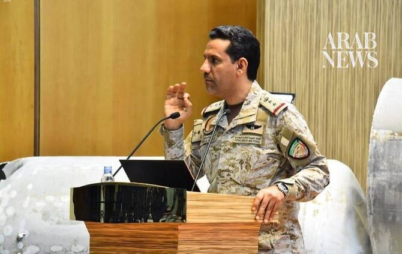

# Saudi Arabia says it intercepted Houthi missiles fired at south

Source: https://www.arabnews.com/node/2650763/saudi-arabia
Captured source: https://www.arabnews.com/node/2650763/saudi-arabia
Published: 2026-07-13T21:37:00+03:00
Modified: 2026-07-13T22:02:16+03:00
Author: Arab News

## Summary

RIYADH: Saudi Arabia said it intercepted ballistic missiles fired at the Kingdom’s south by the Iran-backed Houthi militia on Monday. Saudi air defenses “have dealt with a threat from ballistic missiles launched by the terrorist Houthi militia toward the southern region,” the spokesperson for the Coalition to Restore Legitimacy in Yemen Major General Turki Al-Maliki said.

## Image

## Video Or Embed URLs

- https://439c27fd42d0082328d0db2f97d7c295.safeframe.googlesyndication.com/safeframe/1-0-45/html/container.html
- https://static.addtoany.com/menu/sm.25.html
- about:blank
- https://www.google.com/recaptcha/api2/aframe
- https://imasdk.googleapis.com/js/core/bridge3.776.0_en.html
- https://sync.teads.tv/wigo-no-slot
- https://cm.g.doubleclick.net/partnerpixels?gdpr=0&us_privacy=1---&gpp_sid=-1&url=https%3A%2F%2Fwww.arabnews.com%2Fnode%2F2650763%2Fsaudi-arabia

## Text

https://arab.news/6en9h

Earlier Monday, Yemen’s armed forces said they targeted the runway at Sanaa Airport on Monday in order to block an Iranian plane from landing

RIYADH: Saudi Arabia said it intercepted ballistic missiles fired at the Kingdom’s south by the Iran-backed Houthi militia on Monday. Saudi air defenses “have dealt with a threat from ballistic missiles launched by the terrorist Houthi militia toward the southern region,” the spokesperson for the Coalition to Restore Legitimacy in Yemen Major General Turki Al-Maliki said. Earlier Monday, Yemen’s armed forces said they targeted the runway at Sanaa Airport on Monday in order to block an Iranian plane from landing.

The chairman of Yemen’s presidential leadership council Rashad Al-Alimi said the move was to “protect national sovereignty.”

The leader said he had ordered that “the scope of confrontation not be expanded, in order to thwart the objective that Iran seeks to achieve by dragging Yemen and its people into wars that serve its own interests, using Yemen’s land and people as a card in its regional conflict.”
