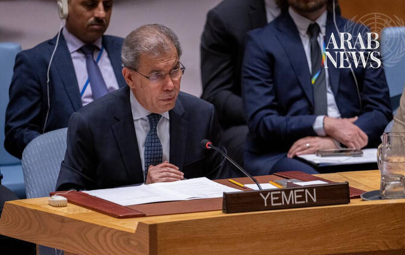

# Let this go and you tell all armed groups sovereignty can be defied, says Yemeni envoy to UN

Source: https://www.arabnews.com/node/2650788/middle-east
Captured source: https://www.arabnews.com/node/2650788/middle-east
Published: 2026-07-14T01:58:44+03:00
Modified: 2026-07-14T01:58:44+03:00
Author: Ephrem Kossaify

## Summary

NEW YORK CITY: Unauthorized Iranian flights to Houthi-held Sanaa Airport amount to a “real test of the principles upon which the international system is founded,” Yemen’s permanent representative to the UN, Abdullah Saadi, told the Security Council on Monday He warned that failure to act would embolden armed groups worldwide to defy state sovereignty without fear of

## Image

## Video Or Embed URLs

- https://f01e1476cacc431b2643944a0871c7d3.safeframe.googlesyndication.com/safeframe/1-0-45/html/container.html
- https://static.addtoany.com/menu/sm.25.html
- about:blank
- https://imasdk.googleapis.com/js/core/bridge3.776.0_en.html
- https://www.google.com/recaptcha/api2/aframe
- https://cm.g.doubleclick.net/partnerpixels?gdpr=0&us_privacy=1---&gpp_sid=-1&url=https%3A%2F%2Fwww.arabnews.com%2Fnode%2F2650788%2Fmiddle-east

## Text

https://arab.news/vhhaq

Abdullah Saadi’s warning to Security Council comes amid unauthorized Iranian flights and escalation in conflict between Yemen’s government and Tehran-backed Houthis

Situation raises the question of whether the council ‘is able to protect the rules of the international system and preserve international peace and security’

NEW YORK CITY: Unauthorized Iranian flights to Houthi-held Sanaa Airport amount to a “real test of the principles upon which the international system is founded,” Yemen’s permanent representative to the UN, Abdullah Saadi, told the Security Council on Monday

He warned that failure to act would embolden armed groups worldwide to defy state sovereignty without fear of consequences.

Addressing an emergency session requested by Yemen’s prime minister, Saadi described the issue as potentially setting “an extremely dangerous precedent,” and raising the question of whether or not the council “is able to protect the rules of the international system and preserve international peace and security.”

It came amid a sharp escalation in the conflict between Yemen’s internationally recognized government and the Iran-backed Houthis. Government forces fired on the runway at Sanaa International Airport on Monday to prevent an Iranian Mahan Air flight from landing there, and the Houthis launched ballistic missiles and drones at Abha International Airport and King Khalid Air Base in southern Saudi Arabia, which were intercepted by Riyadh’s air defenses.

The latest tensions began on July 3 when an Iranian aircraft flew Houthi officials from Sanaa to Tehran to attend the funeral of Iran’s former supreme leader, Ali Khamenei. Yemen’s government said the flight was not authorized.

Saadi told council members that Tehran’s subsequent attempt to fly the delegation back to Sanaa on a Mahan Air flight, a carrier he said had long been linked to logistical support for Iran’s Islamic Revolutionary Guard Corps, could not be characterized as humanitarian in nature.

Yemeni authorities possess documented information that indicated the flight carried “personnel, know-how, and military and dual-use equipment,” he added, and that the government reserved the right to submit evidence of this to the Yemen Sanctions Committee and its panel of experts.

“This incident was meant to test the will of the international community to enforce its decisions,” Saadi said.

He described it as an attempt to send “the wrong message that armed groups can, with external support, circumvent international legitimacy without accountability or consequences.”

Yemen’s government has never treated Sanaa airport “as a tool in a political conflict” he added, and had repeatedly offered to fly the Houthi delegation home on national carrier Yemenia, provided guarantees were given for the safety of the aircraft and its crew.

The Houthis’ rejection of that offer in favor of a foreign airline tied to the Revolutionary Guard exposed the political, rather than humanitarian, nature of the incident, Saadi said.

He confirmed that when the Houthis proceeded on Monday with what he described as a second unauthorized flight, Yemen’s armed forces “took the necessary defensive measures” to prevent it from landing in Sanaa, but the government had deliberately chosen not to escalate the confrontation, wary of being drawn into a wider regional war or serving what he called the agendas of Iran and its allies.

He urged the council to: condemn the unauthorized Iranian flights as violations of Yemeni sovereignty; call on Tehran to halt flights to airports in Yemen without government approval; urge member states to deny overflight and landing permissions for Yemeni territory that is outside of government control; task the Sanctions Committee and its panel of experts with investigating flights for possible arms-embargo violations; strictly enforce Resolutions 2140 and 2216; and continue to support Yemen’s government in its efforts to restore state institutions and pursue a comprehensive peace in the country.

Saadi reaffirmed that Yemen’s government remained committed to a political settlement based on a Gulf Cooperation Council initiative, the outcomes of the National Dialogue Conference, and UN Security Council Resolution 2216.

He noted that authorities in Sanaa had accepted a road map proposal brokered with Saudi Arabia and Oman, only for the Houthis to “renege on their commitments in favor of cross-border military escalation.”

Saudi Arabia has invested in Yemeni state institutions, the economy and humanitarian efforts, he said, while Iranian support for the Houthis had “prolonged suffering, undermined state institutions, deepened societal divisions,” and threatened regional stability and international waterways.

He stressed that Yemen has no hostility toward the Iranian people but rejects policies that arm nonstate actors and interfere in sovereign affairs.

Saadi said the nature of the Security Council’s response to the latest escalation would “go beyond defending the sovereignty and territorial integrity of the Republic of Yemen,” describing it as an indicator of whether council resolutions “may be tested or circumvented without accountability.”

The UN’s special envoy for Yemen, Hans Grundberg, told council members his office was monitoring the airspace developments, and voiced concern about the risk of a wider escalation.
