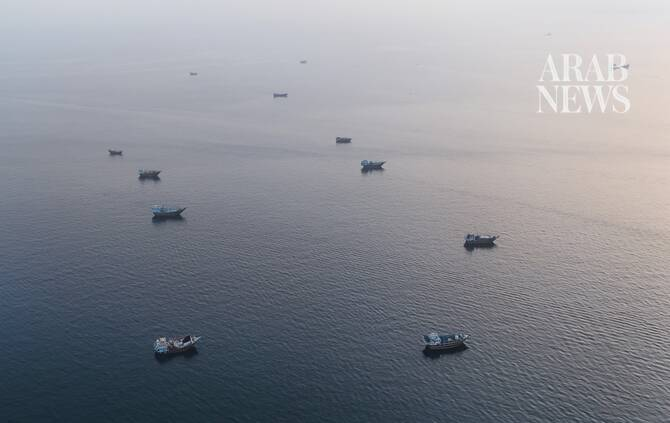

# Sailor dies after UAE ships attacked in Hormuz, defense ministry says

Source: https://www.arabnews.com/node/2650789/middle-east
Captured source: https://www.arabnews.com/node/2650789/middle-east
Published: 2026-07-14T02:20:01+03:00
Modified: 2026-07-14T02:20:34+03:00
Author: Arab News

## Summary

RIYADH: A crew member has died after UAE ships in the Strait of Hormuz were attacked, the UAE defense ministry said early Tuesday. The ministry said the ships were in Omani territorial waters. “The attack resulted in the death of one Indian crew member aboard the Mombasa tanker and the injury of eight others, including four who sustained serious injuries,” the ministry said in

## Image

## Video Or Embed URLs

- https://aa464ba839a4e1dcb3b76aa2eab5f6c6.safeframe.googlesyndication.com/safeframe/1-0-45/html/container.html
- https://static.addtoany.com/menu/sm.25.html
- about:blank
- https://www.google.com/recaptcha/api2/aframe
- https://imasdk.googleapis.com/js/core/bridge3.776.0_en.html
- https://cm.g.doubleclick.net/partnerpixels?gdpr=0&us_privacy=1---&gpp_sid=-1&url=https%3A%2F%2Fwww.arabnews.com%2Fnode%2F2650789%2Fmiddle-east

## Text

https://arab.news/mywn9

RIYADH: A crew member has died after UAE ships in the Strait of Hormuz were attacked, the UAE defense ministry said early Tuesday.

The ministry said the ships were in Omani territorial waters.

“The attack resulted in the death of one Indian crew member aboard the Mombasa tanker and the injury of eight others, including four who sustained serious injuries,” the ministry said in a statement posted on social media.

The injured were six Indians and two Ukrainians.

The ministry said the attack was a “serious violation and a clear breach of international law that threatens the security and stability of the region.”

It added that the UAE “reserves its full right to respond to this escalation and to take all necessary measures to protect its territory, its citizens and residents, in a manner that safeguards its sovereignty, security, and stability, and protects its national interests.”

The UAE defense ministry said that it remains on the highest levels of readiness and will take all measures to respond decisively.
