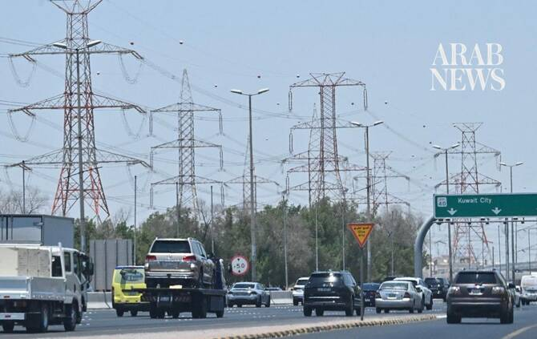

# Blasts heard in Kuwait as army says intercepting ‘aerial targets’

Source: https://www.arabnews.com/node/2650875/middle-east
Captured source: https://www.arabnews.com/node/2650875/middle-east
Published: 2026-07-14T19:16:41+03:00
Modified: 2026-07-14T19:16:41+03:00

## Summary

KUWAIT CITY: Explosions were heard in Kuwait City on Tuesday, an AFP journalist reported, as the Gulf nation’s army announced for the second time in less than half an hour that it was intercepting “hostile” targets.“The General Staff of the Kuwait Armed Forces announces that any explosions are the result of the Air Defense systems intercepting hostile attacks,” the army said

## Image

## Video Or Embed URLs

- https://4fbb0308ed07dddecdb7047b0c84e7ad.safeframe.googlesyndication.com/safeframe/1-0-45/html/container.html
- https://static.addtoany.com/menu/sm.25.html
- about:blank
- https://imasdk.googleapis.com/js/core/bridge3.776.0_en.html
- https://www.google.com/recaptcha/api2/aframe
- https://sync.teads.tv/wigo-no-slot
- https://cm.g.doubleclick.net/partnerpixels?gdpr=0&us_privacy=1---&gpp_sid=-1&url=https%3A%2F%2Fwww.arabnews.com%2Fnode%2F2650875%2Fmiddle-east

## Text

KUWAIT CITY: Explosions were heard in Kuwait City on Tuesday, an AFP journalist reported, as the Gulf nation’s army announced for the second time in less than half an hour that it was intercepting “hostile” targets. “The General Staff of the Kuwait Armed Forces announces that any explosions are the result of the Air Defense systems intercepting hostile attacks,” the army said in its statements, without providing further details.
