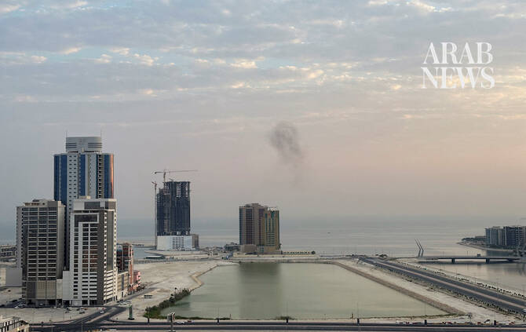

# Bahrain urges ‘firm’ UN Security Council response to Houthi and Iranian ‘blackmail’ attacks

Source: https://www.arabnews.com/node/2650919/middle-east
Captured source: https://www.arabnews.com/node/2650919/middle-east
Published: 2026-07-14T23:44:08+03:00
Modified: 2026-07-14T23:46:01+03:00
Author: Ephrem Kossaify

## Summary

NEW YORK CITY: Bahrain’s ambassador to the UN, Jamal Fares Alrowaiei, told the Security Council on Tuesday that Houthi attacks that threaten navigation in the Bab Al-Mandab Strait and the Red Sea, and Iranian strikes that affect freedom of passage through the Strait of Hormuz, amount to “a form of blackmail” that demands a firm response. “All of these attacks require the

## Image

## Video Or Embed URLs

- https://92122f30eaa4149b9d420507d1606860.safeframe.googlesyndication.com/safeframe/1-0-45/html/container.html
- https://static.addtoany.com/menu/sm.25.html
- about:blank
- https://imasdk.googleapis.com/js/core/bridge3.776.0_en.html
- https://www.google.com/recaptcha/api2/aframe
- https://cm.g.doubleclick.net/partnerpixels?gdpr=0&us_privacy=1---&gpp_sid=-1&url=https%3A%2F%2Fwww.arabnews.com%2Fnode%2F2650919%2Fmiddle-east

## Text

https://arab.news/9zsut

Ambassador Jamal Fares Alrowaiei says council must ensure respect for international and maritime law to safeguard regional peace and security in interest of all member states

He expresses Bahrain’s ‘strongest condemnation’ of Houthi missile strikes that targeted Saudi Arabia on Monday and backs Riyadh’s right to defend its sovereignty

NEW YORK CITY: Bahrain’s ambassador to the UN, Jamal Fares Alrowaiei, told the Security Council on Tuesday that Houthi attacks that threaten navigation in the Bab Al-Mandab Strait and the Red Sea, and Iranian strikes that affect freedom of passage through the Strait of Hormuz, amount to “a form of blackmail” that demands a firm response.

“All of these attacks require the council to take a very firm stance to ensure navigational security and freedom of passage in maritime corridors,” he said.

He was addressing the council on Tuesday after it adopted Resolution 2826, which extended for six months a mandate by the UN secretary-general to report Houthi attacks against shipping in the Red Sea.

Alrowaiei said council members must ensure that international law and the UN Convention on the Law of the Sea are respected “to safeguard the peace and security of the region and to serve the interests of all member states.”

He noted that the adoption of the resolution, drafted by Greece and the US, “coincides with developments on the ground that underscore the need” for the UN reporting mechanism, which was established under Resolution 2722 in January 2024 and most recently extended in January this year by Resolution 2812.

The reports it facilitates “document repeated violations of Security Council resolutions by the Houthis,” Alrowaiei said.

His remarks came as council members weighed the fallout from a strike by Yemeni government forces on the runway at Houthi-controlled Sanaa International Airport on Monday that prevented an unauthorized Iranian aircraft from landing there, and a subsequent Houthi missile and drone attack on Abha International Airport in Saudi Arabia.

He referred to a meeting of the Security Council on Monday at which members had “witnessed a deliberate and illegal Iranian attack in the region,” and noted that the Houthis had threatened to close the Bab Al-Mandab Strait and target civilian facilities, civilian infrastructure and vessels belonging to Saudi Arabia.

Bahrain, he said, “has expressed its strongest condemnation of the terrorist, unjust attacks launched by the Houthi militias” against southern Saudi Arabia on Monday using ballistic missiles, describing this as “a dangerous escalation” and “a flagrant violation of international law.”

He commended the efficiency of the Saudi air defense systems that intercepted the attacks, and said Manama’s position was firm: “We fully support the Kingdom of Saudi Arabia in all steps it takes to safeguard its sovereignty and security.”

The Houthi threats constitute dangerous violations of Security Council resolutions, Alrowaiei said, “most notably 2722” which stipulates that the group must immediately cease all attacks that obstruct international trade and undermine navigational rights, freedoms and regional peace and security. The threats also violate international law and the UN Convention on the Law of the Sea, he added.
