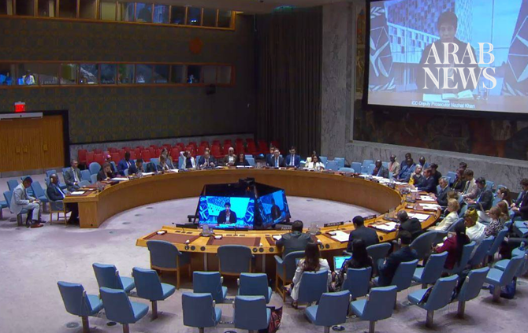

# ICC warns world cannot ignore warnings of new atrocities in Sudan

Source: https://www.arabnews.com/node/2651109/middle-east
Captured source: https://www.arabnews.com/node/2651109/middle-east
Published: 2026-07-16T10:22:39+03:00
Modified: 2026-07-16T10:22:39+03:00
Author: Arab News

## Summary

NEW YORK: The International Criminal Court warned the UN Security Council on Wednesday of the likelihood of new atrocities being committed in Sudan’s Darfur region, urging member states to act immediately to prevent a repeat of the mass crimes that first prompted the court’s intervention two decades ago. Nazhat Khan, the ICC’s deputy prosecutor, said the court shared the

## Image

## Video Or Embed URLs

- https://4e41fa9c87fd8ea2bf1f5f9760454979.safeframe.googlesyndication.com/safeframe/1-0-45/html/container.html
- https://static.addtoany.com/menu/sm.25.html
- about:blank
- https://imasdk.googleapis.com/js/core/bridge3.777.0_en.html
- https://www.google.com/recaptcha/api2/aframe
- https://cm.g.doubleclick.net/partnerpixels?gdpr=0&us_privacy=1---&gpp_sid=-1&url=https%3A%2F%2Fwww.arabnews.com%2Fnode%2F2651109%2Fmiddle-east

## Text

https://arab.news/cktfp

UN must act, says Nazhat Khan, court’s deputy prosecutor

Security Council members urge action against perpetrators

NEW YORK: The International Criminal Court warned the UN Security Council on Wednesday of the likelihood of new atrocities being committed in Sudan’s Darfur region, urging member states to act immediately to prevent a repeat of the mass crimes that first prompted the court’s intervention two decades ago.

Nazhat Khan, the ICC’s deputy prosecutor, said the court shared the assessment of the UN Human Rights office that the gravest international crimes could soon occur in the Sudanese city of El-Obeid.

“We cannot say we did not know,” she said. “It is for this council and all states to act now, to prevent further atrocities.”

The warning came as Security Council members offered differing views on how accountability should be pursued.

China called for caution, saying allegations of international crimes were highly sensitive and should be handled strictly in accordance with facts and the law, while respecting Sudan’s judicial sovereignty.

The US renewed its opposition to the ICC, with Deputy Representative Jeffrey Bartos arguing that the court had overstepped its mandate by asserting jurisdiction over states that are not party to the Rome Statute.

He said Washington believed alternative international tribunals could provide justice in cases such as Darfur without expanding the ICC’s authority.

Khan said refugees she met during a recent visit to eastern Chad described widespread killings, rape and attacks on children, with many believing the international community had abandoned them.

“There is real despair in those camps,” Khan told the council. “People sacrificed as if they were livestock.”

She said the accounts mirrored the patterns of violence seen during the Darfur conflict that led the Security Council to refer the situation to the ICC in 2005, warning that many displaced people fear “the worst is still to come.”

Khan said prosecutors had made significant progress in recent months, conducting key witness interviews that had enabled investigators to establish direct links between crimes and those responsible.

“This is a paradigm shift — it is a breakthrough,” Khan said. “It is a real message to those who lead these attacks, to those who plan them, to those who support the commission of atrocities from afar and think they can benefit from them — you are mistaken.”

Khan also pointed to the conviction of former Janjaweed commander Ali Kushayb for war crimes and crimes against humanity, saying it offered hope to victims seeking justice and reparations.

Several Security Council members echoed calls for urgent action.

Liberia’s ambassador, Lewis Garseedah Brown II, warned that the re-emergence of patterns seen during previous phases of the Darfur conflict showed that impunity continued to fuel violence.

“Justice cannot be measured solely by investigations and indictments,” he said, urging states to enforce outstanding arrest warrants and ensure accountability.

Denmark’s representative, Lars Bo Kirketerp Lund, said the conflict in Sudan continued to spiral with devastating consequences for civilians, calling for immediate protection measures and humanitarian access while urging countries to stop supplying weapons that prolong the war.

“We must also ensure that accountability is pursued and the cycle of impunity is broken, not just in Darfur but across Sudan,” he said.

Somalia also backed accountability efforts, with Deputy Permanent Representative Mohamed Rabi A. Yusuf expressing concern over what he described as the failure to hold the Rapid Support Forces accountable for atrocities committed in Al-Geneina and El-Fasher.

He said newly gathered witness testimony and satellite imagery had strengthened links to senior perpetrators and warned that similar crimes threatened to spread to El-Obeid.
