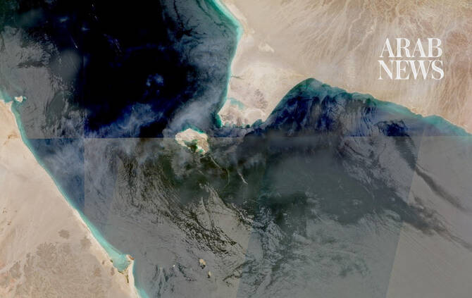

# Iran tells Houthis to close Bab El-Mandeb strait if US hits power network: Reports

Source: https://www.arabnews.com/node/2651170/middle-east
Captured source: https://www.arabnews.com/node/2651170/middle-east
Published: 2026-07-16T17:54:10+03:00
Modified: 2026-07-16T17:54:10+03:00
Author: Reuters

## Summary

DUBAI: Iran has asked Yemen’s Houthi militia to stand ready to close the Bab El-Mandeb oil route if the United States strikes Iranian power infrastructure, three sources told Reuters on Thursday, posing a potent new ​threat to global energy supplies. The idea has been discussed within the Islamic Republic’s leadership, and the message has been conveyed to Iran’s Houthi allies,

## Image

## Video Or Embed URLs

- https://653197b6d63299b89982ac4a1170ca81.safeframe.googlesyndication.com/safeframe/1-0-45/html/container.html
- https://static.addtoany.com/menu/sm.25.html
- about:blank
- https://imasdk.googleapis.com/js/core/bridge3.777.0_en.html
- https://www.google.com/recaptcha/api2/aframe
- https://cm.g.doubleclick.net/partnerpixels?gdpr=0&us_privacy=1---&gpp_sid=-1&url=https%3A%2F%2Fwww.arabnews.com%2Fnode%2F2651170%2Fmiddle-east

## Text

https://arab.news/4g8yu

A source close to the Houthis said the group had completed preparations to attack shipping by deploying missiles and drones near the strait

DUBAI: Iran has asked Yemen’s Houthi militia to stand ready to close the Bab El-Mandeb oil route if the United States strikes Iranian power infrastructure, three sources told Reuters on Thursday, posing a potent new ​threat to global energy supplies.

The idea has been discussed within the Islamic Republic’s leadership, and the message has been conveyed to Iran’s Houthi allies, two senior Iranian sources and a regional source familiar with the matter said, speaking on condition of anonymity.

The sources said the Houthis had been informed recently of Tehran’s request, which has not been previously reported.

They did not give further details on how it had been conveyed or whether it was after US President Donald Trump’s threat to attack Iranian power infrastructure on Tuesday.

Iran’s foreign ministry and a spokesperson for the Houthi group were not immediately available to respond to Reuters’ request.

A source close to the Houthis said the group had completed preparations to attack shipping by deploying missiles and drones near Bab El-Mandeb strait, the gateway ‌to the Red ‌Sea, in Yemen’s highlands overlooking Hodeidah and the Gulf of Aden and was awaiting the order ​to ‌begin.

With the Hormuz strait already shut, any Houthi attacks on vessels or ports in the Red Sea would leave the Middle East’s two main oil export routes disrupted simultaneously, opening a new front in both the energy crisis and Iran’s wider conflict with the US.

Representatives of Iran’s Islamic Revolutionary Guard Corps (IRGC) who are already in Yemen will control the decision on when to close the Bab El-Mandeb strait, said the source close to the Houthis.

Iran views the Houthis as part of its regional “Axis of Resistance,” an alliance that also includes Lebanon’s Hezbollah and Iraqi Shiite armed groups that have already ​joined the regional conflict between Tehran and Washington.

But the Houthis ​have not formally entered the fray.

The US says Iran has provided the Houthis with weapons, funding and training, including support channelled through Hezbollah. Tehran has denied the accusation.
