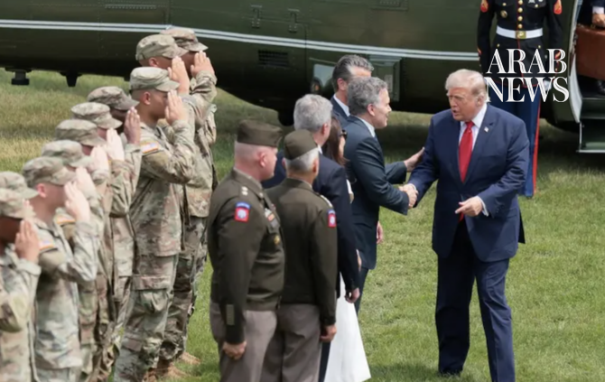

# Trump says ‘open to diplomacy’ with Iran as US launches wave of new strikes

Source: https://www.arabnews.com/node/2651195/middle-east
Captured source: https://www.arabnews.com/node/2651195/middle-east
Published: 2026-07-17T09:27:45+03:00
Modified: 2026-07-17T09:28:22+03:00
Author: Agencies

## Summary

WASHINGTON: US President Donald Trump remains open to diplomacy with Iran, the White House said Thursday, adding that Washington is still talking to Tehran despite the renewal of hostilities. The comments come a day after Trump thanked Iran for freeing a US citizen detained since December 2024, in a move seen as a possible diplomatic opening. “The president will hold them

## Image

## Video Or Embed URLs

- blob:https://www.arabnews.com/1b72fb33-1657-4d48-ae45-2aa826ab27e8
- https://imasdk.googleapis.com/js/core/bridge3.777.0_en.html
- https://platform.twitter.com/embed/Tweet.html?creatorScreenName=Arab_News&creatorUserId=69172612&dnt=false&embedId=twitter-widget-0&features=eyJ0ZndfdGltZWxpbmVfbGlzdCI6eyJidWNrZXQiOltdLCJ2ZXJzaW9uIjpudWxsfSwidGZ3X2ZvbGxvd2VyX2NvdW50X3N1bnNldCI6eyJidWNrZXQiOnRydWUsInZlcnNpb24iOm51bGx9LCJ0ZndfdHdlZXRfZWRpdF9iYWNrZW5kIjp7ImJ1Y2tldCI6Im9uIiwidmVyc2lvbiI6bnVsbH0sInRmd19yZWZzcmNfc2Vzc2lvbiI6eyJidWNrZXQiOiJvbiIsInZlcnNpb24iOm51bGx9LCJ0ZndfZm9zbnJfc29mdF9pbnRlcnZlbnRpb25zX2VuYWJsZWQiOnsiYnVja2V0Ijoib24iLCJ2ZXJzaW9uIjpudWxsfSwidGZ3X21peGVkX21lZGlhXzE1ODk3Ijp7ImJ1Y2tldCI6InRyZWF0bWVudCIsInZlcnNpb24iOm51bGx9LCJ0ZndfZXhwZXJpbWVudHNfY29va2llX2V4cGlyYXRpb24iOnsiYnVja2V0IjoxMjA5NjAwLCJ2ZXJzaW9uIjpudWxsfSwidGZ3X3Nob3dfYmlyZHdhdGNoX3Bpdm90c19lbmFibGVkIjp7ImJ1Y2tldCI6Im9uIiwidmVyc2lvbiI6bnVsbH0sInRmd19kdXBsaWNhdGVfc2NyaWJlc190b19zZXR0aW5ncyI6eyJidWNrZXQiOiJvbiIsInZlcnNpb24iOm51bGx9LCJ0ZndfdXNlX3Byb2ZpbGVfaW1hZ2Vfc2hhcGVfZW5hYmxlZCI6eyJidWNrZXQiOiJvbiIsInZlcnNpb24iOm51bGx9LCJ0ZndfdmlkZW9faGxzX2R5bmFtaWNfbWFuaWZlc3RzXzE1MDgyIjp7ImJ1Y2tldCI6InRydWVfYml0cmF0ZSIsInZlcnNpb24iOm51bGx9LCJ0ZndfbGVnYWN5X3RpbWVsaW5lX3N1bnNldCI6eyJidWNrZXQiOnRydWUsInZlcnNpb24iOm51bGx9LCJ0ZndfdHdlZXRfZWRpdF9mcm9udGVuZCI6eyJidWNrZXQiOiJvbiIsInZlcnNpb24iOm51bGx9fQ%3D%3D&frame=false&hideCard=false&hideThread=false&id=2077821502683042140&lang=en&origin=https%3A%2F%2Fwww.arabnews.com%2Fnode%2F2651195%2Fmiddle-east&sessionId=ffbd41c2e78d72eef1f016cd79abe0c81396ea77&siteScreenName=Arab_News&siteUserId=69172612&theme=light&widgetsVersion=6a3ad42b224df%3A1778106238597&width=600px
- https://f373b5487ca2fb9e485c9c7b22b7f7f0.safeframe.googlesyndication.com/safeframe/1-0-45/html/container.html
- https://static.addtoany.com/menu/sm.25.html
- https://platform.twitter.com/widgets/widget_iframe.1227a5674072e080ffb1ba14ac0c1079.html?origin=https%3A%2F%2Fwww.arabnews.com
- about:blank
- https://www.google.com/recaptcha/api2/aframe
- https://cm.g.doubleclick.net/partnerpixels?gdpr=0&us_privacy=1---&gpp_sid=-1&url=https%3A%2F%2Fwww.arabnews.com%2Fnode%2F2651195%2Fmiddle-east

## Text

https://arab.news/nx8ds

A fragile ceasefire agreed in June is on the rocks after the US launched several rounds of strikes in recent days

US President Donald Trump hailed the release of a US citizen in Iran as a “gesture of goodwill” - Tehran denies release

Military spokesman said if US followed through on threats, “all infrastructure in the region” would be “crushed”

WASHINGTON: US President Donald Trump remains open to diplomacy with Iran, the White House said Thursday, adding that Washington is still talking to Tehran despite the renewal of hostilities.

The comments come a day after Trump thanked Iran for freeing a US citizen detained since December 2024, in a move seen as a possible diplomatic opening.

“The president will hold them accountable when they turn their back on the words that they state to the United States. But he is always open to diplomacy at the very same time,” White House Press Secretary Karoline Leavitt told reporters.

“They have expressed they still want to make a deal to the president. We’re talking to them, but again, the president is not going to allow them to fire on ships in the Strait without paying a consequence for that.”

A fragile ceasefire agreed in June is on the rocks after the US launched several rounds of strikes in recent days in a bid to curb Iran’s ability to threaten shipping in the Strait of Hormuz.

Trump has also warned he could widen attacks to target power plants and bridges unless the Islamic republic returns to talks.

US forces launched strikes against Iran for a fifth night in a row on Thursday, the US military said.

The strikes — which began at 1800 GMT — were carried out to “further degrade Iranian military capabilities,” US Central Command said in a post on X.

On Thursday evening, US projectiles struck Qeshm Island and near Bandar Abbas — home to Iran’s largest port and key navy and Revolutionary Guards facilities — both on the Strait of Hormuz, Iranian state media said.

But as the attacks unfurled, US President Donald Trump hailed the release of a US citizen in Iran as a “gesture of goodwill.”

Human rights lawyer Jared Genser identified her as Dena Karari, who he said had been “trapped in Iran since December 2024 on bogus charges” and was “now safe and traveling back to the United States.”

Iran has denied the release.

The Strait of Hormuz has been at the heart of the recent fighting and is crucial to global oil and gas flows.

The strait was briefly reopened after the US-Iran deal in June, but Tehran said last week it would be closed again “until the US ends its aggression.”

The US has also reimposed a blockade of Iran’s ports.

Pakistan’s foreign office spokesman, Tahir Andrabi, said Islamabad would “continue to encourage all sides to end violence and resume technical-level talks” under the memorandum of understanding it helped mediate last month.

But Iran’s top negotiator Mohammad Bagher Ghalibaf has warned that a deal “only has meaning when its clauses are valid and being implemented.”

White House Press Secretary Karoline Leavitt told reporters Thursday that Trump would hold Iran “accountable” for going back on its word, “But he is always open to diplomacy at the very same time.”

“They have expressed they still want to make a deal to the president. We’re talking to them, but again, the president is not going to allow them to fire on ships in the strait without paying a consequence for that,” she said.

Trump previously threatened to hit Iranian power plants and bridges unless Tehran returned to the negotiating table.

“Next week it gets really bad for them,” he told Fox News.

On Thursday, the spokesman for Iran’s military headquarters said that if the US followed through on its threats, “all infrastructure in the region” would be “crushed.”

* With AFP and Reuters
