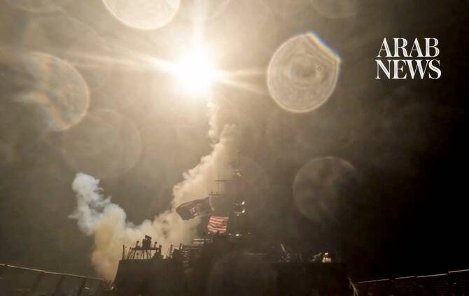

# Iran targets US bases in Iraq, Jordan, Oman and Syria

Source: https://www.arabnews.com/node/2651240/middle-east
Captured source: https://www.arabnews.com/node/2651240/middle-east
Published: 2026-07-17T12:09:40+03:00
Modified: 2026-07-17T14:23:18+03:00
Author: Arab News

## Summary

DUBAI: Iran’s ‌Revolutionary Guards said on Friday they had attacked a US special operations command center at ​Al-Tanf in Syria in retaliation for the killing of Iranian soldiers in Iranshahr, state media reported. Reuters could not independently verify the claim, and there was no immediate comment from the Syrian government or the ‌US military. The US ‌military said in

## Image

## Video Or Embed URLs

- https://7296cf8b6cd90d1872bb72d1bbc8b854.safeframe.googlesyndication.com/safeframe/1-0-45/html/container.html
- https://static.addtoany.com/menu/sm.25.html
- about:blank
- https://imasdk.googleapis.com/js/core/bridge3.777.0_en.html
- https://www.google.com/recaptcha/api2/aframe
- https://cm.g.doubleclick.net/partnerpixels?gdpr=0&us_privacy=1---&gpp_sid=-1&url=https%3A%2F%2Fwww.arabnews.com%2Fnode%2F2651240%2Fmiddle-east

## Text

https://arab.news/jgp2h

The IRGC said they had attacked a US special operations command center at ​al-Tanf in Syria

Jordan’s military said it shot down three Iranian missiles on Friday

The US-led coalition shot down several drones on Friday over Erbil

The IRGC also said it had struck two US radar sites in Oman

DUBAI: Iran’s ‌Revolutionary Guards said on Friday they had attacked a US special operations command center at ​Al-Tanf in Syria in retaliation for the killing of Iranian soldiers in Iranshahr, state media reported. Reuters could not independently verify the claim, and there was no immediate comment from the Syrian government or the ‌US military. The US ‌military said in ​February ‌it ⁠completed ​a withdrawal from ⁠the Al-Tanf base positioned at the tri-border confluence of Syria, Jordan and Iraq. Syria has sought to avoid being drawn into the regional conflict that has engulfed neighboring countries, including Lebanon, ⁠where Hezbollah has fought Israeli ‌forces, and ‌Iraq, where Iran-backed armed groups ​have launched drone ‌and rocket attacks. Syrian President Ahmed Al-Sharaa ‌said in March that his country would stay out of any conflict unless it came under attack. “Unless Syria is targeted by ‌any party, Syria will remain outside any conflict,” Sharaa said at ⁠an ⁠event hosted by the Chatham House think tank in London.

Iran Guards say attacked US base in Qatar to ‘punish aggressor’

Iran’s Islamic Revolutionary Guard Corps said Friday that they had targeted US radar systems and military aircraft in Qatar to “punish the aggressor” following overnight US strikes on Iran.

“In continuation of last night’s retaliatory operations, the brave fighters of the IRGC’s Aerospace Force … carried out a heavy and surprise attack on the US air base at Al-Udeid, Qatar, to punish the aggressor and the child-killing US military,” the IRGC said in a statement.

Kuwait says Iranian attack damages power generation, water desalination station One ​of Kuwait’s power generation and water desalination ‌stations ‌was ​hit ‌in ⁠an ​Iranian attack, causing ⁠damage to facilities, a fire ⁠and ‌the ‌disruption ​of a large ‌number ‌of electricity generation units, ‌Kuwait’s Ministry of Electricity, ⁠Water and ⁠Renewable Energy said on Friday.

Iran Guards say struck US aircraft in Jordan with missiles, drones Iran’s Revolutionary Guards said Friday they had struck US military aircraft stationed in Jordan with ballistic missiles and drones in retaliation for overnight US strikes. In a statement, they claimed to have destroyed “several US refueling aircraft and fighter jets” and caused “serious damage to many more.” They also called on Jordanians to target “the interests of the aggressive and anti-Islamic Americans” in their country.

Drones downed over Erbil

The US-led coalition shot down several drones on Friday over Erbil, the capital of Iraq’s northern Kurdistan region, Kurdish forces said, in the second such incident in the city this week. Kurdish counterterrorism forces said that “coalition forces downed eight explosive-laden drones over Irbil between 04:19 and 05:25 am (0119 and 0225 GMT),” with no damage or casualties reported.

Jordan downs missiles

Jordan’s military said it shot down three Iranian missiles on Friday, reporting no casualties or damage, as the war in the Middle East escalated. “This Friday morning, air defense systems intercepted three Iranian missiles that entered Jordanian airspace and were targeting the kingdom’s territory, and managed to intercept and bring them down,” said a military statement.

Radar sites in Oman targeted

The IRGC also said Friday they had struck two radar sites belonging to the United States in the Gulf sultanate of Oman. A statement said their forces “targeted and destroyed the maritime surveillance radar at the Salamah Rocks and the US air surveillance radar stationed in the Ghanam area.”
