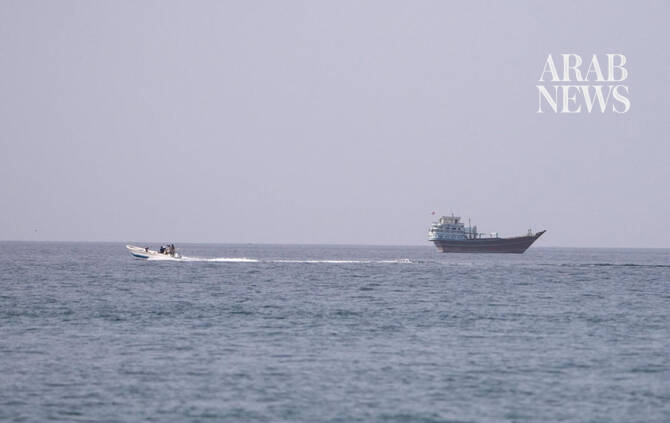

# Iran’s Guards say two oil tankers explode after hitting mines in Hormuz

Source: https://www.arabnews.com/node/2651361/middle-east
Captured source: https://www.arabnews.com/node/2651361/middle-east
Published: 2026-07-18T04:27:40+03:00
Modified: 2026-07-18T04:30:32+03:00
Author: AFP

## Summary

TEHRAN: Iran’s Revolutionary Guards said Saturday that two oil tankers transiting through the Strait of Hormuz hit mines and exploded, a claim disputed by the US military. “An hour ago, two oil tankers, which were trying to pass through the minefield south of the Strait of Hormuz by deceptive American intelligence agencies, exploded and caught fire,” the Guards said in a

## Image

## Video Or Embed URLs

- https://57a287af894e394d64118ee9dc61fa5e.safeframe.googlesyndication.com/safeframe/1-0-45/html/container.html
- https://static.addtoany.com/menu/sm.25.html
- about:blank
- https://imasdk.googleapis.com/js/core/bridge3.777.0_en.html
- https://www.google.com/recaptcha/api2/aframe
- https://sync.teads.tv/wigo-no-slot
- https://cm.g.doubleclick.net/partnerpixels?gdpr=0&us_privacy=1---&gpp_sid=-1&url=https%3A%2F%2Fwww.arabnews.com%2Fnode%2F2651361%2Fmiddle-east

## Text

https://arab.news/2kw2f

“Like most IRGC claims, this is false,” US military replies on X

IRGC also claimed it had “stopped” four ships trying to transit the vital strait

TEHRAN: Iran’s Revolutionary Guards said Saturday that two oil tankers transiting through the Strait of Hormuz hit mines and exploded, a claim disputed by the US military. “An hour ago, two oil tankers, which were trying to pass through the minefield south of the Strait of Hormuz by deceptive American intelligence agencies, exploded and caught fire,” the Guards said in a statement published by state news agency IRNA, without identifying the tankers. “To protect their capital and, more importantly, their lives, the sailors should not be deceived and enter the minefield,” they said. US Central Command (CENTCOM) issued a brief denial, saying on X, “Like most IRGC claims, this is false.” The Guards said separately on Saturday that they had “stopped” four ships trying to transit the Strait of Hormuz. “In the past hours, four violating ships with the support of the terrorist US army were trying to pass through the Strait of Hormuz, and all four ships were stopped in place during a combined missile and drone operation,” the Guards said in a statement carried by the state broadcaster. Iran has again virtually closed the Strait of Hormuz for a week. It is seeking to control the vital waterway and has been warning tankers and cargo ships to only use channels close to its coastline, to the north of the strait, and not southern corridors the United States has been attempting to protect. The US, in response to Iran’s threats to shipping in the strait, reimposed a navy blockade against Iranian ports. It has also been carrying out nightly airstrikes on targets in Iran aimed at weakening Tehran’s abilities to monitor and threaten the strait.
