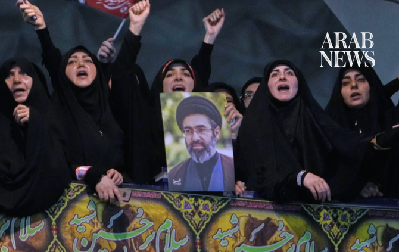

# Iran’s Supreme Leader warns of ‘unforgettable lessons’ if US continues strikes

Source: https://www.arabnews.com/node/2651363/middle-east
Captured source: https://www.arabnews.com/node/2651363/middle-east
Published: 2026-07-18T18:08:28+03:00
Modified: 2026-07-18T20:12:42+03:00
Author: APArab News

## Summary

RIYADH/DUBAI/TEHRAN: Iran’s supreme leader Mojtaba Khamenei warned on Saturday of “unforgettable lessons” if US continued its attacks. A new statement attributed to Khamenei, still unseen since the war began, was read out on state television. He also called US President Donald Trump’s signature “worthless and invalid,” after an Iranian negotiator earlier Saturday said Tehran

## Image

## Video Or Embed URLs

- https://platform.twitter.com/embed/Tweet.html?creatorScreenName=Arab_News&creatorUserId=69172612&dnt=false&embedId=twitter-widget-0&features=eyJ0ZndfdGltZWxpbmVfbGlzdCI6eyJidWNrZXQiOltdLCJ2ZXJzaW9uIjpudWxsfSwidGZ3X2ZvbGxvd2VyX2NvdW50X3N1bnNldCI6eyJidWNrZXQiOnRydWUsInZlcnNpb24iOm51bGx9LCJ0ZndfdHdlZXRfZWRpdF9iYWNrZW5kIjp7ImJ1Y2tldCI6Im9uIiwidmVyc2lvbiI6bnVsbH0sInRmd19yZWZzcmNfc2Vzc2lvbiI6eyJidWNrZXQiOiJvbiIsInZlcnNpb24iOm51bGx9LCJ0ZndfZm9zbnJfc29mdF9pbnRlcnZlbnRpb25zX2VuYWJsZWQiOnsiYnVja2V0Ijoib24iLCJ2ZXJzaW9uIjpudWxsfSwidGZ3X21peGVkX21lZGlhXzE1ODk3Ijp7ImJ1Y2tldCI6InRyZWF0bWVudCIsInZlcnNpb24iOm51bGx9LCJ0ZndfZXhwZXJpbWVudHNfY29va2llX2V4cGlyYXRpb24iOnsiYnVja2V0IjoxMjA5NjAwLCJ2ZXJzaW9uIjpudWxsfSwidGZ3X3Nob3dfYmlyZHdhdGNoX3Bpdm90c19lbmFibGVkIjp7ImJ1Y2tldCI6Im9uIiwidmVyc2lvbiI6bnVsbH0sInRmd19kdXBsaWNhdGVfc2NyaWJlc190b19zZXR0aW5ncyI6eyJidWNrZXQiOiJvbiIsInZlcnNpb24iOm51bGx9LCJ0ZndfdXNlX3Byb2ZpbGVfaW1hZ2Vfc2hhcGVfZW5hYmxlZCI6eyJidWNrZXQiOiJvbiIsInZlcnNpb24iOm51bGx9LCJ0ZndfdmlkZW9faGxzX2R5bmFtaWNfbWFuaWZlc3RzXzE1MDgyIjp7ImJ1Y2tldCI6InRydWVfYml0cmF0ZSIsInZlcnNpb24iOm51bGx9LCJ0ZndfbGVnYWN5X3RpbWVsaW5lX3N1bnNldCI6eyJidWNrZXQiOnRydWUsInZlcnNpb24iOm51bGx9LCJ0ZndfdHdlZXRfZWRpdF9mcm9udGVuZCI6eyJidWNrZXQiOiJvbiIsInZlcnNpb24iOm51bGx9fQ%3D%3D&frame=false&hideCard=false&hideThread=false&id=2078205881670349272&lang=en&origin=https%3A%2F%2Fwww.arabnews.com%2Fnode%2F2651363%2Fmiddle-east&sessionId=59cb76bd30d0c176744e6eb1edbf93ba8931f29f&siteScreenName=Arab_News&siteUserId=69172612&theme=light&widgetsVersion=6a3ad42b224df%3A1778106238597&width=600px
- https://c10582f3a44875aa97dff36c217163f1.safeframe.googlesyndication.com/safeframe/1-0-45/html/container.html
- https://static.addtoany.com/menu/sm.25.html
- https://platform.twitter.com/widgets/widget_iframe.1227a5674072e080ffb1ba14ac0c1079.html?origin=https%3A%2F%2Fwww.arabnews.com
- about:blank
- https://imasdk.googleapis.com/js/core/bridge3.777.0_en.html
- https://www.google.com/recaptcha/api2/aframe
- https://cm.g.doubleclick.net/partnerpixels?gdpr=0&us_privacy=1---&gpp_sid=-1&url=https%3A%2F%2Fwww.arabnews.com%2Fnode%2F2651363%2Fmiddle-east

## Text

https://arab.news/bzgxj

Iran attack sparks two fires in Kuwait, firefighters injured

Attacks on bridges, energy facilities and shipping raise fears of wider escalation

RIYADH/DUBAI/TEHRAN: Iran’s supreme leader Mojtaba Khamenei warned on Saturday of “unforgettable lessons” if US continued its attacks.

A new statement attributed to Khamenei, still unseen since the war began, was read out on state television.

He also called US President Donald Trump’s signature “worthless and invalid,” after an Iranian negotiator earlier Saturday said Tehran was suspending its commitments to the interim deal signed by both countries about a month ago.

The deal was aimed at permanently ending the war.

Khamenei said ⁠the ⁠US should know that the Iranian nation and the “resistance front” had “unforgettable lessons” for it.

Washington and Tehran exchanged strikes aimed at infrastructure and military targets on Saturday as their battle over the Strait of Hormuz intensified.

The region has endured days of back-and-forth attacks in a conflict increasingly focused on control of the strait. The collapse of an interim ceasefire leaves no clear end in sight for the war that the US and Israel began more than four months ago.

The US Central Command said early Saturday that its seventh straight night of strikes had hit “surveillance sites, military logistics infrastructure, underground weapons storage, and maritime capabilities.”

Kuwait said Saturday it intercepted Iranian missiles and drones and that a water desalination plant was struck, causing a fire, the second such attack in two days in the tiny desert nation, which depends on desalination for 90 percent of its drinking water.

Several firefighters and a worker were injured while battling two other blazes sparked by Iranian strikes, according to the Kuwait Fire Force.

The fire service said on X that it was dealing with “two fires that erupted in two different locations” following the latest Iranian attacks, adding that this "resulted in injuries among firemen and a worker.

Kuwaiti authorities said several generating units were shut down as a precaution.

Kuwait briefly closed its airspace in the morning due to missile threats, and Kuwait Airways said it was rescheduling most flights to and from the capital.

Iraq said it shot down attack drones over the city of Irbil.

Jordan’s state-run Petra news agency said that the kingdom’s air defense systems had downed Iranian missiles, while air sirens sounded multiple times in Bahrain, according to the government.

Jordan’s military said it intercepted three Iranian missiles launched toward the kingdom. Kuwait’s army said explosions were heard as its air defense systems intercepted hostile targets, while several Kuwaiti military facilities were damaged in Iranian drone and missile attacks.

Iranian officials say recent US strikes have killed dozens of people and wounded hundreds in Iran. The US military also acknowledged that several more service members were injured. Iran effectively closed the strait to shipping traffic after the war started Feb. 28. That sent the price of oil soaring and gave Iran significant leverage in negotiations. The price of oil rose Friday above $86 a barrel, close to its highest level in a month, as crossings through the strait fell to a three-week low, according to an international shipping tracker.

US strikes bridges, port infrastructure in Iran

US airstrikes hit an electricity and desalination plant in Iran’s southern Hormozgan province, Iranian state television reported. The attacks hit Bonji, a village on Iran’s coast on the Strait of Hormuz.

Overnight strikes damaged two tunnels and a bridge, disrupting one of the main highways toward Bandar Abbas, a city which sits near the narrowest part of the Strait of Hormuz, according to Iran’s state-run news agency. Iran also reported strikes on the strategic Qeshm Island inside the Strait.

The previous day, Iranian state media reported that the US hit highways and railway bridges, seemingly aimed at cutting off Bandar Abbas, Iran’s main port, from roads leading into the Islamic Republic’s central region onward to Tehran, the capital.

Iran acknowledged “attacks on power infrastructure” during the US airstrike campaign for the first time Friday when its Energy Ministry issued a call for people to use less power in southern provinces “experiencing extreme heat.” The ministry did not specify what was hit.

Iranian authorities said at least 46 people have been killed and more than 400 wounded in recent US strikes, including eight killed in a strike on a bridge Friday.

The Islamic Revolutionary Guard Corps on Saturday stepped up its warning that countries hosting US forces should be “prepared to receive a corresponding response,” according to Iran’s State TV.

US officials acknowledged 13 additional US service members — 10 Army soldiers and three Navy sailors — had been injured since Monday, but offered no further details. Since the war began, 14 US service members have been killed and 427 wounded.

Hormuz remains at center of conflict

Iran has said the strait must be under its sole control and that vessels should pay fees to Tehran — even though the world for decades has considered it an international waterway.

Trump has returned in recent days to his threats to target Iranian power stations and bridges to try to compel Iran to loosen its hold on the strait, through which about a fifth of all oil and natural gas traded once passed in peacetime. The US also reimposed a naval blockade on Iranian ports to halt its shipments of crude oil.

Crossings through the strait fell to a three-week low of just eight vessels on Thursday, according to MarineTraffic.com.

A growing amount of the region’s energy is being shipped through pipelines, but not nearly enough to offset the decline in shipping through the strait.

Fears of further escalation

The latest attacks have raised growing concern that the conflict is expanding beyond military targets to vital civilian and commercial infrastructure.

UN Secretary-General Antonio Guterres expressed deep concern over the escalation, particularly attacks on civilian infrastructure in Iran and across the region.

Iranian military adviser Mohsen Rezaei warned that Tehran would move to “full-scale offensive operations” if US strikes continued for another two or three days.

“Iran will no longer limit itself to retaliatory, like-for-like responses ... and no political border will be safe,” Rezaei said, according to Iranian state media.

Iranian Revolutionary Guards aerospace commander Majid Mousavi also said attacks would continue until the United States ended operations against Iranian coastal facilities and areas around the strait.

The war began on Feb. 28 with US-Israeli strikes on Iran, which responded with attacks on Israel and US interests across the Gulf and by effectively closing the Strait of Hormuz.

Mediators have sought to revive negotiations. China and Pakistan have called on Washington and Tehran to stop fighting and return to talks, but the latest escalation has so far offered little indication that either side is ready to compromise.

David Khalfa, a Middle East specialist at the Jean-Jaures Foundation, said a widening range of strategic infrastructure was being drawn into the conflict.

“The paradox is that, while the conflict continues to escalate, neither side has a strategic interest in allowing this dynamic to continue. Yet both perceive any compromise as a form of capitulation,” he said.

• With AFP, Reuters & AP
