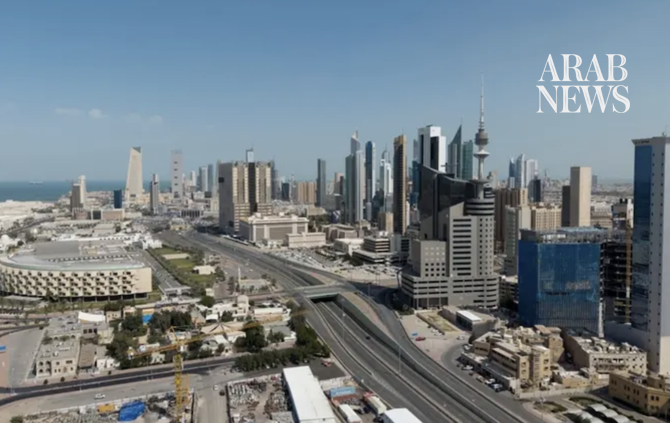

# Kuwait reports injuries and damage to power and water plants after Iranian attack

Source: https://www.arabnews.com/node/2651398/middle-east
Captured source: https://www.arabnews.com/node/2651398/middle-east
Published: 2026-07-18T17:08:03+03:00
Modified: 2026-07-18T17:09:01+03:00
Author: Arab News

## Summary

KUWAIT CITY: Kuwait Petroleum Corporation on Saturday said one of its oil facilities was hit by “repeated Iranian attacks” amid an escalation in hostilities between the US and Iran and the subsequent spillover across the Middle East. The strikes resulted in significant material damage and some injuries, according to the Kuwait News Agency. It added that Iran struck another of

## Image

## Video Or Embed URLs

- https://3429150888d1415d97150c64d2dbb4b7.safeframe.googlesyndication.com/safeframe/1-0-45/html/container.html
- https://static.addtoany.com/menu/sm.25.html
- about:blank
- https://imasdk.googleapis.com/js/core/bridge3.777.0_en.html
- https://www.google.com/recaptcha/api2/aframe
- https://cm.g.doubleclick.net/partnerpixels?gdpr=0&us_privacy=1---&gpp_sid=-1&url=https%3A%2F%2Fwww.arabnews.com%2Fnode%2F2651398%2Fmiddle-east

## Text

https://arab.news/ynh3w

The strikes resulted in significant material damage and some injuries

Kuwait accused Iran on Saturday of targeting civilian sites and vital infrastructure

KUWAIT CITY: Kuwait Petroleum Corporation on Saturday said one of its oil facilities was hit by “repeated Iranian attacks” amid an escalation in hostilities between the US and Iran and the subsequent spillover across the Middle East.

The strikes resulted in significant material damage and some injuries, according to the Kuwait News Agency.

It added that Iran struck another of its power and water plants, leading to the deactivation of several power generation units, a day after a similar attack.

Firefighters tending to the blaze and a worker have been injured in the attack, according to the Kuwaiti fire department.

Kuwait accused Iran on Saturday of targeting civilian sites and vital infrastructure in the country, after reporting attacks on an oil facility and a power and water plant.

“The repeated targeting of these vital facilities reveals a systematic hostile approach targeting civilian sites and vital infrastructure that endangers the lives and safety of civilians,” the foreign ministry said.

US forces launched strikes against Iran for a seventh night in a row on Friday.

Iran has retaliated by striking non-warring Gulf parties, with Bahrain and Kuwait coming under drone and missile attacks, as well as bases in Jordan.
