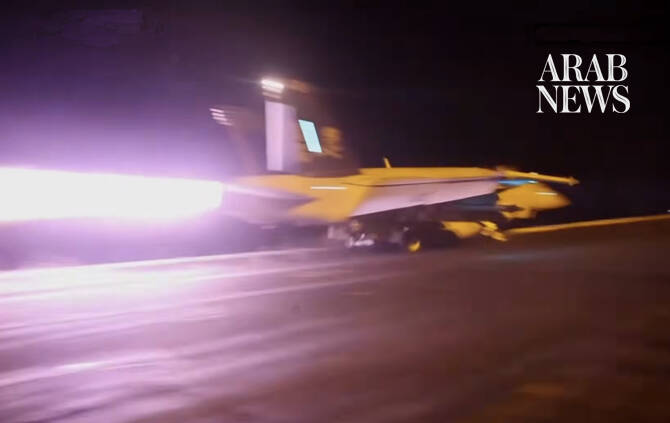

# US military launches new airstrikes to punish Iran for deaths of US troops

Source: https://www.arabnews.com/node/2651453/middle-east
Captured source: https://www.arabnews.com/node/2651453/middle-east
Published: 2026-07-19T01:17:28+03:00
Modified: 2026-07-19T06:22:41+03:00
Author: Agencies

## Summary

DUBAI: The US military said that it carried out new airstrikes against Iran on Sunday to “swiftly punish” the country’s Revolutionary Guard after an attack on a base in Jordan killed two American service members, left one missing and four requiring hospitalization. The Central Command said in a statement that the airstrikes began at 6 p.m. ET (2200 GMT), at President Donald

## Image

## Video Or Embed URLs

- https://www.youtube.com/embed/1fxV2hbjHBk?si=eCNvSTZ_UnnwsFUg
- https://e366b86c9650c7be89a72eb4467e8498.safeframe.googlesyndication.com/safeframe/1-0-45/html/container.html
- https://static.addtoany.com/menu/sm.25.html
- about:blank
- https://imasdk.googleapis.com/js/core/bridge3.777.0_en.html
- https://www.google.com/recaptcha/api2/aframe
- https://cm.g.doubleclick.net/partnerpixels?gdpr=0&us_privacy=1---&gpp_sid=-1&url=https%3A%2F%2Fwww.arabnews.com%2Fnode%2F2651453%2Fmiddle-east

## Text

https://arab.news/5wuhr

After initial denials, CENTCOM reported 2 dead and 1 missing in Iranian attacks on base in Jordan

Since the war began, 16 US service members have been killed and over 430 wounded

Iran hits back as usual at US allies in the region, targeting the base of the Kurdistan Freedom Party near Irbil and 2 US bases in Kuwait

DUBAI: The US military said that it carried out new airstrikes against Iran on Sunday to “swiftly punish” the country’s Revolutionary Guard after an attack on a base in Jordan killed two American service members, left one missing and four requiring hospitalization.

The Central Command said in a statement that the airstrikes began at 6 p.m. ET (2200 GMT), at President Donald Trump’s direction.

“The strikes are designed to further degrade Iran’s ability to threaten commercial shipping in the Strait of Hormuz and swiftly punish Islamic Revolutionary Guard Corps forces who launched attacks against American service members in Jordan last night,” it said, without providing further details.

The waterway accounted for roughly 20 percent of global oil supplies before the war. Iran effectively closed the strait to shipping traffic after the war started with US and Israeli strikes on Feb. 28.

As usual, Iran hit back at US allies in the region, targeting the base of the Kurdistan Freedom Party near Irbil with a drone early Sunday, and also two US bases in Kuwait with kamikaze drones before daybreak.

According to Iran’s stat TV, Iran’s army carried out “large-scale attacks with kamikaze drones against the US military’s ammunition depot at Camp Udairi and the Patriot radar system and air surveillance radar at Ali Al Salem Air Base in Kuwait.”

The new strikes came after the US military announced its first troop deaths from direct Iranian fire since the opening days of the war, following a drone and missile attack on a base in Jordan on Friday. The dead were not identified, and Central Command didn’t offer any further details on the deaths.

Since the war began, 16 US service members have been killed and over 430 wounded.

The previous recorded death of a US service member was that of a helicopter pilot who crashed in the Arabian Sea earlier this month. Early in the war, an Iranian drone strike on a command center in Kuwait killed six soldiers. One soldier died after an attack on a base in Saudi Arabia. Six were killed when a refueling aircraft crashed in Iraq.

US Defense ‌Secretary Pete Hegseth posted on X: “Godspeed, heroes. Their sacrifice only stiffens our resolve.”

The US and Iran have intensified attacks since an interim ceasefire deal signed a month ago fell apart last week, raising the possibility of a return to all-out war.

Iran appeared to target other ⁠US Gulf allies and Jordan on Saturday after US attacks on Iranian bridges, power facilities and other infrastructure.

Strikes target southern Iran

Iran’s Mehr news agency said the US carried out an attack near Sirik in southern Iran, adding that no casualties or damage to infrastructure have been reported.

An area near Sirik, on the Strait of Hormuz, was targeted around 1:30 a.m. local time, according to Iran’s state-run IRNA news agency, which cited local authorities in southern Hormozgan province. In the same province, a location near Hajjiabad was targeted and explosions were heard in Bandar Abbas, according to IRNA. An area near Qeshm Island, which is inside the strait, was also targeted, according to Iran’s state-run broadcaster, IRIB. On Saturday, Iranian state media reported that US airstrikes had hit an electricity and desalination plant in Hormozgan and damaged tunnels and bridges, disrupting a main highway toward Bandar Abbas, the site of Iran’s main port near the narrowest part of the strait. Trump has threatened to target Iran’s power stations and bridges to try to compel Tehran to loosen its hold on the Strait of Hormuz. The US in the past week also reimposed a naval blockade on Iranian ports to halt its shipments of crude oil, and the military on Saturday said it had redirected five ships and disabled one since then. Iranian authorities said Saturday that at least 50 people have been killed and more than 500 wounded in US strikes in the past three weeks, including eight killed in a strike on a bridge Friday. Strikes hit Iraq’s Kurdish region In neighboring Iraq, a base of the Kurdistan Freedom Party, an Iranian Kurdish dissident group, near Irbil was struck by a drone early Sunday, wounding eight of its members, according to Rebaz Sharifi, a military official with the group. Residents of Irbil, the capital of Iraq’s semi-autonomous northern Kurdish region, also heard explosions from air defenses early Sunday. Irbil has been targeted by drone attacks multiple times over the past four days, which coincided with a visit by new Iraqi Prime Minister Ali Al-Zaidi to Washington last week and an ongoing escalation between the US and Iran. No group has claimed responsibility for the attacks, but in the past both Iran and Iran-backed Iraqi militias have launched attacks in the Kurdish region, where both US troops and armed Kurdish Iranian dissident groups are present. Iran’s supreme leader warns of ‘unforgettable lessons’ Minutes before the US announced the troop deaths earlier Saturday, Iran’s supreme leader warned of “unforgettable lessons” if the US keeps attacking the Islamic Republic. The remarks read out on state TV and attributed to Mojtaba Khamenei, still unseen since the war began, called President Donald Trump’s signature “worthless and invalid.” An Iranian negotiator said Tehran was suspending its commitments to the interim deal signed about a month ago and aimed at permanently ending the fighting. Tehran’s declarations snapped another fragile thread as the war shows no end in sight. Now Khamenei warns of “lessons” not only from Iran but also its armed proxies in the region, calling them the “Axis of Resistance.” The US issued a global travel alert over the rising tensions. The battle has focused on control of the Strait of Hormuz. The widening strikes now threaten civilians and infrastructure, including desalination plants for drinking water, while the global economy again is on alert. The US has violated its commitments under the deal and now Iran is “no longer implementing them,” Kazem Gharibabadi, Iran’s deputy foreign minister, told state TV. There was no new word on mediation efforts. * AP & Reuters
