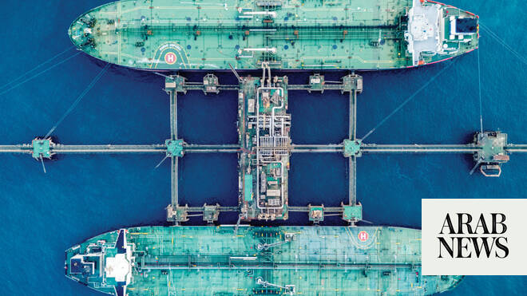

# Iran war poses Middle East’s biggest economic shock in five decades

Source: https://www.arabnews.com/node/2646842/business-economy
Captured source: https://www.arabnews.com/node/2646842/business-economy
Published: 2026-06-11T23:26:33+03:00
Modified: 2026-06-12T06:08:08+03:00
Author: ALAA SHAHINE SALHA

## Summary

RIYADH: The Iran war has delivered the broadest economic shock to the Middle East and North Africa in at least half a century of regional upheaval, according to an analysis produced by Asharq Business with Bloomberg. Its report, based on analyzing International Monetary Fund data dating back to 1980, compared the conflict with the onset of major geopolitical crises, including

## Image

## Video Or Embed URLs

- https://9c2497a1e5f84befc768ca7f0f77d33c.safeframe.googlesyndication.com/safeframe/1-0-45/html/container.html
- https://static.addtoany.com/menu/sm.25.html
- about:blank
- https://www.google.com/recaptcha/api2/aframe
- https://imasdk.googleapis.com/js/core/bridge3.770.1_en.html
- https://cm.g.doubleclick.net/partnerpixels?gdpr=0&us_privacy=1---&gpp_sid=-1&url=https%3A%2F%2Fwww.arabnews.com%2Fnode%2F2646842%2Fbusiness-economy

## Text

https://arab.news/p7jw6

Conflict has disrupted energy exports, trade routes and investment across economies worth almost $4 trillion, Asharq Business with Bloomberg analysis shows

Report suggests that recovery hinges on reopening the Strait of Hormuz and preventing a return to regional conflict

RIYADH: The Iran war has delivered the broadest economic shock to the Middle East and North Africa in at least half a century of regional upheaval, according to an analysis produced by Asharq Business with Bloomberg.

Its report, based on analyzing International Monetary Fund data dating back to 1980, compared the conflict with the onset of major geopolitical crises, including the Iran-Iraq war, Iraq’s invasion of Kuwait, the 2003 US-led invasion of Iraq, the 2011 Arab protests and the aftermath of the Oct. 7, 2023, attacks.

The current crisis is hitting a much larger economic bloc than previous shocks in the sample.

The combined nominal gross domestic product of the 10 directly affected economies — including Iran, the Gulf states, Iraq, Lebanon, and Israel — is about $4 trillion, equal to roughly 70 percent of the Middle East and North Africa economy and around 3 percent of global output, according to the analysis.

It underscores how the conflict may prove to be the region’s biggest turning point since the 1973 Arab oil embargo, a crisis that disrupted the global economy and led to what economists later called “stagflation.”

The difference is that the 1970s oil shock helped launch a Gulf boom, while the Iran war threatens to leave the region facing higher costs from disrupted trade and damaged investor confidence.

The conflict also came at a time when the Middle East was gearing up for a massive multi-year reconstruction effort in several postwar countries, including Syria, Lebanon, and Sudan, where Gulf states had been expected to play a major role alongside international institutions.

Here are the report’s key findings.

For the first time since the 1940s, a military conflict in the Middle East directly affected 10 countries: Iran, the UAE, Saudi Arabia, Bahrain, Kuwait, Qatar, Oman, Iraq, Lebanon, and Israel.

The war disrupted oil and gas production and exports across most Gulf countries, as well as Iraq and Iran. It also pushed OPEC production in May to its lowest level since 1985, according to Bloomberg estimates.

Combined GDP of the countries directly affected by the war is close to $4 trillion, equal to about 3 percent of the global economy and roughly 70 percent of the Middle East and North Africa’s nominal GDP — a share unmatched by any other crisis in the historical sample.

In growth terms, the aftermath of the 1979 Iranian revolution and the start of the Iran-Iraq war caused the region’s economy to contract by more than 1 percent in 1980, driven by a 21.6 percent collapse in Iran’s economy.

This year, the IMF’s baseline scenario expects Iran’s economy to shrink by about 6 percent.

By contrast, higher oil prices helped the region’s GDP grow by about 7 percent in 1990 and 1991, despite Iraq’s invasion of Kuwait and the subsequent war to liberate the country.

Oil prices also helped the region grow by about 5.8 percent in 2003 despite the US-led invasion of Iraq, while Iraq’s own economy contracted by more than 36 percent.

In 2011, the data show the region’s GDP grew by about 4 percent despite the impact of the anti-government protests on Egypt, Tunisia and Libya, as Gulf economies — led by Qatar, Saudi Arabia, and Kuwait — posted strong growth supported by oil prices.

In 2024, reflecting the impact of the Gaza war, the region grew by 1.8 percent, according to the data.

Saudi Arabia’s economy has shown resilience through most major geopolitical crises to hit the region over the past five decades, according to historical data and current IMF forecasts — a situation that largely reflects the Kingdom’s ability to keep producing and exporting oil during periods of conflict.

In the current Iran war, Saudi Aramco diverted most crude exports through the East-West pipeline to Yanbu on the Red Sea, reducing exposure to the Strait of Hormuz.

The crisis has also highlighted the strength of Saudi Arabia’s economy beyond oil, supported by domestic demand and a more diversified government revenue base after years of reforms.

Saudi GDP growth remained positive in the crises reviewed: 5.8 percent in 1980, 9.4 percent in 1990, 8.2 percent in 1991, 8.8 percent in 2003, 11 percent in 2011, 2.6 percent in 2024, and a forecast 3.1 percent in 2026.

The report said the path of recovery will depend on how quickly the war ends, whether the Strait of Hormuz fully reopens, and how fast energy exports return to normal.

A rebound in oil and gas output could lead to a sharp, V-shaped growth because of the weight of the energy sector in Gulf and Iraqi GDP.

But the harder challenge will be ensuring there is no repeat conflict anytime soon. That is essential for tourism, foreign direct investment, shipping, and non-oil activity — sectors that have become increasingly important for employment and diversification plans, according to the report.
