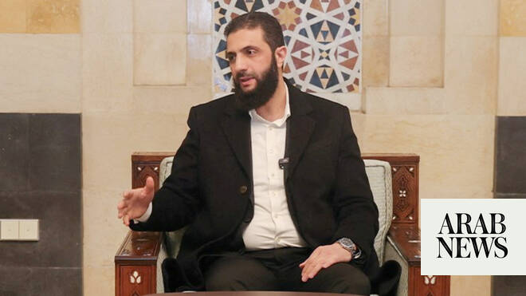

# Syrian president has no intention of intervening in Lebanon: sources

Source: https://www.arabnews.com/node/2646979/middle-east
Captured source: https://www.arabnews.com/node/2646979/middle-east
Published: 2026-06-12T23:51:16+03:00
Modified: 2026-06-12T23:51:16+03:00
Author: AFP

## Summary

DAMASCUS: Syrian President Ahmed Al-Sharaa told visitors that Damascus has no intention of intervening in Lebanon, two of them told AFP, days after US President Donald Trump suggested it might be willing to do so.

## Image

## Video Or Embed URLs

- https://bde5ceb40b8eb5dfdf400b17eb99c7a3.safeframe.googlesyndication.com/safeframe/1-0-45/html/container.html
- https://static.addtoany.com/menu/sm.25.html
- about:blank
- https://imasdk.googleapis.com/js/core/bridge3.770.1_en.html
- https://www.google.com/recaptcha/api2/aframe
- https://sync.teads.tv/wigo-no-slot
- https://cm.g.doubleclick.net/partnerpixels?gdpr=0&us_privacy=1---&gpp_sid=-1&url=https%3A%2F%2Fwww.arabnews.com%2Fnode%2F2646979%2Fmiddle-east

## Text

https://arab.news/pnnf6

Trump told US broadcaster NBC last week that Sharaa was willing to help against Hezbollah, which has been fighting a war with Israel since March 2 as part of the broader Middle East conflict

DAMASCUS: Syrian President Ahmed Al-Sharaa told visitors that Damascus has no intention of intervening in Lebanon, two of them told AFP, days after US President Donald Trump suggested it might be willing to do so. One of those present, requesting anonymity to speak freely, said that Sharaa told dozens of notables and dignitaries from the Damascus province that “what is being circulated about Syria entering Lebanon is nothing more than rumors.” The Syrian presidency announced on Thursday that Sharaa received the delegation at the presidential palace in a meeting that addressed service and development issues of concern to the province’s residents. The statement made no mention of Sharaa’s remarks on Lebanon. It came with Israel and Iran-backed Hezbollah still trading blows in the country, despite a conditional ceasefire announced by Lebanese and Israeli envoys earlier this month in Washington. Hezbollah rejected the agreement, which makes no mention of Israel having to cease attacks or withdraw its troops from Lebanon. Trump told US broadcaster NBC last week that Sharaa was willing to help against Hezbollah, which has been fighting a war with Israel since March 2 as part of the broader Middle East conflict. “I’d like to see a more surgical attack on Hezbollah. I think it should be more surgical. And we can help them with that, or we can recommend Syria,” he said. “Syria’s doing a very good job of cleaning up their act. They have a very good leader. They have a leader that’s really done a good job in a short period of time. And he would love to help.” In a televised interview on Thursday, Syrian interior ministry spokesperson Noureddine Al-Baba aid that Damascus stands with Lebanese President Joseph Aoun in “preserving Lebanon’s security and the sovereignty of the Lebanese state.” “Coordination with our brother Lebanon is the cornerstone of any possible role that Syria can play in resolving Lebanese issues,” he added. Responding to Trump’s words, Baba said that “the Syrian and Lebanese sides are best positioned to interpret these statements and agree on a formula that serves both countries within the framework of the common Arab vision.” Syria, which under the Assad family was a close ally of Hezbollah, dominated Lebanon for decades following a military intervention in the latter’s 1975-1990 civil war, withdrawing only in 2005, making any new military involvement a fraught proposition. Hezbollah fought alongside the Syrian government in that country’s own civil war, making the new authorities in Damascus, which took over after the fall of Bashar Assad in 2024, deeply hostile to it.
