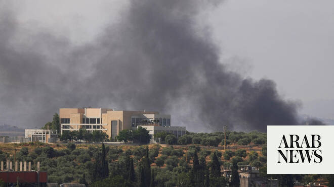

# Lebanon reports 1 dead in strikes on south as Israel issues broad evacuation warnings

Source: https://www.arabnews.com/node/2647007/middle-east
Captured source: https://www.arabnews.com/node/2647007/middle-east
Published: 2026-06-13T10:35:02+03:00
Modified: 2026-06-13T19:31:57+03:00
Author: AFP

## Summary

BEIRUT: Lebanon reported Israeli strikes on the country’s south on Saturday as the Israeli army issued evacuation warnings for more than 20 locations including the city of Nabatieh ahead of raids there. The state-run National News Agency (NNA) said Israeli airstrikes hit several areas covered by the warning, including the villages of Rihan and Sujud, located not far from

## Image

## Video Or Embed URLs

- https://static.addtoany.com/menu/sm.25.html
- about:blank
- https://www.google.com/recaptcha/api2/aframe
- https://imasdk.googleapis.com/js/core/bridge3.770.1_en.html
- https://cm.g.doubleclick.net/partnerpixels?gdpr=0&us_privacy=1---&gpp_sid=-1&url=https%3A%2F%2Fwww.arabnews.com%2Fnode%2F2647007%2Fmiddle-east

## Text

https://arab.news/bqfun

NNA said Israeli airstrikes hit several areas covered by the warning, including the villages of Rihan and Sujud

Hezbollah said its fighters launched drone attacks on Israeli military vehicles in the south

BEIRUT: Lebanon reported Israeli strikes on the country’s south on Saturday as the Israeli army issued evacuation warnings for more than 20 locations including the city of Nabatieh ahead of raids there.

The state-run National News Agency (NNA) said Israeli airstrikes hit several areas covered by the warning, including the villages of Rihan and Sujud, located not far from Nabatieh, and other areas not mentioned in the evacuation notice.

It said an Israeli strike killed a local official in Rihan, located in the southern region of Jezzine.

An AFP correspondent in Nabatieh said the city was almost deserted, and also reported artillery shelling there and in nearby areas overnight and on Saturday.

A day earlier, the NNA reported explosions and artillery shelling near the Ali Taher hills overlooking the city.

The Israeli army warned residents in 24 locations, both in and around Nabatieh and nearer to the coast, to “evacuate your homes immediately and move to the north of the Zahrani River,” around 45 kilometers (28 miles) from the southern border with Israel.

Last month it declared all areas south of the river “combat zones,” and has been heavily striking the area.

Israel’s military also said its air force on Saturday “intercepted a suspicious aerial target that crossed from Lebanon into Israeli territory.”

Hezbollah, which has kept up attacks on Israeli troops who have invaded south Lebanon, said its fighters launched drone attacks on Israeli military vehicles in the south.

Israel and Hezbollah have been at war since early March when the Iran-backed group drew Lebanon into the Middle East conflict with rocket fire at Israel to avenge the killing of Iran’s supreme leader in US-Israeli strikes.

Iran insists that Lebanon must be part of any agreement to end the wider Middle East war, and a senior US official said Friday that a peace deal with Iran “includes Lebanon.”

Neither Israel nor Hezbollah have respected a ceasefire announced in April, and a conditional truce deal announced this month after a fourth round of direct Lebanese-Israeli negotiations in Washington has also failed to halt the fighting. Lebanon says Israel’s massive campaign of airstrikes and ground invasion have killed more than 3,700 people. Hezbollah has rejected the direct talks and the conditional agreement, which requires it to cease attacks but makes no mention of Israel doing so or withdrawing troops from Lebanon. Lebanon’s leaders have instead accused Tehran of treating the country as a “bargaining chip.” Hezbollah lawmaker Ali Fayyad on Saturday urged Lebanon to take advantage of any deal to end the Iran war that includes the country. “We want the Lebanese state to negotiate for itself, and nobody is suggesting forfeiting this role,” Fayyad said, “however, the state must abandon the policy of being crushed in the face of the Israelis and submission to the Americans.” Lebanese President Joseph Aoun said in a statement on X on Saturday that Lebanon faces “a fateful test.” “Either its people unite around a sovereign state that monopolizes weapons, upholds the law and protects citizens irrespective of their affiliation or position, or it remains hostage to the logic of militias,” the statement said. Further Israel-Lebanon talks are scheduled for later this month.
