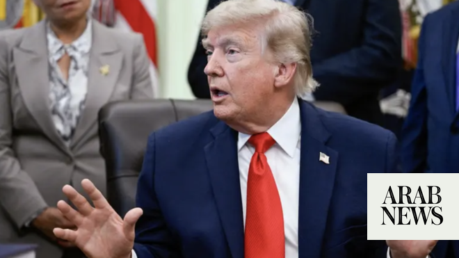

# US, Iran inch closer to deal, timing remains unclear

Source: https://www.arabnews.com/node/2647023/middle-east
Captured source: https://www.arabnews.com/node/2647023/middle-east
Published: 2026-06-13T14:21:26+03:00
Modified: 2026-06-14T10:24:22+03:00
Author: AFPReuters

## Summary

WASHINGTON/DUBAI: US and Pakistani leaders forecast a Sunday signing of a long-elusive framework agreement to end fighting ​between the United States and Iran, but Tehran cast doubt over the timing and hard-line protesters in Iran voiced opposition. Qatari negotiators flew to ​Tehran on Sunday morning as part of effort to ‌finalize ‌an ​agreement ‌to ⁠end US-Iran ​war, a

## Image

## Video Or Embed URLs

- https://static.addtoany.com/menu/sm.25.html
- about:blank
- https://www.google.com/recaptcha/api2/aframe
- https://imasdk.googleapis.com/js/core/bridge3.770.1_en.html
- https://cm.g.doubleclick.net/partnerpixels?gdpr=0&us_privacy=1---&gpp_sid=-1&url=https%3A%2F%2Fwww.arabnews.com%2Fnode%2F2647023%2Fmiddle-east

## Text

https://arab.news/wbpn6

US, Pakistani leaders predict Sunday signing of peace framework

Iranian officials, protesters express skepticism, opposition to timing, ‌terms

Deal framework includes reopening Strait of Hormuz, lifting US blockade, phased de-escalation, sources say

WASHINGTON/DUBAI: US and Pakistani leaders forecast a Sunday signing of a long-elusive framework agreement to end fighting ​between the United States and Iran, but Tehran cast doubt over the timing and hard-line protesters in Iran voiced opposition.

Qatari negotiators flew to ​Tehran on Sunday morning as part of effort to ‌finalize ‌an ​agreement ‌to ⁠end US-Iran ​war, a ⁠source with knowledge of the situation told Reuters.

US ⁠and Pakistani ‌leaders ‌forecast ​a ‌Sunday ‌signing of a framework agreement to end ‌the more than three-month-long war, but ⁠Tehran ⁠cast doubt over the timing as hard-line protesters in Iran voiced opposition.

President Donald Trump posted on social media on Saturday that the deal with Iran was scheduled to be signed the next day, his 80th birthday. Pakistani Prime Minister Shehbaz Sharif said the two sides had agreed on a framework for a peace deal and that Islamabad was preparing for an electronic signing on Sunday, to be followed by technical-level talks in the coming week.

But Iran did not confirm a Sunday signing. Iranian Foreign Ministry spokesperson Esmaeil Baghaei, speaking before Trump’s post, had cautioned against commenting on the timing of the signing but was quoted by state media saying, “It will not be tomorrow,” but could happen “in the coming days.”

Trump wrote on Truth Social that after a framework deal is signed, the Strait of Hormuz, a ‌vital artery for ‌global oil supplies that Iran has blocked, would immediately be “open to all.”

The new momentum came in spite of fresh skirmishes in the Strait of Hormuz, which Iran has blockaded since early in the war, throwing global markets into turmoil.

Since an April 8 truce paused the worst of the fighting, Trump has repeatedly insisted a deal was near only for the wrangling to drag on. Hormuz drones

Tehran has insisted it will maintain control over the Strait of Hormuz, a key maritime trade route for oil and gas shipments from the Gulf.

Since imposing its blockade, Iran has demanded vessels obtain permission from its armed forces before transiting the waterway, and has established a new body to oversee it and collect tolls.

The US has responded with its own blockade of Iranian ports.

Earlier on Saturday, the US military’s Central Command said Iran had “launched multiple one-way attack drones in an attempt to strike commercial ships transiting the Strait.”

It added that “US forces have downed all of them in recent hours.”

Araghchi, in an interview with state television Friday, had said the deal on the table called for the lifting of the US naval blockade.

He added that “the administration of Strait of Hormuz will no longer be the same as before,” calling the waterway one of Iran’s “main instruments of deterrence.”

The US has repeatedly said Iran remaining in control of the strait would be unacceptable, and Trump’s post made no mention of tolls or other arrangements.

Another key sticking point in the talks has been the fate of Iran’s nuclear program, and particularly its stockpile of highly enriched uranium — believed to have been buried by US strikes last year during a previous short-lived war.

Iran has long insisted its nuclear program is peaceful and that it has a right to enrichment, but the United States, Israel and other Western governments suspect it of seeking a bomb.

Araghchi on Friday said the only way to deal with Iran’s enriched uranium “is to dilute it inside Iran.”

Trump, who has justified the war as necessary to prevent Iran from obtaining nuclear weapons, previously said the US would remove and destroy the uranium.

In his post on Saturday, he said that “when all is calm, we will go in and get the Nuclear Dust... and downblend and destroy it, whether in Iran, or the United States.”

“Hopefully, this process will all work out quickly, easily, and smoothly,” he added. “If it doesn’t, we have the ultimate alternative, hopefully never to be used again!“

Prime Minister Benjamin Netanyahu of Israel — which launched the war in tandem with the US in February — said Trump had promised him any agreement would include the removal of the enriched nuclear material.

In the streets of Tehran, there was skepticism the latest agreement would cross the finish line.

“I don’t think there is any deal soon,” said Saeed Sadeghi, 49. “I don’t trust their word.”

Another man in the city of Tonekabon, who identified himself only as Ali, said deal or no deal, Iranians would suffer.

“Neither outcome is in the people’s interest. If they reach an agreement and no longer have to worry about the international community, they’ll oppress people a thousand times harder,” he said of the Iranian authorities.
