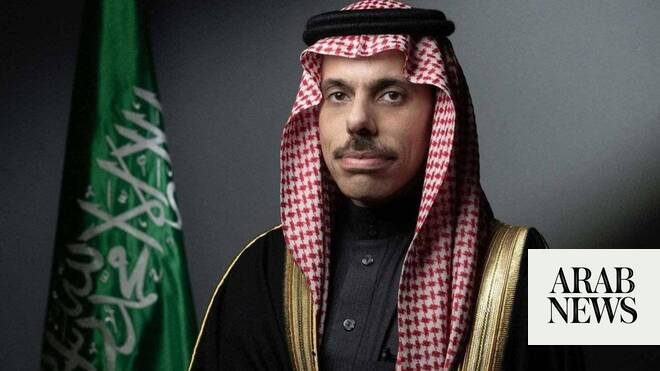

# Saudi and Pakistani foreign ministers discuss regional situation, US-Iran deal

Source: https://www.arabnews.com/node/2647056/saudi-arabia
Captured source: https://www.arabnews.com/node/2647056/saudi-arabia
Published: 2026-06-13T21:55:33+03:00
Modified: 2026-06-13T21:55:33+03:00
Author: Arab News

## Summary

RIYADH: Saudi Foreign Minister Prince Faisal bin Farhan and his counterpart from Pakistan Muhammad Ishaq Dar spoke on the phone on Saturday, the Saudi Press Agency reported. During the call, they discussed the latest regional developments and the efforts being made in this regard, SPA added. The two ministers also reviewed progress in ongoing United States-Iran talks for a

## Image

## Video Or Embed URLs

- https://static.addtoany.com/menu/sm.25.html
- about:blank
- https://www.google.com/recaptcha/api2/aframe
- https://imasdk.googleapis.com/js/core/bridge3.770.1_en.html
- https://sync.teads.tv/wigo-no-slot
- https://cm.g.doubleclick.net/partnerpixels?gdpr=0&us_privacy=1---&gpp_sid=-1&url=https%3A%2F%2Fwww.arabnews.com%2Fnode%2F2647056%2Fsaudi-arabia

## Text

https://arab.news/6z4p2

They discussed latest regional developments and the efforts being made in this regard

RIYADH: Saudi Foreign Minister Prince Faisal bin Farhan and his counterpart from Pakistan Muhammad Ishaq Dar spoke on the phone on Saturday, the Saudi Press Agency reported.

During the call, they discussed the latest regional developments and the efforts being made in this regard, SPA added.

The two ministers also reviewed progress in ongoing United States-Iran talks for a deal to end their war and expressed optimism that it would lead to lasting peace in the Middle East, the Pakistani foreign ministry said.

The statement came shortly after Prime Minister Shehbaz Sharif, whose government has mediated between Iran and the US, said that a peace deal to end the US-Iran war would “likely” be finalized within 24 hours
