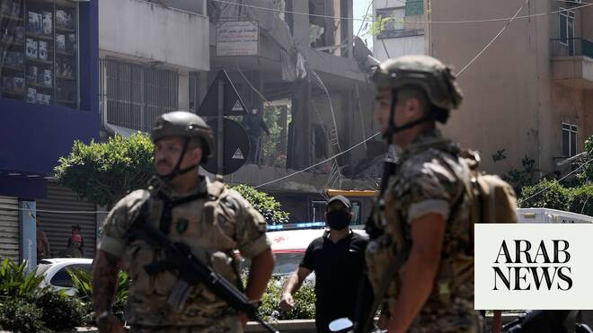

# Three dead as Israel says strikes Hezbollah in Beirut’s southern suburbs

Source: https://www.arabnews.com/node/2647106/middle-east
Captured source: https://www.arabnews.com/node/2647106/middle-east
Published: 2026-06-14T10:27:07+03:00
Modified: 2026-06-14T18:25:30+03:00
Author: AFP

## Summary

BEIRUT: Israel struck Beirut’s southern suburbs on Sunday, killing three people, in response to what it said was Hezbollah fire at northern Israel, while its military also carried out broader strikes on southern Lebanon. The latest escalation came amid expectations that a deal between the United States and Iran to end the Middle East war could be imminent, but Iranian chief

## Image

## Video Or Embed URLs

- blob:https://www.arabnews.com/b13c54e7-43db-4c0c-81b5-44b45dd0ecf1
- https://imasdk.googleapis.com/js/core/bridge3.771.2_en.html
- https://static.addtoany.com/menu/sm.25.html
- about:blank
- https://sync.teads.tv/wigo-no-slot
- https://www.google.com/recaptcha/api2/aframe
- https://cm.g.doubleclick.net/partnerpixels?gdpr=0&us_privacy=1---&gpp_sid=-1&url=https%3A%2F%2Fwww.arabnews.com%2Fnode%2F2647106%2Fmiddle-east

## Text

https://arab.news/r87ww

AFP correspondent saw smoke and dust rising near a heavily damaged apartment as debris covered the street and people searched for survivors

BEIRUT: Israel struck Beirut’s southern suburbs on Sunday, killing three people, in response to what it said was Hezbollah fire at northern Israel, while its military also carried out broader strikes on southern Lebanon. The latest escalation came amid expectations that a deal between the United States and Iran to end the Middle East war could be imminent, but Iranian chief negotiator Mohammad Bagher Ghalibaf said there was “no point” in continuing peace talks with Washington after the strike. Tehran insists a ceasefire in Lebanon must be part of any deal. Israel and Hezbollah have been at war since March 2 when the Iran-backed group fired rockets at Israel to avenge the killing of Iran’s supreme leader in US-Israeli strikes days earlier. Lebanon’s official National News Agency (NNA) said a strike hit an apartment in the Ghobeiry neighborhood of Beirut’s southern suburbs, a Hezbollah stronghold known as Dahiyeh. An AFP correspondent saw smoke and dust rising near a heavily damaged apartment as debris covered the street and people searched for survivors, with panic in the area after the strike along a busy road filled with shops. Lebanon’s civil defense agency reported three dead and six wounded. Israeli officials including Prime Minister Benjamin Netanyahu have warned that Israel would strike south Beirut if the Iran-backed Hezbollah group targets northern Israeli communities, a position they say has the backing of Washington. The Israeli military earlier Sunday said three suspected Hezbollah drones struck northern Israel in separate incidents, causing no casualties. Hezbollah on Sunday claimed several attacks on Israeli troops who have invaded south Lebanon, but none on north Israel.

Israel’s military had struck Beirut’s southern suburbs last week after saying it had intercepted rockets launched by Hezbollah into Israeli territory. Iran launched missiles toward Israel in response to that attack, triggering Israeli retaliatory strikes before both sides halted fire. Iran had repeatedly warned it would strike Israel if the Lebanese capital was targeted. Netanyahu’s office said Sunday that the military “carried out strikes in the Dahiyeh district of Beirut against terrorist targets belonging to the Hezbollah terrorist organization, in response to Hezbollah’s firing toward Israeli territory.” Israel’s military said it “conducted a precise strike on a Hezbollah command center” in the area. Two far-right Israeli ministers earlier Sunday had called for strikes. “The shooting at northern communities is a test of the Dahiyeh Doctrine that the prime minister declared. I call on him to implement it decisively and firmly, and to bring down buildings in Dahiyeh,” Finance Minister Bezalel Smotrich said on X. “For every drone — a missile; for every violation — fire; for every UAV — Dahiyeh must tremble,” wrote National Security Minister Itamar Ben Gvir on X. A senior Iranian military official meanwhile warned that Israel’s strike on Beirut’s southern suburbs would not go “unanswered” by Tehran. “Without a doubt, these crimes will not go unanswered,” Brig. Gen. Mohammad Jafar Asadi, deputy commander of Iran’s highest military command, told Defa Press news agency. Lebanon’s NNA also reported Israeli strikes on more than 20 locations in the country’s south, including the city of Nabatieh. The strikes came both before and after the Israeli army issued evacuation warnings for almost 30 south Lebanon locations ahead of raids there. Israel’s military activity in recent days has been focused on the region around Nabatieh.

A military source told AFP on Sunday that a small Lebanese army force which had been present in Kfar Tibnit, near Nabatieh, evacuated its position there a day earlier after an Israeli incursion into the village. Requesting anonymity, the source emphasized that the Lebanese army was however still present at the Nabatieh barracks. An AFP correspondent saw around a dozen vehicles, including some military trucks and heavy machinery as well as civilian vehicles, heading out of Nabatieh on Sunday. In April, Israel and Lebanon began landmark direct talks in Washington seeking to halt the hostilities, with a fifth round scheduled later this month. Hezbollah rejects the direct talks and has dismissed a conditional ceasefire announced this month that would require it to cease attacks but makes no mention of Israel doing so or withdrawing troops from Lebanon. Lebanon says Israel’s campaign of airstrikes and ground invasion since March 2 have killed more than 3,700 people.
