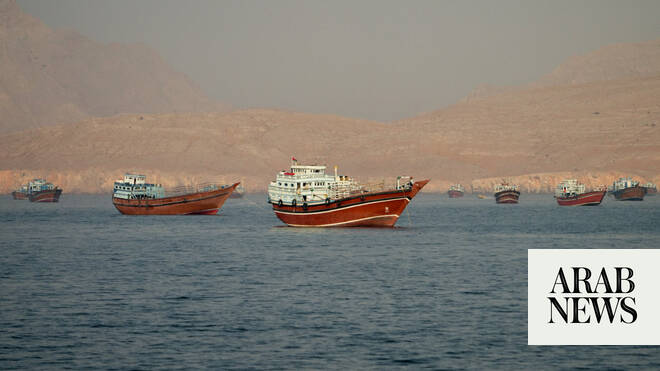

# Iran’s foreign ministry says ‘deep mistrust’ in US remains despite deal

Source: https://www.arabnews.com/node/2647180/middle-east
Captured source: https://www.arabnews.com/node/2647180/middle-east
Published: 2026-06-15T15:16:18+03:00
Modified: 2026-06-15T15:22:47+03:00
Author: Agencies

## Summary

ISLAMABAD/DUBAI/TEHRAN: Iran’s foreign ministry said on Monday that Tehran still holds “deep mistrust” of the United States despite an agreed framework aimed at ending the war. “Unfortunately, it must be acknowledged that Iran’s deep mistrust of the United States stems from long history of wrongdoing by American leaders,” said foreign ministry spokesman Esmaeil Baqaei in a

## Image

## Video Or Embed URLs

- https://0167994a036871b7a6ad9d2dd1d18d23.safeframe.googlesyndication.com/safeframe/1-0-45/html/container.html
- blob:https://www.arabnews.com/675633e8-a2fd-4a86-80a2-84c6ee0c8337
- https://imasdk.googleapis.com/js/core/bridge3.771.2_en.html
- https://truthsocial.com/@realDonaldTrump/116750814874397998/embed
- https://platform.twitter.com/embed/Tweet.html?creatorScreenName=Arab_News&creatorUserId=69172612&dnt=false&embedId=twitter-widget-0&features=eyJ0ZndfdGltZWxpbmVfbGlzdCI6eyJidWNrZXQiOltdLCJ2ZXJzaW9uIjpudWxsfSwidGZ3X2ZvbGxvd2VyX2NvdW50X3N1bnNldCI6eyJidWNrZXQiOnRydWUsInZlcnNpb24iOm51bGx9LCJ0ZndfdHdlZXRfZWRpdF9iYWNrZW5kIjp7ImJ1Y2tldCI6Im9uIiwidmVyc2lvbiI6bnVsbH0sInRmd19yZWZzcmNfc2Vzc2lvbiI6eyJidWNrZXQiOiJvbiIsInZlcnNpb24iOm51bGx9LCJ0ZndfZm9zbnJfc29mdF9pbnRlcnZlbnRpb25zX2VuYWJsZWQiOnsiYnVja2V0Ijoib24iLCJ2ZXJzaW9uIjpudWxsfSwidGZ3X21peGVkX21lZGlhXzE1ODk3Ijp7ImJ1Y2tldCI6InRyZWF0bWVudCIsInZlcnNpb24iOm51bGx9LCJ0ZndfZXhwZXJpbWVudHNfY29va2llX2V4cGlyYXRpb24iOnsiYnVja2V0IjoxMjA5NjAwLCJ2ZXJzaW9uIjpudWxsfSwidGZ3X3Nob3dfYmlyZHdhdGNoX3Bpdm90c19lbmFibGVkIjp7ImJ1Y2tldCI6Im9uIiwidmVyc2lvbiI6bnVsbH0sInRmd19kdXBsaWNhdGVfc2NyaWJlc190b19zZXR0aW5ncyI6eyJidWNrZXQiOiJvbiIsInZlcnNpb24iOm51bGx9LCJ0ZndfdXNlX3Byb2ZpbGVfaW1hZ2Vfc2hhcGVfZW5hYmxlZCI6eyJidWNrZXQiOiJvbiIsInZlcnNpb24iOm51bGx9LCJ0ZndfdmlkZW9faGxzX2R5bmFtaWNfbWFuaWZlc3RzXzE1MDgyIjp7ImJ1Y2tldCI6InRydWVfYml0cmF0ZSIsInZlcnNpb24iOm51bGx9LCJ0ZndfbGVnYWN5X3RpbWVsaW5lX3N1bnNldCI6eyJidWNrZXQiOnRydWUsInZlcnNpb24iOm51bGx9LCJ0ZndfdHdlZXRfZWRpdF9mcm9udGVuZCI6eyJidWNrZXQiOiJvbiIsInZlcnNpb24iOm51bGx9fQ%3D%3D&frame=false&hideCard=false&hideThread=false&id=2066374691489751310&lang=en&origin=https%3A%2F%2Fwww.arabnews.com%2Fnode%2F2647180%2Fmiddle-east&sessionId=900a34c3d836b07ae5dec3c2f4eee8823d1f40ff&siteScreenName=Arab_News&siteUserId=69172612&theme=light&widgetsVersion=6a3ad42b224df%3A1778106238597&width=600px
- https://platform.twitter.com/embed/Tweet.html?creatorScreenName=Arab_News&creatorUserId=69172612&dnt=false&embedId=twitter-widget-1&features=eyJ0ZndfdGltZWxpbmVfbGlzdCI6eyJidWNrZXQiOltdLCJ2ZXJzaW9uIjpudWxsfSwidGZ3X2ZvbGxvd2VyX2NvdW50X3N1bnNldCI6eyJidWNrZXQiOnRydWUsInZlcnNpb24iOm51bGx9LCJ0ZndfdHdlZXRfZWRpdF9iYWNrZW5kIjp7ImJ1Y2tldCI6Im9uIiwidmVyc2lvbiI6bnVsbH0sInRmd19yZWZzcmNfc2Vzc2lvbiI6eyJidWNrZXQiOiJvbiIsInZlcnNpb24iOm51bGx9LCJ0ZndfZm9zbnJfc29mdF9pbnRlcnZlbnRpb25zX2VuYWJsZWQiOnsiYnVja2V0Ijoib24iLCJ2ZXJzaW9uIjpudWxsfSwidGZ3X21peGVkX21lZGlhXzE1ODk3Ijp7ImJ1Y2tldCI6InRyZWF0bWVudCIsInZlcnNpb24iOm51bGx9LCJ0ZndfZXhwZXJpbWVudHNfY29va2llX2V4cGlyYXRpb24iOnsiYnVja2V0IjoxMjA5NjAwLCJ2ZXJzaW9uIjpudWxsfSwidGZ3X3Nob3dfYmlyZHdhdGNoX3Bpdm90c19lbmFibGVkIjp7ImJ1Y2tldCI6Im9uIiwidmVyc2lvbiI6bnVsbH0sInRmd19kdXBsaWNhdGVfc2NyaWJlc190b19zZXR0aW5ncyI6eyJidWNrZXQiOiJvbiIsInZlcnNpb24iOm51bGx9LCJ0ZndfdXNlX3Byb2ZpbGVfaW1hZ2Vfc2hhcGVfZW5hYmxlZCI6eyJidWNrZXQiOiJvbiIsInZlcnNpb24iOm51bGx9LCJ0ZndfdmlkZW9faGxzX2R5bmFtaWNfbWFuaWZlc3RzXzE1MDgyIjp7ImJ1Y2tldCI6InRydWVfYml0cmF0ZSIsInZlcnNpb24iOm51bGx9LCJ0ZndfbGVnYWN5X3RpbWVsaW5lX3N1bnNldCI6eyJidWNrZXQiOnRydWUsInZlcnNpb24iOm51bGx9LCJ0ZndfdHdlZXRfZWRpdF9mcm9udGVuZCI6eyJidWNrZXQiOiJvbiIsInZlcnNpb24iOm51bGx9fQ%3D%3D&frame=false&hideCard=false&hideThread=false&id=2066268332832194810&lang=en&origin=https%3A%2F%2Fwww.arabnews.com%2Fnode%2F2647180%2Fmiddle-east&sessionId=900a34c3d836b07ae5dec3c2f4eee8823d1f40ff&siteScreenName=Arab_News&siteUserId=69172612&theme=light&widgetsVersion=6a3ad42b224df%3A1778106238597&width=600px
- about:blank
- https://static.addtoany.com/menu/sm.25.html
- https://platform.twitter.com/widgets/widget_iframe.1227a5674072e080ffb1ba14ac0c1079.html?origin=https%3A%2F%2Fwww.arabnews.com
- https://ep2.adtrafficquality.google/sodar/sodar2/254/runner.html
- https://www.google.com/recaptcha/api2/aframe
- https://cm.g.doubleclick.net/partnerpixels?gdpr=0&us_privacy=1---&gpp_sid=-1&url=https%3A%2F%2Fwww.arabnews.com%2Fnode%2F2647180%2Fmiddle-east

## Text

https://arab.news/y9atd

Deal offers relief to the global economy more than three months since fighting began

Details of the deal, to be signed Friday in Switzerland, were not immediately available

ISLAMABAD/DUBAI/TEHRAN: Iran’s foreign ministry said on Monday that Tehran still holds “deep mistrust” of the United States despite an agreed framework aimed at ending the war.

“Unfortunately, it must be acknowledged that Iran’s deep mistrust of the United States stems from long history of wrongdoing by American leaders,” said foreign ministry spokesman Esmaeil Baqaei in a weekly press briefing.

“The United States still has a long way to go before it can earn the trust of the Iranian people,” he noted, adding that the framework was “merely a step toward reducing tensions and end a war” which broke out late February.

The US and Iran are to hold indirect meetings in Doha this week ahead of the formal signing of a deal aimed at ending the Middle East war, a diplomat told AFP on Monday.

“Separate preparatory meetings with each side will now take place in Doha this week, ahead of the official signing in Switzerland and the start of the technical talks,” the diplomat said, speaking on condition of anonymity to discuss the sensitive arrangements.

The source added that Qatari mediators had departed Tehran after “17 hours of intensive negotiations,” which began on Sunday and culminated in an agreement being reached.

The US and Iran have reached an agreement to end the war and open the Strait of Hormuz, offering relief to the global economy more than three months since fighting began.

Details of the deal were not immediately available. Key mediator Pakistan said the signing will be Friday in Switzerland. Key issues like Iran’s nuclear program are expected to be addressed later.

Pakistan’s Prime Minister Shehbaz Sharif called the US-Iran deal a “historic step toward peace” Monday following weeks of his government mediating between the warring sides.

“Today, the world has seen a historic step toward peace. After the darkness of war, the sun of peace has risen,” Sharif told Pakistani lawmakers after earlier announcing the deal would be signed in Geneva on June 19.

​Iran’s Foreign ‌Minister ‌Abbas Araghchi told his ‌Turkish, Iraqi and Egyptian ⁠counterparts on ⁠Monday in separate calls that Israeli ​attacks against Lebanon need to be ‌completely ‌halted ​and ‌the ⁠US ​bears responsibility for implementing ⁠the framework deal ⁠on ‌ending the ‌war, according to his ​Telegram ​account.

Sharif earlier said in a post on X that the pact called for “the immediate and permanent termination of military operations on all fronts, including in Lebanon.”

Lebanon has been a sticking point in negotiations, with Israel and Hezbollah ignoring calls from Trump and others to stop their attacks on each other in recent weeks.

US President Donald Trump confirmed a deal had been reached and said he had authorized an end to the US naval blockade of Iranian ports in the Strait of Hormuz, imposed in retaliation for Iran’s grip on the crucial waterway.

“Congratulations to all!” Trump wrote on social media, adding: “I hereby fully authorize the toll free opening of the Strait of Hormuz, and, simultaneously herewith, authorize the immediate removal of the United States Naval blockade.”

The US previously said it would ease its blockade of Iranian ports as the strait reopens, and would agree to relax sanctions to allow Iran to sell more of its oil and strengthen its battered economy. Iran’s deputy foreign minister, Kazem Gharibabadi, confirmed the agreement on state television but said Iran would not start implementing it until it was signed on Friday. He said the deal followed over 14 hours of talks in Tehran with a representative from Qatar, another mediator. Iranian state TV showed a banner asserting: “US was forced to sign an agreement to end the war.” Pakistan first announced the deal after a day in which Israel, sidelined from the negotiations, attacked Beirut’s southern suburbs while pursuing the Iranian-backed Hezbollah. The attacks posed a threat to completing the negotiations. “Both sides have declared the immediate and permanent termination of military operations on all fronts, including in Lebanon,” Pakistani Prime Minister Shehbaz Sharif said, adding that mediators this week will facilitate meetings to “lay the foundation for the technical talks.”

Deputy Pakistani prime minister and foreign minister Ishaq Dar meanwhile added the country warmly welcomes the understanding reached between the United States and Iran. Dar posted on his X account: “This significant breakthrough reflects the power of sustained diplomatic engagement and the collective resolve of friendly nations to choose dialogue over confrontation. It also sends a reassuring message to the international community and provides much-needed confidence and stability to global markets and the world economy, particularly for developing countries that are most vulnerable to regional instability.”

Dar also thanked Saudi Arabia, Qatar, Turkiye, Egypt and the UN for helping to achieve “this important milestone.”

US-Iran deal should immediately reopen Hormuz Strait

agreement between the United States and Iran ​should allow for the “immediate reopening” of the Strait of Hormuz, EU Commission President Ursula von der Leyen said on Monday.

“The ‌priority now ‌is ​its ‌swift ⁠and ​full implementation ⁠by all parties,” von der Leyen said about the announced deal.

“Freedom of navigation must be restored ⁠toll-free. This is essential ‌for ‌regional stability and ​the ‌global economy. It opens ‌the door to broader negotiations on peace and security in the Middle East,” ‌she added.

Von der Leyen also said ⁠that ⁠peace in the Middle East was impossible “while Lebanon is in flames.”

“Once again Europe calls on all parties to respect Lebanon’s sovereignty and territorial integrity and implement ​a ​genuine ceasefire,” she said.

Nuclear accord and saving Israel President Donald Trump told the New ​York Times on Sunday if Iran failed to reach a final nuclear accord with the US, he ‌would ​restart ‌military ⁠attacks ​on Tehran or ⁠make the US “the guardian of the Middle East” in return for ⁠20 percent of the ‌region’s ‌revenues. Trump told ​the ‌Times in an ‌interview the agreement he reached with Iran would ultimately assure ‌that the Strait of Hormuz is “permanently ⁠toll ⁠free” and argued that, despite the objections of Prime Minister Benjamin Netanyahu of Israel, he had saved Israel from nuclear obliteration.

The deal came under criticism even in the final hours Broader negotiations on outstanding issues like Iran’s nuclear program would continue over the next 60 days, two senior Pakistani officials said earlier Sunday, speaking on condition of anonymity because they were not authorized to discuss the matter publicly. If the sides fail to reach a resolution within that time, the timeline could be extended. The deal likely returns the region to a status that existed before the war, but with thousands of people dead and Iran wielding a new source of negotiating pressure with its ability to influence shipping in the strait. The waterway is crucial to significant shipments of oil, natural gas and related products like fertilizer, and its effective closure rocked the global economy. Of the stated targets by the US and Israel when they launched the war on Feb. 28 with strikes that killed Iran’s supreme leader, Ayatollah Ali Khamenei, Tehran still has a missile program, support for armed proxies in the region like Hezbollah and a stockpile of highly enriched uranium for its nuclear program. Khamenei’s son is now supreme leader, though he has not been seen in the public since the war began. His approval was needed for Iran to sign off on the deal. Iran wanted a ceasefire deal to include the fighting in Lebanon, where Israel has pushed its invasion deeper than at any point in over a quarter-century as it targets Hezbollah. Tehran also has sought the release of billions of dollars in frozen funds. The emerging deal had been sharply criticized by Israel’s government and by critics in Trump’s own Republican Party. Some said it did not improve on the terms of the 2015 Iran nuclear deal that Trump withdrew the US from during his first term and still describes as “bad.” There was also apparent friction inside Iran in the hours before the announcement, as the government earlier Sunday warned that any division at home over the deal weakens its negotiating position. Iranian President Masoud Pezeshkian urged national unity and called it a “disgrace” when someone stands before parliament and calls anyone who negotiates a traitor. The central question of Iran’s nuclear program remains After the war began, Iran attacked Israel and several Arab Gulf nations with missiles and drones. A ceasefire was reached on April 7. Ten days later, the US military imposed its blockade. A historic face-to-face meeting between Vice President JD Vance and Iranian parliament speaker Mohammad Bagher Qalibaf ended without success. Throughout negotiations, Trump alternatively threatened to destroy Iranian infrastructure, even its civilization, and praised the relationship with Iran as “more professional” as his administration sought an exit from the war with midterm US elections coming later this year. Iran’s government, with its own tensions around hard-liners as it scrambled to replace several top officials killed in the war, repeatedly expressed wariness of negotiations after rounds of talks last year and early this year ended with US and Israeli attacks. Tehran has emphasized that it wanted a deal to focus on ending the war, with discussions put off until later on its nuclear program — the issue at the center of it all. Iran has 440.9 kilograms (972 pounds) of uranium that is enriched up to 60 percent purity, a short, technical step from weapons-grade levels of 90 percent, according to the International Atomic Energy Agency. Iran has long maintained its nuclear program is peaceful and has not publicly committed to giving up the enriched uranium, which is believed to be buried under three nuclear sites that were badly damaged by US strikes last year. At times, the US had sought the removal of the enriched uranium from Iran as part of a deal. Russia has offered to take it. At other times, Trump said he wanted the uranium destroyed.

– with AP and Reuters
