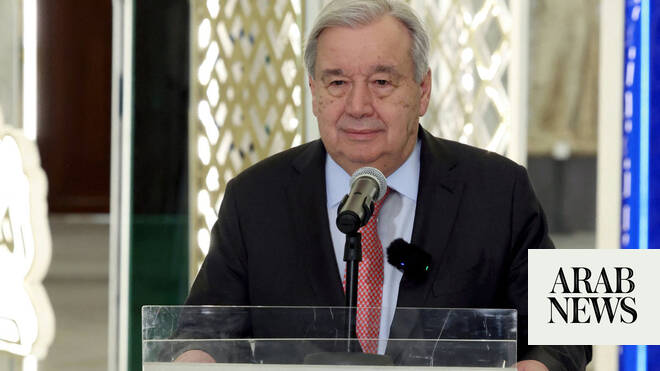

# US-Iran peace deal gets global support, UN chief hails it as a ‘critical step’

Source: https://www.arabnews.com/node/2647186/world
Captured source: https://www.arabnews.com/node/2647186/world
Published: 2026-06-15T11:42:50+03:00
Modified: 2026-06-15T14:07:38+03:00
Author: Agencies

## Summary

China welcomed on Monday an agreement by the United States and Iran to end the Middle East war, commending Pakistan for its mediation efforts. “China welcomes the agreement … and expresses appreciation for the mediation efforts made by Pakistan,” foreign ministry spokesperson Lin Jian told a news briefing, adding that Beijing hopes the deal would be signed as scheduled. China

## Image

## Video Or Embed URLs

- blob:https://www.arabnews.com/0e9e20d4-eec6-45a6-9c89-723ae384ec96
- https://imasdk.googleapis.com/js/core/bridge3.770.1_en.html
- about:blank
- https://static.addtoany.com/menu/sm.25.html
- https://www.google.com/recaptcha/api2/aframe
- https://cm.g.doubleclick.net/partnerpixels?gdpr=0&us_privacy=1---&gpp_sid=-1&url=https%3A%2F%2Fwww.arabnews.com%2Fnode%2F2647186%2Fworld

## Text

https://arab.news/psbg3

Guterres cites Pakistan, Qatar, Egypt, Saudi Arabia, Türkiye for the “constructive role” they played

World leaders say they are prepared to lift ​sanctions ‌on ⁠Iran ​in response to ⁠steps on its nuclear program

China welcomed on Monday an agreement by the United States and Iran to end the Middle East war, commending Pakistan for its mediation efforts.

“China welcomes the agreement … and expresses appreciation for the mediation efforts made by Pakistan,” foreign ministry spokesperson Lin Jian told a news briefing, adding that Beijing hopes the deal would be signed as scheduled.

China “hopes that safe and free passage through the strait will be restored as soon as possible,” Lin added.

British Prime Minster Keir Starmer ​said the agreement between the US and Iran ‌was ⁠very ​significant, and ⁠that he had discussed it with President Donald Trump ⁠on Saturday.

“Obviously, nothing ‌is ‌guaranteed, ​but ‌it is, I ‌think, a significant breakthrough, a very significant breakthrough. Hopefully, ‌something which as we work together ⁠we ⁠can turn into that enduring peace that we all want to see,” Starmer told a press conference.

In Tokyo, Prime Minister Sanae Takaichi on Monday said Japan’s welcomes the deal ​toward ending hostilities and hopes for steady implementation of the agreement, including the ‌actual ‌reopening of ​the ‌Strait ⁠of ​Hormuz for ⁠international vessels.

Posting on ⁠X, Takaichi ‌said ‌Japan “strongly ​hopes” ‌that “free and safe ‌navigation through the Strait of Hormuz will ‌be ensured in practice, and that a ⁠final ⁠agreement on Iran’s nuclear issue and other matters will be reached as soon as possible.”

The EU’s top officials also welcomed the deal, saying Europe was ready to contribute to “a lasting peace.”

“I look forward to an end to this costly war and to the full restoration of freedom of navigation in the Strait of Hormuz,” Antonio Costa, the president of the European Council representing member states, wrote on X.

“Weapons must now fall silent,” Costa urged, saying the “European Union is ready to contribute to advancing a comprehensive strategy for lasting peace across the Middle East.”

European Commission chief Ursula von der Leyen stressed the “priority now is its swift and full implementation” — calling on “all parties to respect Lebanon’s sovereignty and territorial integrity and implement a genuine ceasefire.”

“There can be no peace in the Middle East while Lebanon is in flames,” she warned, adding that Hormuz reopening was “essential for regional stability and the global economy” and that a final deal “should end Iran’s nuclear and ballistic programs and its destabilizing activities in the region.”

EU foreign policy chief Kaja Kallas said the is “much welcomed,” calling it an initial step to reopen the Strait of Hormuz and advance further talks on nuclear and regional stability issues.

Meanwhile, the United Nations’ human rights chief on ​Monday welcomed the announcement of the peace deal, and urged for maximum restraint by all sides in the region. “I welcome the announcement that the United States and Iran have agreed on a peace deal ‌that provides ‌for an immediate and permanent ​ceasefire, ‌the ⁠reopening ​of the ⁠Strait of Hormuz, and a framework for further negotiations,” said human rights chief Volker Turk. “At this fragile moment it is clear all sides need to exercise maximum restraint and work to implement the agreement reached quickly ⁠and in good faith,” he ‌added.

UN Secretary-General Antonio Guterres on Sunday welcomed the US-Iran peace deal as a “critical step” toward resolving the war in the Middle East.

“The Secretary-General hopes that the parties will build on this new momentum and redouble their efforts toward a final resolution of the conflict,” Guterres said in a statement attributed to his spokesman Stephane Dujarric.

Guterres also expressed “deep appreciation for the constructive role played by Pakistan, Qatar, Egypt, Saudi Arabia, Türkiye, and other regional countries in supporting the negotiations that led to the peace deal,” the statement said.

“The Secretary-General reaffirms that the United Nations stands ready to support the parties in achieving a durable and comprehensive peace,” it added.

Indonesia's foreign ministry said that it also welcomed the peace agreement as a positive development and also called on all parties to continue exercising restraint and uphold their commitments to de-escalate.

Indonesia also reaffirmed its readiness to support efforts to promote peace, security, and stability in the region, the ministry said.

European leaders ready to lift Iran sanctions

E4 nations including the United ​Kingdom, France, Germany and Italy said the countries were prepared ‌to ‌lift ​sanctions ‌on ⁠Iran ​in response to ⁠steps on its nuclear program after the US and ⁠Iran reached ‌a ‌deal ​to ‌end their war.

“Iran ‌must never acquire a nuclear weapon. We ‌stand ready to work with the US, ⁠Iran ⁠and the IAEA to this end,” the leaders of the countries said in a ​joint ​statement.
