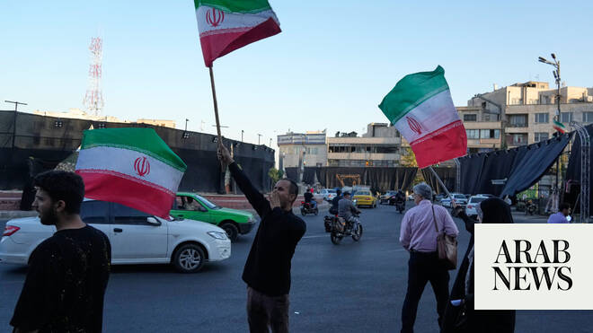

# Iranian officials portray peace deal as strategic victory over US and Israel

Source: https://www.arabnews.com/node/2647193/middle-east
Captured source: https://www.arabnews.com/node/2647193/middle-east
Published: 2026-06-15T04:09:00+03:00
Modified: 2026-06-15T04:09:00+03:00
Author: Agencies

## Summary

TEHRAN: Iran on Monday declared it had won “great victories” over the United States after Tehran and Washington announced an agreement to immediately end their months-long conflict, with Iranian officials portraying the deal as a military and political triumph rather than a diplomatic compromise. “The enemy that had attacked to carry out its evil aims was defeated in all its

## Image

## Video Or Embed URLs

- https://static.addtoany.com/menu/sm.25.html
- about:blank
- https://imasdk.googleapis.com/js/core/bridge3.770.1_en.html
- https://www.google.com/recaptcha/api2/aframe
- https://cm.g.doubleclick.net/partnerpixels?gdpr=0&us_privacy=1---&gpp_sid=-1&url=https%3A%2F%2Fwww.arabnews.com%2Fnode%2F2647193%2Fmiddle-east

## Text

https://arab.news/p6aky

Tehran says military pressure forced Washington to accept ceasefire

Hardliners claim Iran emerged stronger despite months of fighting

TEHRAN: Iran on Monday declared it had won “great victories” over the United States after Tehran and Washington announced an agreement to immediately end their months-long conflict, with Iranian officials portraying the deal as a military and political triumph rather than a diplomatic compromise.

“The enemy that had attacked to carry out its evil aims was defeated in all its aims and the Islamic Republic of Iran won great victories in the war,” Deputy Foreign Minister Kazem Gharibabadi said in comments broadcast on state television.

Gharibabadi confirmed that a “permanent and immediate end to the war” had been declared on all fronts, including Lebanon, and said military operations would cease starting Monday.

He said negotiations on a final agreement would continue during a 60-day period but warned that Tehran would take its own measures if there were “breaches from the other side.”

Iranian state television, IRIB, framed the ceasefire as a result of military pressure exerted by Tehran, saying Iranian forces had imposed their “divine and iron will” on what it called the “American and Zionist enemies.”

The broadcaster said Iran had demonstrated that its adversaries had “no path other than accepting defeat and surrender.”

State media and senior officials repeatedly linked the agreement to Iran’s military actions during the conflict and to what they described as sacrifices made by Iranian fighters and civilians during the war.

Analysts said the victory narrative appears aimed partly at countering criticism from hardline factions in Tehran that have opposed concessions in negotiations with Washington.

Hardliners assert influence

The agreement comes amid signs that hardline figures have played a growing role in shaping Iran’s negotiating posture.

According to a profile published Saturday by the Wall Street Journal, Ahmad Vahidi, commander-in-chief of Iran’s Islamic Revolutionary Guard Corps (IRGC), emerged as a key figure during negotiations with the United States.

The newspaper, citing Iranian and Arab officials, said Vahidi advocated a hard line in talks and opposed concessions to Washington.

The report said Vahidi also supported Iran’s ballistic missile barrage against Israel last week following an Israeli strike on Hezbollah headquarters in Beirut’s southern suburbs.

More moderate voices inside Tehran reportedly worried that direct attacks on Israel could jeopardize ongoing negotiations with Washington, according to the report.

Lebanon remains a red line

Iranian officials continued to signal that regional security issues remain central to Tehran’s calculations despite the ceasefire announcement.

Mohammad Baqer Zolqadr, secretary of Iran’s Supreme National Security Council, warned Sunday that Lebanon remained one of Tehran’s “red lines.”

“The unity of the fronts has created a security chain in defense of the region,” Zolqadr wrote on X.

“Lebanon is our lifeblood, and any violation of the Islamic Republic’s red lines will not be tolerated,” he added.

His remarks followed a new Israeli strike on Beirut’s southern suburbs, an attack that came as negotiators sought to finalize the ceasefire framework.

Iran has previously linked its military responses to Israeli actions in Lebanon, arguing that attacks on Beirut threaten broader regional stability.

Military readiness maintained

Despite the ceasefire, senior military officials stressed that Iran’s armed forces remain prepared for renewed hostilities.

IRGC Deputy Commander for Political Affairs Brig. Gen. Yadollah Javani said Iran’s military stood ready to respond immediately to any threat, Fars News Agency reported.

“The Armed Forces of the Islamic Republic are ready to respond to any act of mischief with their eyes open and fingers on the trigger,” he said.

Javani argued that Iran’s retaliatory operations and its leverage over the Strait of Hormuz had forced its adversaries to halt military operations during previous rounds of fighting.

He said Washington and Israel had entered the conflict expecting the Islamic Republic to collapse quickly but instead encountered strong resistance.

“Today, American Republicans and Democrats, Zionists, and their allies are stunned because they thought that the war would result in the destruction of the Islamic Republic, but contrary to their expectations, Iran became stronger,” he said.

Javani added that many analysts now viewed Iran as having emerged from the conflict stronger than before, echoing a broader message being promoted across Iranian state media following the ceasefire announcement.

(With AFP & Reuters)
