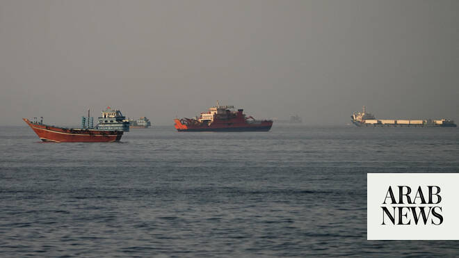

# Trump says ships carrying oil are moving out of Strait of Hormuz

Source: https://www.arabnews.com/node/2647219/middle-east
Captured source: https://www.arabnews.com/node/2647219/middle-east
Published: 2026-06-15T15:51:15+03:00
Modified: 2026-06-15T16:19:19+03:00
Author: Reuters

## Summary

TOKYO/COPENHAGEN/WASHINGTON: US President Donald Trump said ‌in ‌a ​social ‌media ⁠post ​on ⁠Monday that ⁠many ‌ships ‌loaded with ​oil ‌are starting ‌to move ‌out of the ⁠Strait ⁠of Hormuz. Trump’s latest comments come as shippers in Asia and Europe said ​confidence in resuming transit through the Strait of Hormuz could take weeks to rebuild and navigation will only restart

## Image

## Video Or Embed URLs

- https://static.addtoany.com/menu/sm.25.html
- about:blank
- https://imasdk.googleapis.com/js/core/bridge3.771.2_en.html
- https://www.google.com/recaptcha/api2/aframe
- https://cm.g.doubleclick.net/partnerpixels?gdpr=0&us_privacy=1---&gpp_sid=-1&url=https%3A%2F%2Fwww.arabnews.com%2Fnode%2F2647219%2Fmiddle-east

## Text

https://arab.news/zy582

LNG tanker Disha picked up its cargo at Qatar’s Ras Laffan on March 1-2 and had been west of the strait since

An ⁠estimated 155 tankers, carrying oil and chemicals, were in the Middle East Gulf ‌area as of June 15

TOKYO/COPENHAGEN/WASHINGTON: US President Donald Trump said ‌in ‌a ​social ‌media ⁠post ​on ⁠Monday that ⁠many ‌ships ‌loaded with ​oil ‌are starting ‌to move ‌out of the ⁠Strait ⁠of Hormuz.

Trump’s latest comments come as shippers in Asia and Europe said ​confidence in resuming transit through the Strait of Hormuz could take weeks to rebuild and navigation will only restart once safety is assured, after the US and Iran agreed a framework deal to reopen the waterway.

US and Iranian officials are expected to sign a memorandum of understanding to end their war and reopen the strait on Friday. Global oil prices fell about 5 percent on Monday in response.

Shippers have welcomed news of the deal, but are still waiting for more details, including on mine clearance in the strait.

“Initial reactions in the shipping industry are muted. AIS data shows no wave of ships heading toward Hormuz this morning,” Jyske Bank analyst Haider Anjum said in a note to clients.

“The shipping companies probably want to wait until it is clear that the ‌agreement holds, as ‌we have already had Hormuz ‘open’ for a very short time twice before,” he ​added.

War ‌largely ⁠stopped shipping ​through ⁠strait

The US-Israeli war with Iran that began on February 28 has largely stopped shipping through the strait, the transit route for roughly a fifth of the world’s oil and liquefied natural gas supply, along with vital products such as aluminum and urea.

While traffic through the waterway remains limited, India’s Petronet sent the LNG tanker Disha through Hormuz on Monday, the only visible shipment so far, data from Kpler and LSEG showed.

The tanker loaded at Qatar’s Ras Laffan on March 1-2 and had been west of the strait since. It was expected to arrive at the Dahej terminal in India on June 18, an official at India’s federal shipping ministry said.

Shipping association BIMCO said ⁠on Monday it still considers transit through the strait highly risky, with mines remaining a key ‌concern.

“The next step is for shipowners to be reassured that transiting the Strait ‌of Hormuz is not only permitted, but also safe,” said Jakob Larsen, BIMCO’s ​chief safety and security officer.

Concrete information awaited

A spokesperson for the Japanese ‌Shipowners’ Association said on Monday that while the group welcomed the peace agreement, it wanted to “wait a little longer for ‌more concrete information.”

“Given the situation, we cannot simply say, ‘Right then, let’s go’ based on news of the agreement alone,” he added.

Nippon Yusen, the country’s biggest shipper, said it hoped operations would return to normal as soon as possible. Mitsui O.S.K. Lines said it would only resume navigation once safety has been fully confirmed.

German shipowners’ association VDR said on Monday it was “cautiously optimistic” about whether the US-Iran deal could reopen the Strait ‌of Hormuz, while German shipper Hapag-Lloyd said it hoped that vessels will be able to cross the strait this week.

Danish shipping giant Maersk welcomed the deal, but said it was ⁠too early to assess its ⁠impact and that it was making no changes yet to its Middle East operations.

Norway-headquartered shipping group Wallenius Wilhelmsen also said it was “still too early to comment on operational implications,” while Oslo-listed Frontline, one of the world’s largest tanker companies, said only that it viewed the development positively.

Many tankers still stuck inside Gulf

An estimated 155 tankers, carrying oil and chemicals, were in the Mideast Gulf area as of June 15, shiptracking data from Kpler showed, down from 201 tankers at the end of May.

Oil Brokerage’s estimate stood at 215 tankers. Under unrestricted navigation, the traffic pile-up on either side can be resolved in 8-10 days, said Anoop Singh, Oil Brokerage’s global head of shipping research.

While tankers have been quietly moving barrels along Oman’s coast for weeks, sailing dark with US navy support, it would require weeks of de-mining and normalization of insurance rates for resumption of meaningful traffic, said David Jorbenaze, global oil market leader at ICIS.

“Returning to full pre-conflict volumes is realistically a 2027 story, and only if the agreement holds without incident ​and production recovers at pace,” he added.
