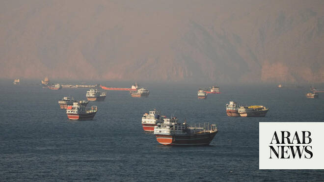

# US says Hormuz to be toll-free under Iran deal

Source: https://www.arabnews.com/node/2647331/middle-east
Captured source: https://www.arabnews.com/node/2647331/middle-east
Published: 2026-06-16T05:58:26+03:00
Modified: 2026-06-16T09:25:04+03:00
Author: AFP

## Summary

WASHINGTON: The United States said Monday that ships will move toll-free through the Strait of Hormuz under an Iran peace deal signed by President Donald Trump, and insisted Tehran would have to fulfill its commitments before getting any economic benefits. They included a possible $300 billion reconstruction fund for the war-battered country, but the release of funds will be

## Image

## Video Or Embed URLs

- https://static.addtoany.com/menu/sm.25.html
- about:blank
- https://imasdk.googleapis.com/js/core/bridge3.771.2_en.html
- https://www.google.com/recaptcha/api2/aframe
- https://cm.g.doubleclick.net/partnerpixels?gdpr=0&us_privacy=1---&gpp_sid=-1&url=https%3A%2F%2Fwww.arabnews.com%2Fnode%2F2647331%2Fmiddle-east

## Text

https://arab.news/nm6zq

The Strait of Hormuz bottleneck is an immediate priority due to the global economic effects from the spike in oil prices

Strait of Hormuz transit will take ‘weeks’ to resume, largest tanker operator tells FT

WASHINGTON: The United States said Monday that ships will move toll-free through the Strait of Hormuz under an Iran peace deal signed by President Donald Trump, and insisted Tehran would have to fulfill its commitments before getting any economic benefits. They included a possible $300 billion reconstruction fund for the war-battered country, but the release of funds will be “tied to performance,” a senior Trump administration official said in a call with reporters. Trump, US Vice President JD Vance and Iranian parliament speaker Mohammad Bagher Qalibaf electronically signed the so-called memorandum of understanding (MoU) Sunday, the officials said. “The president wanted to sign it personally because he wanted to show his dedication to the process,” one of the US officials said on condition of anonymity. But Vance admitted the brief outline deal kicks the thorniest issues — especially Iran’s nuclear program — down the road. “The MoU is about a page and a half, so it is a very general document,” Vance told CNN. He later said on NBC that US and international nuclear inspectors will be allowed back into Iran to help destroy its enriched uranium. Vance will lead technical talks this week and attend a physical signing ceremony expected in Geneva, Switzerland. Trump, attending the G7 summit in France, said the text would likely be released after Friday — but the US officials said it would be “put out in the next 24-48 hours.”

Strait of Hormuz transit will take ‘weeks’ to resume

Shipowners will not resume transit through the Strait of Hormuz for weeks ​until they are confident that the US-Iran deal is “material,” the chief executive of Japan’s Mitsui O.S.K. Lines told the Financial Times in an interview published on Tuesday.

Mitsui O.S.K., one of Japan’s big three shipping firms has a fleet of more than 900 vessels, including bulk carriers, tankers and ferries.

“What will have to come in place is not just a simple agreement ⁠between the relevant countries, but it ‌has to be material ‌and translated into the real ​situations in the Strait of ‌Hormuz, so that shipping lines can make ‌themselves comfortable to go through,” Mitsui O.S.K.’s Jotaro Tamura told FT before US President Donald Trump announced a deal to end the war in Iran.

“Given the experiences ‌in the last couple of months, I think it’s reasonable to assume that ⁠it ⁠may take at least a couple of weeks or if not a month,” Tamura told the paper.

Mitsui O.S.K. did not immediately respond to a Reuters request for comment.

Hormuz normal in ‘couple of weeks’? The signing will kick off a 60-day period in which Tehran and Washington will try to hammer out a full-scale peace deal. “We want to put the nuclear discussions up front,” a US official said on the call. But the Strait of Hormuz bottleneck is an immediate priority due to the global economic effects from the spike in oil prices. Vance told CNBC there was an understanding with Iran that the strait would reopen “in a toll-free way for the long term, and that’s the sort of thing that we’re going to figure out in these technical negotiations.” Trump himself said the critical strait would be “completely open” from Friday but added there was still “hunting” going on to ensure it was de-mined. Shipping traffic should return to pre-war levels “over the next couple of weeks” but there had already been a “substantial increase in traffic,” the first US official said. However, Iran’s foreign ministry said Monday that the deal would allow it to charge maritime service fees on ships transiting the Strait of Hormuz, rather than imposing “tolls.” ‘Zero’ funds released Uncertainty also surrounds other key aspects of the deal, including Iran’s access to its frozen funds and relief from sanctions. The issue is politically sensitive for Trump because he has alleged that a deal signed under Democrat Barack Obama — which Trump scrapped in 2018 — gave Tehran too much money. “The very simple fact is zero dollars of frozen assets have been released by the United States or any other country,” the first US official said. “We discussed the possibility of releasing frozen funds, sanctions relief, a big $300 billion fund to rebuild their country, and all of these things are going to be tied to performance,” added the second official. Vance said no US taxpayer money — “they never get a dime” — will go to Iran under the deal and argued that Americans stand to benefit from lifting of sanctions against Iran by bringing it back into the international economy. “There’s a lot of benefit there, not American money, but there’s a lot of economic prosperity that can flow from that,” Vance told Fox News late Monday. As part of a flurry of interviews to talk up the deal, he told NBC that US and UN nuclear inspectors will be allowed to enter Iran. “In fact, one of the core parts of the agreement is that the (International Atomic Energy Agency) and the United States are going to help Iran destroy the highly enriched stockpile, and that’s something that’s spelled out very clearly” in the MoU, Vance said.
