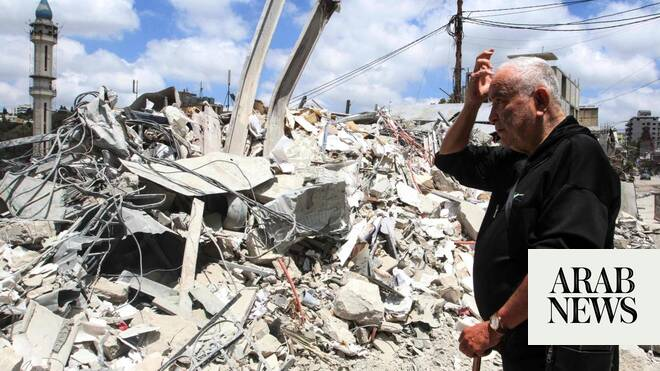

# Trump says Netanyahu should be more responsible with Lebanon

Source: https://www.arabnews.com/node/2647357/middle-east
Captured source: https://www.arabnews.com/node/2647357/middle-east
Published: 2026-06-16T13:12:43+03:00
Modified: 2026-06-16T16:08:05+03:00
Author: AFPReuters

## Summary

TEHRAN/EVIAN-LES-BAINS, France: US President Donald ​Trump said on Tuesday that he has a great relationship with ‌Israeli Prime ‌Minister ​Benjamin ‌Netanyahu, ⁠but ​that he ⁠must be more responsible with respect to Lebanon. Trump, speaking ⁠at the ‌G7 ‌summit, ​said ‌he told ‌Israel that he did not like its attack ‌on Beirut and suggested that ⁠Syria should ⁠take care of

## Image

## Video Or Embed URLs

- https://static.addtoany.com/menu/sm.25.html
- about:blank
- https://imasdk.googleapis.com/js/core/bridge3.771.2_en.html
- https://www.google.com/recaptcha/api2/aframe
- https://cm.g.doubleclick.net/partnerpixels?gdpr=0&us_privacy=1---&gpp_sid=-1&url=https%3A%2F%2Fwww.arabnews.com%2Fnode%2F2647357%2Fmiddle-east

## Text

https://arab.news/m9d45

US president says ‌he told ‌Israel that he did not like its attack ‌on Beirut and suggested that ⁠Syria should ⁠take care of Hezbollah instead of Israel

TEHRAN/EVIAN-LES-BAINS, France: US President Donald ​Trump said on Tuesday that he has a great relationship with ‌Israeli Prime ‌Minister ​Benjamin ‌Netanyahu, ⁠but ​that he ⁠must be more responsible with respect to Lebanon.

Trump, speaking ⁠at the ‌G7 ‌summit, ​said ‌he told ‌Israel that he did not like its attack ‌on Beirut and suggested that ⁠Syria should ⁠take care of Hezbollah instead of Israel.

“If Israel can’t do the job (against Hezbollah) without killing everyone else, than he (Sharaa) will do the job. Syria will do the job,” Trump said at a G7 summit, praising Syrian President Ahmed Al-Sharaa as doing an “amazing job.”

Hezbollah has received assurances from its ally ​Iran that it will demand a withdrawal of Israeli troops from Lebanon in its ‌next phase ‌of ​talks ‌with ⁠the ​United States, Hezbollah’s ⁠media relations office told Reuters on Tuesday. A withdrawal would be the ⁠result of, and ‌not ‌a pre-condition for, ​continuing ‌talks between ‌Tehran and Washington following the signing of a memorandum of ‌understanding between the two countries on Friday, ⁠Hezbollah ⁠said. The group told Reuters that there would be “no nuclear deal between Iran and the United States unless the Israelis ​withdraw” from ​Lebanon.

Iran’s Foreign Minister Abbas Araghchi said on Tuesday that ending the war on all fronts, including Lebanon, was “the most important” issue in the peace deal with the US announced the day before.

“The important point I want to emphasize here is that in our view, there are two parties to this memorandum — one side is America and Israel, and the other side is Iran and Hezbollah,” said Araghchi during a briefing with foreign diplomats broadcast on state television.

“This is perhaps the most important issue in the memorandum — the declaration of an immediate and permanent end to the war on all fronts, including in Lebanon,” he said, adding that “ending the war in Lebanon is an inseparable part of the complete end of the war.”

His remarks came one day after Tehran and Washington announced a memorandum of understanding aimed at ending the conflict, which broke out on February 28 with US-Israeli strikes on Iran and engulfed the Middle East. The deal between Iran and the United States is expected to be signed on Friday in Switzerland.

Lebanese President Joseph Aoun and Prime Minister Nawaf Salam on Tuesday reaffirmed Lebanon’s position in negotiations for a permanent ceasefire and the withdrawal of Israeli forces, stressing the deployment of the Lebanese army to the international borders and the return of prisoners.

Lebanon was pulled into the war in early March when Iran-backed Hezbollah launched rockets at Israel after the killing of Iran’s supreme leader, prompting Israeli strikes and a ground invasion.

Araghchi said an end to the war would not be complete “without the withdrawal of Israeli forces from the territories it occupied in this war.”

“Any military attack by the Zionist regime on Lebanon from now on and the continued occupation of Lebanese territories from now on will be considered a violation of the memorandum of understanding in our view,” he added.

Israeli Prime Minister Benjamin Netanyahu has said his country’s forces will remain in Lebanon, Syria and Gaza “as long as necessary.”

Following the deal announcement on Monday, Lebanese militant group Hezbollah said it had attacked Israeli forces trying to advance in southern Lebanon.

The deal between Iran and the United States is expected to be signed on Friday in Switzerland.
