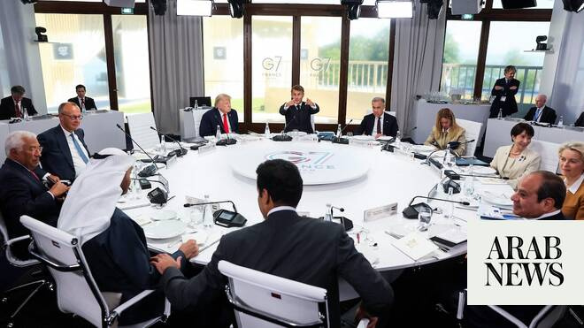

# Arab leaders join G7 meetings on Trump’s tentative Iran deal, Ukraine war

Source: https://www.arabnews.com/node/2647364/world
Captured source: https://www.arabnews.com/node/2647364/world
Published: 2026-06-16T14:15:16+03:00
Modified: 2026-06-16T16:21:10+03:00
Author: APArab News

## Summary

DUBAI: Arab heads of states joined a meeting of G7 leaders in France with a packed agenda on their first full day, including challenging discussions on the Middle East conflict and ending Russia’s war in Ukraine. Egyptian President Abdel Fattah El-Sisi, Emir of Qatar Sheikh Tamim bin Hamad Al-Thani and UAE President Sheikh Mohamed bin Zayed Al-Nahyan had arrived in the French

## Image

## Video Or Embed URLs

- https://static.addtoany.com/menu/sm.25.html
- about:blank
- https://www.google.com/recaptcha/api2/aframe
- https://imasdk.googleapis.com/js/core/bridge3.771.2_en.html
- https://cm.g.doubleclick.net/partnerpixels?gdpr=0&us_privacy=1---&gpp_sid=-1&url=https%3A%2F%2Fwww.arabnews.com%2Fnode%2F2647364%2Fworld

## Text

https://arab.news/5qn79

Arab leaders attend G7 summit in France

DUBAI: Arab heads of states joined a meeting of G7 leaders in France with a packed agenda on their first full day, including challenging discussions on the Middle East conflict and ending Russia’s war in Ukraine.

Egyptian President Abdel Fattah El-Sisi, Emir of Qatar Sheikh Tamim bin Hamad Al-Thani and UAE President Sheikh Mohamed bin Zayed Al-Nahyan had arrived in the French town of Evian-les-Bains to participate in the summit.

Conversations on the working lunch, dubbed “Addressing Crises and Ensuring Stability in the Middle East,” were expected to focus on the path ahead after the ceasefire agreement between the US and Iran.

US President Donald Trump is scheduled to host one-on-one talks with Qatar’s Sheikh Tamim and the UAE’s Sheikh Mohamed later. The Gulf nations are not part of the G7, but French President Emmanuel Macron extended invitations to the leaders to take part in the summit at a fraught moment for the region.

The US and Iran said they had agreed terms to end their war and reopen the strait, although the pact may hinge on an end to hostilities in Lebanon and defers talks on Tehran’s nuclear program.

While still a framework, the deal marked the biggest breakthrough toward resolving the conflict that has killed thousands and upended energy markets since it began with joint US-Israeli strikes on Iran in February.

US allies at the summit are pushing the war in Ukraine back on Trump’s agenda. The Iran conflict has recently overshadowed the war in Ukraine.

Macron aims to persuade Trump to support Ukraine and pressure Russia for peace.

The US has cut back aid to Ukraine, making the Europeans the biggest supporters.

Trump said he would focus again on Ukraine following a bilateral meeting with Macron shortly after arriving late Monday.

“Now that this (Iran) is finished, we’re going to be focusing on that,” Trump said.

Macron said he will seek to persuade Trump to continue supporting Ukraine and increase pressure on Russia to help reach a peace agreement more than four years after Russian President Vladimir Putin launched the war. Trump said he had good conversations on Sunday with Putin and Ukrainian President Volodymyr Zelensky, who is attending the summit at France’s invitation.

The leaders also will have a working session focused on ending crises and ensuring stability in the Middle East. They are expected to discuss the global economic crisis resulting from the war and the closure of the Strait of Hormuz.

Shortly before his arrival, Trump announced an agreement to end the 3 1/2-month-old US war against Iran.

The G7 includes France, the United States, Canada, Germany, Italy, Japan and the United Kingdom.

Guest nations at this summit include Brazil, Egypt, India, Kenya, South Korea, Qatar, Ukraine and the UAE.
