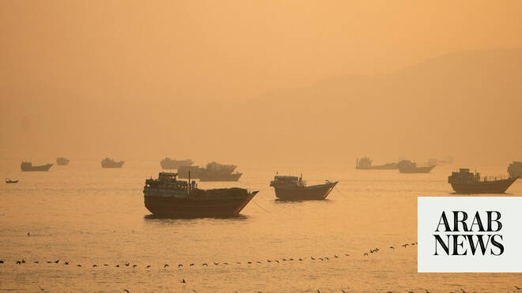

# IEA says ‘unconditionally’ re-opening Hormuz vital to end energy crisis

Source: https://www.arabnews.com/node/2647389/middle-east
Captured source: https://www.arabnews.com/node/2647389/middle-east
Published: 2026-06-16T14:06:55+03:00
Modified: 2026-06-16T14:15:36+03:00
Author: AFPReuters

## Summary

PARIS: The head of the International Energy Agency said Tuesday that “unconditionally” opening the Strait of Hormuz to Gulf tanker traffic was essential to ending the shock from soaring oil and gas prices to economies worldwide. “The single most important solution to this problem is the fully and unconditionally opening up of the state of Hormuz to shipping,” IEA chief Fatih

## Image

## Video Or Embed URLs

- https://c5d0db486494fd99acf139129be3f46f.safeframe.googlesyndication.com/safeframe/1-0-45/html/container.html
- https://static.addtoany.com/menu/sm.25.html
- about:blank
- https://www.google.com/recaptcha/api2/aframe
- https://imasdk.googleapis.com/js/core/bridge3.771.2_en.html
- https://sync.teads.tv/wigo-no-slot
- https://cm.g.doubleclick.net/partnerpixels?gdpr=0&us_privacy=1---&gpp_sid=-1&url=https%3A%2F%2Fwww.arabnews.com%2Fnode%2F2647389%2Fmiddle-east

## Text

https://arab.news/grzbj

Several Iranian vessels sailing toward Iranian ports despite US blockade – Iranian state TV

PARIS: The head of the International Energy Agency said Tuesday that “unconditionally” opening the Strait of Hormuz to Gulf tanker traffic was essential to ending the shock from soaring oil and gas prices to economies worldwide. “The single most important solution to this problem is the fully and unconditionally opening up of the state of Hormuz to shipping,” IEA chief Fatih Birol told a press conference. Iran had effectively halted tanker traffic through the Strait of Hormuz in retaliation for US and Israeli strikes launched in late February, choking off oil and gas traffic and sending crude prices skyrocketing.

Three ​Iranian tankers and two vessels carrying essential ‌goods ‌are ​currently ‌sailing ⁠toward Iranian ​southern ports ⁠from the Indian Ocean, ⁠Iranian ‌state ‌TV said ​on Tuesday, ‌despite ‌a US military ‌advisory note saying on Monday ⁠that ⁠a blockade of Iranian ports remains in ​effect ​until Friday. The deal between Iran and the United States to end the Middle East war calls for the strait to be opened, but Iranian officials have said tolls or “service fees” could be imposed for ships passing through the crucial channel for Gulf oil and gas. Birol “warmly” welcomed the deal, calling it “great news” that “will give a comfort to the markets.” “The crisis has started almost four months now,” the IEA chief, who has previously compared the fallout to the great oil shocks of the 1970s, pointed out. The IEA has coordinated the release of hundreds of millions of barrels of oil from emergency stocks by its 32 member countries, and said in May that around 164 million barrels have already been drawn.
