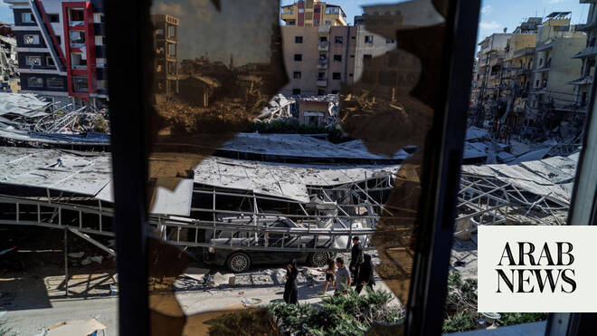

# Several Israeli strikes hit south Lebanon

Source: https://www.arabnews.com/node/2647500/middle-east
Captured source: https://www.arabnews.com/node/2647500/middle-east
Published: 2026-06-17T09:05:15+03:00
Modified: 2026-06-17T20:43:28+03:00
Author: AFPReuters

## Summary

BEIRUT: Israeli forces on Wednesday carried out airstrikes on several areas in south Lebanon, state media reported, despite a peace deal in the Middle East war that includes Lebanon. Lebanon’s National News Agency said Israeli warplanes launched raids targeting the Nabatieh Al-Fawqa area and the eastern outskirts of neighboring town Kfar Tebnit. The Israelis also launched a

## Image

## Video Or Embed URLs

- https://838e6a732895a56cc7dbae7a83ce2eef.safeframe.googlesyndication.com/safeframe/1-0-45/html/container.html
- https://static.addtoany.com/menu/sm.25.html
- about:blank
- https://www.google.com/recaptcha/api2/aframe
- https://imasdk.googleapis.com/js/core/bridge3.771.2_en.html
- https://sync.teads.tv/wigo-no-slot
- https://cm.g.doubleclick.net/partnerpixels?gdpr=0&us_privacy=1---&gpp_sid=-1&url=https%3A%2F%2Fwww.arabnews.com%2Fnode%2F2647500%2Fmiddle-east

## Text

https://arab.news/yx34r

Israeli warplanes launch raids targeting the Nabatieh Al-Fawqa area and the eastern outskirts of neighboring town Kfar Tebnit

The Israelis also launched a drone strike on the town of Ansariyeh in the Zahrani area — state media

BEIRUT: Israeli forces on Wednesday carried out airstrikes on several areas in south Lebanon, state media reported, despite a peace deal in the Middle East war that includes Lebanon. Lebanon’s National News Agency said Israeli warplanes launched raids targeting the Nabatieh Al-Fawqa area and the eastern outskirts of neighboring town Kfar Tebnit. The Israelis also launched a drone strike on the town of Ansariyeh in the Zahrani area, NNA reported.

The Israeli ⁠military later said an explosive ​Hezbollah drone detonated near Israeli soldiers ‌in ‌southern ​Lebanon, ‌injuring ⁠four ​of them, Reuters reported. A ‌second ‌drone exploded several minutes ‌later, injuring another soldier, ⁠the Israeli ⁠military added. While violence has declined in Lebanon since a US-Iran agreement to end the Middle East war was announced on Monday, Israeli strikes on the south have still killed at least five people since the deal, according to NNA. The reduction in violence has allowed some south Lebanon residents to return and inspect their towns and villages, but the Lebanese army has urged locals to delay their return, citing “the risk of Israeli violations and attacks.” The Iran-backed militant group Hezbollah drew Lebanon into the Middle East war in early March by firing rockets at Israel to avenge the killing of Iran’s supreme leader in US-Israeli strikes. Israel responded with a massive campaign of airstrikes and a ground invasion. Iran’s Foreign Minister Abbas Araghchi said on Tuesday that an end to the conflict would be incomplete “without the withdrawal of Israeli forces from the territories it occupied in this war.” “Any military attack by the Zionist regime on Lebanon from now on and the continued occupation of Lebanese territories from now on will be considered a violation of the memorandum of understanding in our view,” he said. But Israeli Prime Minister Benjamin Netanyahu said on Monday that his country’s forces would remain in Lebanon “for as long as necessary.” Hezbollah has so far not issued any statements since Tuesday claiming attacks on Israeli targets in south Lebanon. The group’s leader Naim Qassem is due to make a televised address on Wednesday. He expressed “profound gratitude” on Tuesday for Iran’s efforts “to compel the Israeli entity to an immediate and permanent cessation of military operations on all fronts including in Lebanon.” Lebanon’s health ministry on Tuesday raised the death toll in Israeli attacks since the war broke out to 3,826, as rescuers pull more bodies from the rubble.
