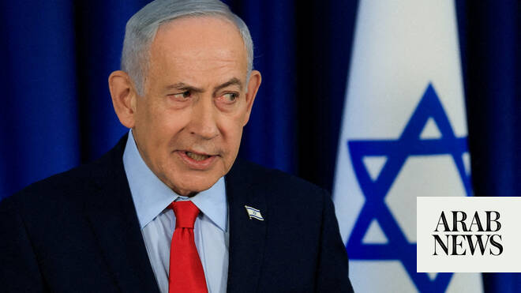

# Israel ‘conducting stubborn negotiations’ with US over continuing its Lebanon troop deployment, officials say

Source: https://www.arabnews.com/node/2647602/middle-east
Captured source: https://www.arabnews.com/node/2647602/middle-east
Published: 2026-06-18T11:18:18+03:00
Modified: 2026-06-18T12:06:23+03:00
Author: Reuters

## Summary

JERUSALEM: Israel is holding negotiations with the US as it seeks to continue its deployment of ​troops in southern Lebanon, two Israeli officials including a senior Israeli official close to Prime Minister Benjamin Netanyahu told Reuters on Thursday.

## Image

## Video Or Embed URLs

- https://static.addtoany.com/menu/sm.25.html
- about:blank
- https://www.google.com/recaptcha/api2/aframe
- https://imasdk.googleapis.com/js/core/bridge3.771.2_en.html
- https://cm.g.doubleclick.net/partnerpixels?gdpr=0&us_privacy=1---&gpp_sid=-1&url=https%3A%2F%2Fwww.arabnews.com%2Fnode%2F2647602%2Fmiddle-east

## Text

https://arab.news/zfa6v

Trump said on Wednesday that Netanyahu could use a “softer touch” in the fight against Hezbollah

Netanyahu ⁠and Trump have clashed over Israel’s refusal to constrain its pursuit of Hezbollah

JERUSALEM: Israel is holding negotiations with the US as it seeks to continue its deployment of ​troops in southern Lebanon, two Israeli officials including a senior Israeli official close to Prime Minister Benjamin Netanyahu told Reuters on Thursday.

The officials, who spoke on condition of anonymity to discuss the sensitive talks, made the comments a day after the US and ‌Iran signed ‌an interim pact that ​calls ‌for ⁠parties ​to ensure “the territorial ⁠integrity and sovereignty of Lebanon.”

Israel expanded its invasion of southern Lebanon after the Lebanese militia Hezbollah opened fire at Israel on March 2 in support of its ally Iran. It has since staged a devastating ⁠air and ground campaign that it says ‌aims at rooting ‌out Hezbollah.

Israel describes the territory ​it has seized ‌in Lebanon, Gaza and Syria as “buffer zones” between ‌it and its enemies, a core facet of Israel’s recent security policy. Netanyahu has rejected calls for Israel to withdraw from those territories.

The senior ‌Israeli official told Reuters that Israel was “conducting stubborn negotiations” with Washington ⁠over continuing its ⁠deployment of troops in southern Lebanon.

The official said Israel would not back down on its positions, including keeping troops deployed in the area south of Lebanon’s Litani River.

A second Israeli official told Reuters that the outcome of the talks would ultimately depend on whether US President Donald Trump “decides to force the issue” by threatening repercussions if Israel ​does not abide ​by the interim Iran pact’s terms.

Netanyahu’s office did not immediately respond to a request for comment.

Trump said on Wednesday that Netanyahu could use a “softer touch” ​in the fight against Hezbollah militants in Lebanon, the US president’s latest public rebuke to his partner in the war on Iran.

Netanyahu and Trump have repeatedly clashed over Israel’s refusal to constrain its pursuit of Iran-backed Hezbollah in Lebanon, where a cessation of hostilities is a key Iranian demand under a limited ‌interim agreement ‌with the US “Netanyahu happens to ​be ‌a ⁠good ​man, gets ⁠a little excited sometimes,” Trump told reporters on Wednesday at the close of a G7 summit in France.

The Israeli leader helped convince Trump to go to war against Iran, according to US and Israeli officials, and joined in attacks launched on February 28.

But Netanyahu ⁠has insisted Israel is not bound ‌by any US-Iran agreement in ‌its fight against Hezbollah, though hostilities ​in Lebanon have abated ‌somewhat since Trump sharply criticized him earlier this week.

“We ‌have a little dispute over Lebanon. I say you can do a little softer touch, Bibi,” Trump said, referring to Netanyahu by his nickname. “You don’t have to knock ‌down a building every time somebody walks into it that’s from Hezbollah.”

Trump added that ⁠he agreed ⁠with the description of Israel as being a “very small partner” of the United States but thanked Netanyahu for his role in the conflict against Iran, Israel’s arch-foe.

He also insisted he had sent Netanyahu a copy of the “memorandum of understanding” the US reached with Iran on Sunday, pushing back against news reports that the administration had turned down an Israeli request. It paves the way for broader US-Iran peace ​talks set to ​begin in Switzerland on Friday.
