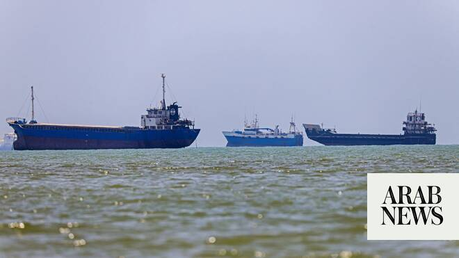

# US allows more than a dozen ships through to Iranian ports, as CENTCOM lifts blockade of Hormuz

Source: https://www.arabnews.com/node/2647725/world
Captured source: https://www.arabnews.com/node/2647725/world
Published: 2026-06-18T19:31:21+03:00
Modified: 2026-06-18T21:16:05+03:00
Author: AP

## Summary

WASHINGTON: Vice President JD Vance said Thursday that the US Navy has allowed more than a dozen ships through to Iranian ports, lifting a blockade as part of an agreement to end the war. Vance made the announcement at a White House press briefing, where he said more oil is now flowing through the Strait of Hormuz. The Republican vice president said more than 12.5 million

## Image

## Video Or Embed URLs

- blob:https://www.arabnews.com/8a6f6dbf-960f-41b5-a351-dcc93be5e9a8
- https://imasdk.googleapis.com/js/core/bridge3.772.0_en.html
- https://platform.twitter.com/embed/Tweet.html?creatorScreenName=Arab_News&creatorUserId=69172612&dnt=false&embedId=twitter-widget-0&features=eyJ0ZndfdGltZWxpbmVfbGlzdCI6eyJidWNrZXQiOltdLCJ2ZXJzaW9uIjpudWxsfSwidGZ3X2ZvbGxvd2VyX2NvdW50X3N1bnNldCI6eyJidWNrZXQiOnRydWUsInZlcnNpb24iOm51bGx9LCJ0ZndfdHdlZXRfZWRpdF9iYWNrZW5kIjp7ImJ1Y2tldCI6Im9uIiwidmVyc2lvbiI6bnVsbH0sInRmd19yZWZzcmNfc2Vzc2lvbiI6eyJidWNrZXQiOiJvbiIsInZlcnNpb24iOm51bGx9LCJ0ZndfZm9zbnJfc29mdF9pbnRlcnZlbnRpb25zX2VuYWJsZWQiOnsiYnVja2V0Ijoib24iLCJ2ZXJzaW9uIjpudWxsfSwidGZ3X21peGVkX21lZGlhXzE1ODk3Ijp7ImJ1Y2tldCI6InRyZWF0bWVudCIsInZlcnNpb24iOm51bGx9LCJ0ZndfZXhwZXJpbWVudHNfY29va2llX2V4cGlyYXRpb24iOnsiYnVja2V0IjoxMjA5NjAwLCJ2ZXJzaW9uIjpudWxsfSwidGZ3X3Nob3dfYmlyZHdhdGNoX3Bpdm90c19lbmFibGVkIjp7ImJ1Y2tldCI6Im9uIiwidmVyc2lvbiI6bnVsbH0sInRmd19kdXBsaWNhdGVfc2NyaWJlc190b19zZXR0aW5ncyI6eyJidWNrZXQiOiJvbiIsInZlcnNpb24iOm51bGx9LCJ0ZndfdXNlX3Byb2ZpbGVfaW1hZ2Vfc2hhcGVfZW5hYmxlZCI6eyJidWNrZXQiOiJvbiIsInZlcnNpb24iOm51bGx9LCJ0ZndfdmlkZW9faGxzX2R5bmFtaWNfbWFuaWZlc3RzXzE1MDgyIjp7ImJ1Y2tldCI6InRydWVfYml0cmF0ZSIsInZlcnNpb24iOm51bGx9LCJ0ZndfbGVnYWN5X3RpbWVsaW5lX3N1bnNldCI6eyJidWNrZXQiOnRydWUsInZlcnNpb24iOm51bGx9LCJ0ZndfdHdlZXRfZWRpdF9mcm9udGVuZCI6eyJidWNrZXQiOiJvbiIsInZlcnNpb24iOm51bGx9fQ%3D%3D&frame=false&hideCard=false&hideThread=false&id=2067660042736734352&lang=en&origin=https%3A%2F%2Fwww.arabnews.com%2Fnode%2F2647725%2Fworld&sessionId=5f23ac416ab74288fb2e739d355c6af81e06f921&siteScreenName=Arab_News&siteUserId=69172612&theme=light&widgetsVersion=6a3ad42b224df%3A1778106238597&width=600px
- about:blank
- https://static.addtoany.com/menu/sm.25.html
- https://platform.twitter.com/widgets/widget_iframe.1227a5674072e080ffb1ba14ac0c1079.html?origin=https%3A%2F%2Fwww.arabnews.com
- https://www.google.com/recaptcha/api2/aframe
- https://cm.g.doubleclick.net/partnerpixels?gdpr=0&us_privacy=1---&gpp_sid=-1&url=https%3A%2F%2Fwww.arabnews.com%2Fnode%2F2647725%2Fworld

## Text

https://arab.news/b7wt6

Vance said more than 12.5 million barrels went through the shipping channel Wednesday night

He plans to travel to Switzerland for talks on the Iran deal but he doesn’t know when that will happen

WASHINGTON: Vice President JD Vance said Thursday that the US Navy has allowed more than a dozen ships through to Iranian ports, lifting a blockade as part of an agreement to end the war.

Vance made the announcement at a White House press briefing, where he said more oil is now flowing through the Strait of Hormuz. The Republican vice president said more than 12.5 million barrels went through the shipping channel Wednesday night.

“So we’re also honoring our end of the early part of the agreement on the military side,” Vance said, citing it as an immediate benefit of the deal as he downplayed criticism that the agreement tilts in favor of Iran.

The ​US military announced later on Thursday it had lifted its blockade of maritime ‌traffic ‌entering ​and ‌exiting ⁠Iranian ports ​and coastal ⁠areas. US Central Command confirmed it ‌in a ‌post ​on X ‌on ‌Thursday, adding that US ‌naval ships would remain ⁠in ⁠the general area.

Vance said he plans to travel to Switzerland for talks on the Iran deal but he doesn’t know when that will happen. He had been expected to lead talks on implementing the agreement with Iran aimed at diluting its stockpile of highly enriched uranium and restarting oil traffic through the Strait of Hormuz.

On Tuesday, two oil tankers left Iran and crossed the US military blockade without being stopped. A merchant shipping tracking website said the ships were carrying a combined total of 3.8 million barrels of Iranian crude oil.

Meanwhile, Iranian state media said that shipping has “normalized” at Iran’s southern ports but added that the Strait of Hormuz remains supervised and under the control of the Iranian military and transiting through the vital waterway still requires coordination.

Major shipowners have begun moving vessels through the Strait of Hormuz since the agreement was signed, according to maritime data company Lloyd’s List Intelligence — though they did not give data on how many ships have passed through the strait as of Thursday.

In a media briefing, Richard Meade, editor in chief of Lloyd’s List, said for the first time in 110 days, ships owned by major companies are transiting the strait after effectively being marooned there since February.

Tankers controlled by major ship owners Grimaldi Group, Cosco, Knutsen and NYK have passed through the strait. And two Iran-flagged, National Iranian Tanker Company-owned, sanctioned crude oil tankers have entered the strait, according to Lloyd’s List.

Phillip Belcher, marine director of Intertanko, a trade group for global independent tanker owners, said the main central route of the Strait of Hormuz is still closed and has an estimated 80 mines that need to be cleared.

But ships have been passing through the smaller Northern route, which goes through Iranian waters, and the Southern route, which goes through Omani waters.

The agreement calls for a permanent end to hostilities and starts a 60-day negotiating clock to reach a final deal on the future of Iran’s nuclear program, though Trump left the door open to resume attacks. It appears to offer Iran several benefits up front while extracting little in return.

It states that Iran’s stockpile of highly enriched uranium, which is believed to be buried under rubble, must at minimum be diluted under international supervision. It also states that Iran shall not procure or develop nuclear weapons — a commitment it has made previously. But beyond stating that the US and Iran will negotiate over Iran’s nuclear program, other commitments still need to be worked out.

Much of the agreement would restore the status quo before the war, including ending hostilities, restarting talks between the US and Iran over Tehran’s nuclear program, and reopening the Strait of Hormuz, the crucial passage for the world’s oil and natural gas whose closure created a historic energy crisis.
