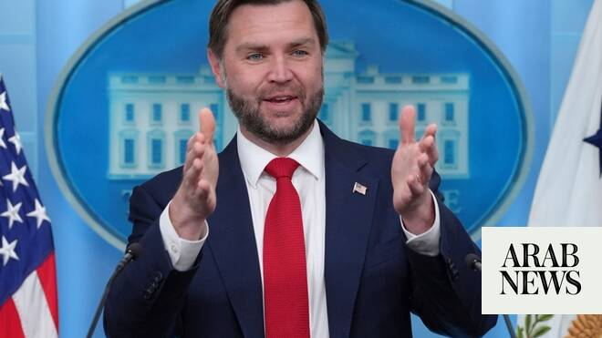

# Iran’s chief negotiator says US talks bound by Tehran’s ‘red lines’

Source: https://www.arabnews.com/node/2647772/world
Captured source: https://www.arabnews.com/node/2647772/world
Published: 2026-06-19T14:08:45+03:00
Modified: 2026-06-19T14:26:37+03:00
Author: AFP

## Summary

TEHRAN: Iran’s chief negotiator Mohammad Bagher Qalibaf said on Friday that talks with the United States would remain bound by Tehran’s “red lines.” “As we have shown in the past path of negotiations, we are steadfast in fulfilling the conditions and red lines set, and in achieving the interests of the Iranian nation,” Qalibaf said in remarks published by the official IRNA

## Image

## Video Or Embed URLs

- blob:https://www.arabnews.com/03e5ee28-d676-43fe-9c20-208653979baf
- https://imasdk.googleapis.com/js/core/bridge3.772.0_en.html
- about:blank
- https://static.addtoany.com/menu/sm.25.html
- https://www.google.com/recaptcha/api2/aframe
- https://cm.g.doubleclick.net/partnerpixels?gdpr=0&us_privacy=1---&gpp_sid=-1&url=https%3A%2F%2Fwww.arabnews.com%2Fnode%2F2647772%2Fworld

## Text

https://arab.news/rzqwb

Vice President JD Vance dropped plans to travel to Geneva due to logistical issues, White House says

Hezbollah lawmaker says Iran told group talks with US hinge on comprehensive ceasefire

TEHRAN: Iran’s chief negotiator Mohammad Bagher Qalibaf said on Friday that talks with the United States would remain bound by Tehran’s “red lines.”

“As we have shown in the past path of negotiations, we are steadfast in fulfilling the conditions and red lines set, and in achieving the interests of the Iranian nation,” Qalibaf said in remarks published by the official IRNA news agency.

“If the enemy seeks to be excessive, we have proven that our fingers are on the trigger and we have no hesitation in giving a crushing response to the enemy.”

Tehran and Washington signed a memorandum of understanding this week ending a regional war that erupted on February 28 with US-Israeli strikes on Iran.

Switzerland said US talks with Iranian negotiators on a pact to end the Middle East conflict would not take place on Friday, as Vice President JD Vance dropped plans to travel to Geneva, adding to uncertainty whether a lasting truce can be found.

“The logistics of ​these negotiations have never been simple or predictable,” the White House spokesperson said in a statement on Thursday night. Vance and the US delegation had been ready to depart as soon as plans were finalized.

The White House blamed logistical issues, but the announcement came after a report from Al-Mayadeen, a pan-Arab satellite channel that is politically allied to Hezbollah, that Iran was delaying sending its delegation to Switzerland over Israel’s ongoing military campaign in Lebanon.

“A senior American official told me that one of the reasons for postponing the trip might be Iranian claims regarding the situation in Lebanon,” Axios reporter Barak Ravid posted on social media.

Qalibaf’s remarks came after Iran’s supreme leader Ayatollah Mojtaba Khamenei said he had approved the US-Iran deal despite having a “different view” on the matter, without elaborating.

In a message read out on state television, Khamenei said that direct talks with the United States “will not mean accepting the enemy’s point of view.”

In response to Khamenei’s message, Foreign Minister Abbas Araghchi said the country’s foreign policy apparatus “will be used to secure the sublime interests of Iran” and “protect the rights of the noble Iranian nation.”

President Masoud Pezeshkian, who signed the deal on behalf of his country, issued a similar statement promising to adhere to Iran’s red lines and defend its “dignity, honor and authority.”

The US-Iran deal, which US President Donald Trump also signed, lays the groundwork for detailed 60-day negotiations on Iran’s nuclear program and sanctions relief.

It remains unclear when talks for a final settlement would start after a first meeting in Switzerland slated for Friday was postponed.

Lebanese Hezbollah lawmaker Hassan ​Fadlallah told Reuters that Iran had informed the group that talks ‌with the ‌United ​States ‌could ⁠not ​continue without ⁠the implementation of a comprehensive ceasefire.

He called on ⁠the Lebanese government ‌to ‌reject ​any ‌direct negotiations with ‌Israel while Israeli attacks on Lebanon continue, and ‌said Washington bore responsibility ⁠for ensuring Israel ⁠halted its attacks and implemented the terms of the agreement.

Israel must stop hostilities in Lebanon, US must pressure Israel, French minister says

Israel must stop its hostilities in ​Lebanon and the United States must put pressure on Israel, French foreign minister Jean-Noel ‌Barrot said ‌on ​Friday.

Israel ‌said ⁠on ​Thursday it ⁠would not rule out carrying out attacks beyond a military control ⁠zone in southern ‌Lebanon ‌in a challenge ​to ‌the terms ‌of a US-Iran pact that called for the respect of ‌Lebanon’s sovereignty.

Barrot, speaking to French broadcaster ⁠franceinfo, ⁠said that France was still working to hold an international conference to mobilize support for the Lebanese army.

The agreement provides for an end to the Middle East war on all fronts, including Lebanon, the lifting of the two-month US naval blockade on Iranian ports, and Tehran’s reopening of the Strait of Hormuz “with no charge for 60 days only.”

It also includes an Iranian commitment not to procure or develop nuclear weapons — an ambition Tehran has consistently denied pursuing.

Conservatives in Iran appeared deeply skeptical of the deal and US intentions, with some expressing concern that Tehran could be giving up key sources of leverage before securing compensation and sanctions relief.

“The Americans do not honor to any commitments, they have not been loyal to any agreements, and they will not be,” said Hossein Shariatmadari, editor-in-chief of the ultraconservative Kayhan newspaper, in an interview with state television on Thursday.

He added: “the Strait of Hormuz is the way to get compensation.”

Ebrahim Rezaei, spokesman for parliament’s national security commission, took issue with reports of possible inspections of Iranian nuclear facilities by a UN watchdog.

“I hope the government denies this, but if this claim is true … the parliament will stand up to lawlessness and disobedience,” he said in a post on X.
