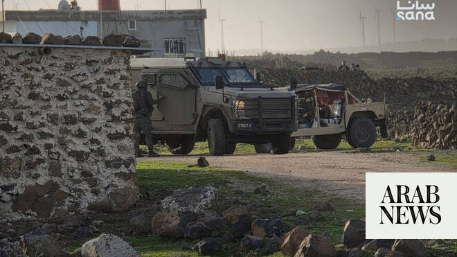

# Syria reports new Israeli incursion into Quneitra village amid ongoing border tensions

Source: https://www.arabnews.com/node/2647777/middle-east
Captured source: https://www.arabnews.com/node/2647777/middle-east
Published: 2026-06-19T05:45:03+03:00
Modified: 2026-06-19T05:45:03+03:00
Author: Arab News

## Summary

QUNEITRA, Syria: Israeli forces carried out an overnight incursion into a village in Syria’s southern Quneitra province, raiding several homes before withdrawing, Syrian state media reported on Thursday, in the latest incident highlighting ongoing tensions along the frontier. According to the Syrian Arab News Agency (SANA), a unit consisting of nine Israeli military vehicles

## Image

## Video Or Embed URLs

- https://static.addtoany.com/menu/sm.25.html
- about:blank
- https://imasdk.googleapis.com/js/core/bridge3.772.0_en.html
- https://www.google.com/recaptcha/api2/aframe
- https://cm.g.doubleclick.net/partnerpixels?gdpr=0&us_privacy=1---&gpp_sid=-1&url=https%3A%2F%2Fwww.arabnews.com%2Fnode%2F2647777%2Fmiddle-east

## Text

https://arab.news/vgpxj

Israeli occupation forces raided several homes before withdrawing, Syrian state media reports

Damascus has complained about repeated Israeli violations of the 1974 Disengagement Agreement

QUNEITRA, Syria: Israeli forces carried out an overnight incursion into a village in Syria’s southern Quneitra province, raiding several homes before withdrawing, Syrian state media reported on Thursday, in the latest incident highlighting ongoing tensions along the frontier.

According to the Syrian Arab News Agency (SANA), a unit consisting of nine Israeli military vehicles entered the village of Al-Asbah in the Quneitra countryside shortly after midnight on Wednesday. The forces searched a number of homes before leaving the area.

No casualties or arrests were immediately reported.

Continuing border incursions

The reported operation comes amid what Damascus describes as repeated Israeli violations of the 1974 Disengagement Agreement that established a UN-monitored buffer zone between Syria and the Israeli-occupied Golan Heights following the 1973 Arab-Israeli war.

Syrian authorities say Israeli forces have continued to conduct military incursions into southern Syrian territory, including raids, arrests, land-clearing activities and artillery strikes.

Damascus has repeatedly demanded the withdrawal of Israeli forces from Syrian territory, maintaining that Israeli actions in the south are illegal under international law and urging the international community to intervene to halt what it describes as ongoing violations.

Growing concern over Israeli presence

The latest raid comes against the backdrop of broader concerns over Israel’s military presence in southern Syria.

Israel captured the Golan Heights from Syria during the 1967 Arab-Israeli war and later annexed the territory, a move not recognized by most of the international community.

Following the collapse of former Syrian president Bashar Assad’s government in December 2024, Israeli forces moved into the UN-monitored buffer zone adjacent to the Golan Heights, saying the deployment was necessary to prevent attacks by armed groups and to disrupt weapons transfers from Iran to Hezbollah in neighboring Lebanon.

The United Nations and several international critics have argued that the deployment violates the 1974 ceasefire arrangements. According to AP reporting, Israel currently controls approximately 235 square kilometers within the buffer zone and surrounding areas that Syria's interim government says should be vacated.

Calls for withdrawal

Syrian interim President Ahmad Al-Sharaa has repeatedly called on Israel to withdraw from the territory, while residents in the affected areas have reported increased military checkpoints, restrictions on movement and occasional confrontations between Israeli troops and local villagers.

The AP reported that Israel has expanded military control in several neighboring territories since the outbreak of regional conflicts following Hamas’ October 2023 attack on Israel, describing the areas as security buffer zones intended to prevent future attacks.

Israeli officials have said such measures are necessary for national security, while Syria and other regional governments argue that the continued presence of Israeli forces risks further destabilizing already fragile border regions.

As tensions persist, Damascus continues to press for the full implementation of the 1974 disengagement arrangements and the withdrawal of Israeli forces from areas it considers occupied Syrian territory.
