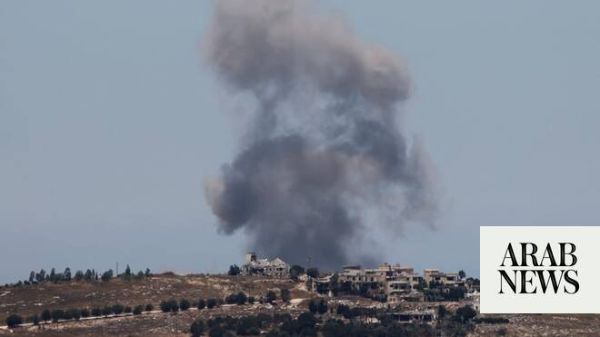

# Israel army says hit 80 targets in Lebanon, killed ‘dozens’ of Hezbollah members

Source: https://www.arabnews.com/node/2647813/middle-east
Captured source: https://www.arabnews.com/node/2647813/middle-east
Published: 2026-06-19T12:55:29+03:00
Modified: 2026-06-19T13:27:45+03:00
Author: AFP

## Summary

JERUSALEM: Israel’s military said Friday that it had struck more than 80 Hezbollah targets in Lebanon and killed dozens of its members in response to what it described as ceasefire violations. “Overnight, the IDF (military) struck more than 80 command centers, terrorists, launch positions, and additional terrorist infrastructure sites in the area of Nabatieh and additional

## Image

## Video Or Embed URLs

- blob:https://www.arabnews.com/aade9227-a16c-47e5-a0ca-bf516b2d001b
- https://imasdk.googleapis.com/js/core/bridge3.772.0_en.html
- https://static.addtoany.com/menu/sm.25.html
- about:blank
- https://sync.teads.tv/wigo-no-slot
- https://www.google.com/recaptcha/api2/aframe
- https://cm.g.doubleclick.net/partnerpixels?gdpr=0&us_privacy=1---&gpp_sid=-1&url=https%3A%2F%2Fwww.arabnews.com%2Fnode%2F2647813%2Fmiddle-east

## Text

https://arab.news/jgm98

Lebanon’s state news agency NNA reported heavy displacement from the southern districts of Tyre and Bint Jbeil

JERUSALEM: Israel’s military said Friday that it had struck more than 80 Hezbollah targets in Lebanon and killed dozens of its members in response to what it described as ceasefire violations. “Overnight, the IDF (military) struck more than 80 command centers, terrorists, launch positions, and additional terrorist infrastructure sites in the area of Nabatieh and additional areas in southern Lebanon, within the Security Zone and beyond it,” an army statement said. “Furthermore, during the strikes, dozens of Hezbollah terrorists operating in the command centers were eliminated.”

Fighting flared in Lebanon on Friday, with authorities reporting 18 killed in Israeli airstrikes across the south. The violence is the worst since the sealing of a US-Iran deal to halt the wider Middle East war, which was supposed to also pause the fighting between Israel and Hezbollah in Lebanon. The deaths of the soldiers drew a furious reaction in Israel, with far-right Israeli National Security Minister Itamar Ben Gvir saying “Lebanon must burn.” The Lebanese health ministry said the “intensive” strikes “resulted in a preliminary toll of 18 martyrs and 33 wounded” in at least 10 villages and towns. Israel’s military said it hit scores of targets overnight and into the morning. “The IDF (military) struck more than 80 command centers, terrorists, launch positions, and additional terrorist infrastructure sites in the area of Nabatieh and additional areas in southern Lebanon,” an army statement said. “Furthermore, during the strikes, dozens of Hezbollah terrorists operating in the command centers were eliminated.” Iran-backed Hezbollah, meanwhile, said it was attacking Israeli forces around the southern town of Nabatieh. Other Israeli strikes targeted the Baalbek region in the east of the country, which had been largely spared since the start of the conflict on March 2. Israel said its strikes in Baalbek and the Bekaa Valley were in response to “repeated violations of the ceasefire by Hezbollah,” which it said “continues to prepare and carry out terrorist attacks against Israeli soldiers.” A military official said the incident involved an impact from “a suspicious target” on an Israeli tank, with Israeli military correspondents reporting it had been hit by “a suspected drone or anti-tank missile.” In a separate statement the military also reported that a reserve officer was severely wounded “as a result of an explosive drone impact in southern Lebanon,” with four other soldiers lightly injured.
