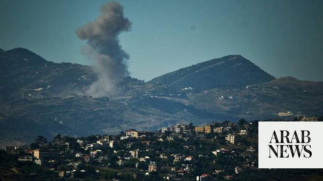

# Netanyahu orders halt to military operations in south Lebanon after Israeli strikes escalate despite ceasefire

Source: https://www.arabnews.com/node/2647909/middle-east
Captured source: https://www.arabnews.com/node/2647909/middle-east
Published: 2026-06-20T08:23:17+03:00
Modified: 2026-06-20T18:40:48+03:00
Author: Arab News

## Summary

BEIRUT: Israeli sources reported on Saturday that Prime Minister Benjamin Netanyahu instructed the army to halt its operations in Lebanon. The reports said the decision by Netanyahu and Defense Minister Israel Katz was made based on an assessment of the situation headed by Chief of Staff Lieutenant General Eyal Zamir. However, they added that those directives did not include

## Image

## Video Or Embed URLs

- blob:https://www.arabnews.com/f56c6ce9-37f1-4bac-8cb6-00c3889e5684
- https://imasdk.googleapis.com/js/core/bridge3.772.0_en.html
- about:blank
- https://static.addtoany.com/menu/sm.25.html
- https://www.google.com/recaptcha/api2/aframe
- https://cm.g.doubleclick.net/partnerpixels?gdpr=0&us_privacy=1---&gpp_sid=-1&url=https%3A%2F%2Fwww.arabnews.com%2Fnode%2F2647909%2Fmiddle-east

## Text

https://arab.news/576tv

Lebanon’s civil defense agency said ongoing Israeli strikes on the Nabatieh district in the country’s south on Saturday had killed 16 people

Israeli aggression on the town of Barish resulted in a massacre in which four members of one family were killed, including a father, a mother, and two children.

The state-run National News Agency (NNA) reported Israeli airstrikes on more than a dozen south Lebanon locations after midnight and into Saturday morning

BEIRUT: Israeli sources reported on Saturday that Prime Minister Benjamin Netanyahu instructed the army to halt its operations in Lebanon.

The reports said the decision by Netanyahu and Defense Minister Israel Katz was made based on an assessment of the situation headed by Chief of Staff Lieutenant General Eyal Zamir.

However, they added that those directives did not include withdrawal from the “security zones” controlled by Israeli forces in the south.

Israel’s Channel 12 said Netanyahu and Katz’s decision “came in coordination with the US.”

“The army enjoys freedom of action to eliminate threats in south Lebanon. If Hezbollah violates the ceasefire, the army will respond forcefully,” Israeli security sources told the public broadcaster.

“The army is operating freely within the Yellow Line in Lebanon,” an Israeli official said.

Lebanon’s civil defense agency said earlier on Saturday that ongoing Israeli strikes on the Nabatieh district in the country’s south had killed 16 people, a day after the latest Israel-Hezbollah ceasefire announcement.

Civil defense personnel have transported “16 dead and 12 wounded” to hospital, a statement said, adding that the personnel were working “since the early morning hours” in the Nabatieh district in response to “ongoing attacks targeting the area.”

The state-run National News Agency (NNA) reported Israeli airstrikes on more than a dozen south Lebanon locations after midnight and into Saturday morning, many in and around the Nabatieh area.

It also reported Israeli artillery shelling on Nabatieh city and its outskirts, a region where fighting has been focused in recent days.

The NNA said three people were killed in airstrikes on the town of Arab Salim, while one person was killed in Deir Zahrani, and another after “an enemy drone launched a strike on a motorbike” at the entrance of the town of Dweir. Strikes on the town of Barish resulted in a massacre in which four members of one family were killed, including a father, a mother, and two children and a Lebanese soldier was killed in a strike on the Kafr Rumman Road in southern Lebanon.

According to NNA, Israeli warplanes also carried out air raids on the Jbour area in Kfarhouna, in the Jezzine district. Additional strikes targeted the towns of Barish in Tyre district and Borj Qalaouiyeh, while heavy drone activity was reported over both the western and central sectors of the south.

On the ground, Israeli forces opened machine-gun fire toward the outskirts of Al-Mansouri, and artillery shelling struck the outskirts of Majdal Zoun. In a separate incident, a drone strike hit the town of Deir Qanoun Ras Al-Ain.

On Friday, a US official told AFP an immediate truce between Israel and Hezbollah had been brokered by US and Qatari mediators following talks with Israel and Iran. A Gulf diplomat confirmed the ceasefire.

Israel’s ambassador to the US said his country would commit to the ceasefire if Hezbollah respected it.

Previous truce announcements have done little to stop attacks from either side.

The announcement came as Lebanon’s health ministry said Israeli airstrikes and bombardment on the country’s south and east killed 47 people on Friday, the worst violence since Washington and Tehran this week sealed a deal to halt the wider Middle East war.

That agreement was supposed to also halt fighting between Israel and Hezbollah in Lebanon.

Israel’s military on Friday said four of its soldiers were killed, and reported more than 150 strikes on Lebanon, killing “dozens of Hezbollah terrorists.”

Also on Friday, Lebanese President Joseph Aoun told US Secretary of State Marco Rubio that a comprehensive ceasefire was needed in order for talks with Israel to progress.

Under US pressure, Lebanon in April began direct talks with Israel in Washington aimed at ending the hostilities and separating the Israel-Hezbollah conflict from the regional war.

A fifth round of talks is due to begin on Tuesday, according to the State Department.

US officials including President Donald Trump have expressed frustration at Israel’s campaign in Lebanon.

But Israeli Prime Minister Benjamin Netanyahu on Friday reiterated that Israeli troops would stay in south Lebanon “as long as necessary.”

Hezbollah drew Lebanon into the Middle East war in early March with rocket fire at Israel to avenge the killing of Iran’s supreme leader in US-Israeli strikes.

Israel responded with a massive campaign of airstrikes and a ground invasion.
